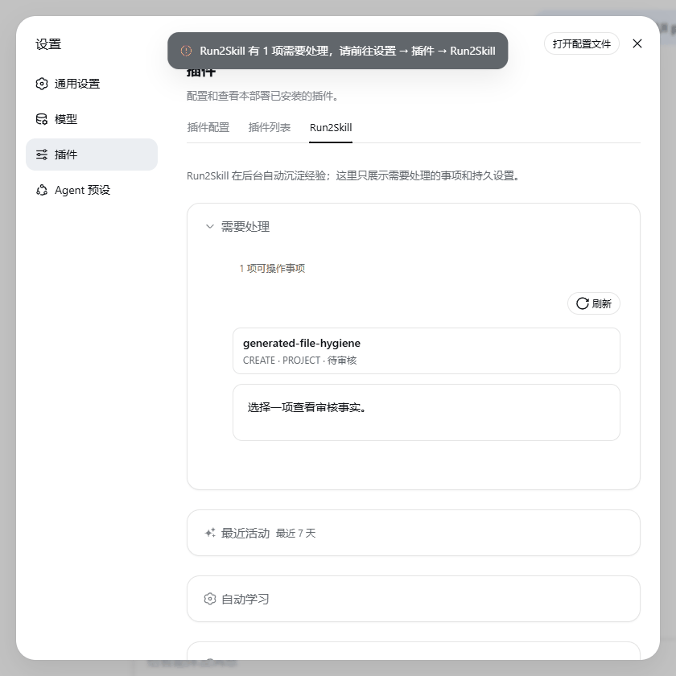
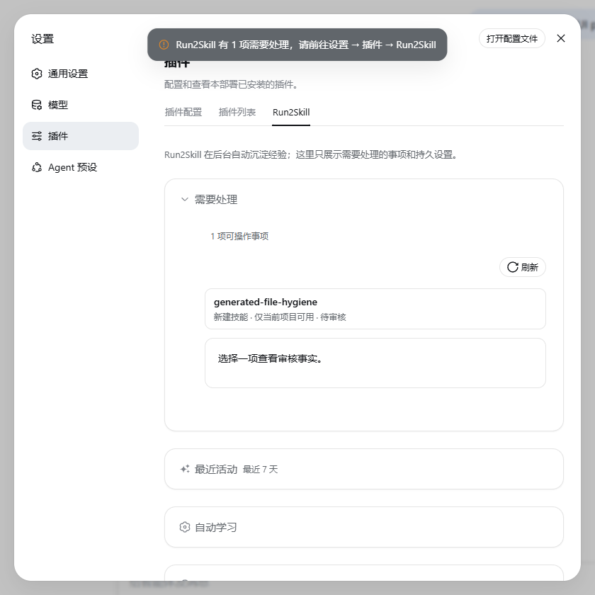
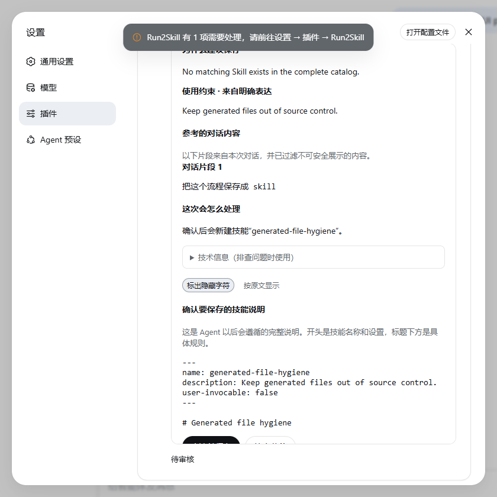
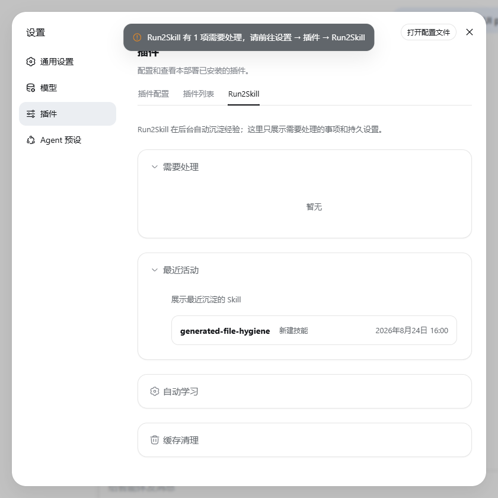

# dsh-run2skill

[中文](README.md) | English

Have you run into any of these situations?

- You teach an agent the same workflow today, then teach it again in a new session tomorrow.
- You keep correcting the agent step by step: “Do not edit that file,” “write the test first,” or “this check is required.”
- The agent finally learns the right approach, but the lesson disappears when the conversation ends.

`dsh-run2skill` turns the corrections, constraints, and workflows you explicitly teach a DeepSeek Harness (DSH) agent into reviewable, reusable native Skills.

> You teach once while doing real work. Run2Skill prepares a Skill draft from the reusable parts. Nothing is saved until you approve it.

Run2Skill does not let an agent silently create permanent rules for itself. Every draft shows its source, intended scope, and complete content before you decide whether to save or discard it. Only an approved draft is written to DSH's native Skill directory.

> The current stable release is `0.3.0`. It supports DSH Web `0.1.1-rc.2` only.

## See the complete flow



1. **Find the draft** — Run2Skill only notifies you when action is required and places the draft under **Settings → Plugins → Run2Skill**.
2. **Review its evidence and scope** — inspect the rationale, filtered conversation evidence, target scope, and the complete `SKILL.md` that would be written.
3. **Save only after approval** — successful results appear under Recent activity and remain ordinary native DSH Skills.

<details>
<summary>View the three key screenshots</summary>







</details>

## Install

First confirm that you use DSH Web `0.1.1-rc.2`, install Node.js `^22.19.0 || >=24.0.0`, and make sure both `dsh` and `pnpm` are available in your terminal. Then run:

```bash
dsh plugin --profile web add dsh-run2skill@0.3.0
```

Restart DSH Web. Open **Settings → Plugins**; the plugin is loaded when the **Run2Skill** tab appears.

Run2Skill does not need a separate model key. When it analyzes a Skill draft, it uses the model already selected for the current DSH session. If the session has no available model, learning stops and reports the reason instead of silently switching providers.

## Use it while you work

Continue talking to DSH normally. For example:

```text
Save this workflow as a Skill so it can be reused later.
```

You can also give an explicit correction, describe a durable constraint, or teach a reusable ordered workflow during ordinary work. You do not need to stop and manually reconstruct a `SKILL.md` file.

Run2Skill performs a lightweight check after a conversation turn. It does not run a model retrospective on every turn; deeper analysis begins only after an explicit learning signal is found.

When something needs your attention, DSH shows one native notification. To review a draft:

1. Open **Settings → Plugins → Run2Skill**.
2. Review the draft, its intended scope, evidence, and complete content.
3. Approve and save it, discard it, or retry a failed save.
4. After a successful save, it is an ordinary native DSH Skill and remains usable even if Run2Skill is later uninstalled.

Drafts can target the current project (`PROJECT`) or the current user (`USER`). The current release writes only to DSH's default Skill storage. If you replace or disable that storage, Run2Skill stops safely instead of guessing a path.

## What it learns

Run2Skill focuses on reusable experience that you state explicitly:

- **Correction:** “Do not fix the implementation first; write a failing test.”
- **Durable constraint:** “All GitHub copy in this project must be written in Chinese.”
- **Workflow:** “Check the upstream version, run compatibility probes, then update the evidence.”
- **Explicit save request:** “Save this process as a Skill.”

It does not turn every successful agent action into a permanent rule. It learns what you clearly taught, rather than trying to guess your intent.

## You remain in control

You can turn **Automatic learning** off under **Settings → Plugins → Run2Skill**:

- On: explicit corrections, durable constraints, and workflows may produce Skill drafts.
- Off: ordinary automatic learning pauses, while an explicit “save this as a Skill” request still works.

Run2Skill is local-first. It does not store model keys or copy the whole session. Only the necessary, filtered, truncated, and redacted context is sent to the session's selected model for analysis. Every Skill draft requires your approval before it is saved.

The settings page also provides **Clear all cache**. It removes Run2Skill-owned intermediate cache, pending Skill drafts, failures, and non-sensitive diagnostics, but never removes:

- original DSH session records;
- already published native Skills;
- provider, agent, or other DSH settings.

See [Storage and upgrades](docs/storage-and-upgrades.md) for the detailed retention and migration rules.

## Update and uninstall

Install another explicit version:

```bash
dsh plugin --profile web add dsh-run2skill@<version>
```

Uninstall:

```bash
dsh plugin --profile web remove dsh-run2skill
```

Restart DSH Web after either command. Uninstalling does not delete published Skills and keeps Run2Skill data by default. Use **Clear all cache** on the settings page before uninstalling if you want to remove that data.

## Troubleshooting

- **The Run2Skill tab is missing:** confirm that you use the DSH `web` profile and restarted DSH Web after installation.
- **“Run2Skill is currently limited” (`DEGRADED`):** do not manually delete storage files. Retry, then report the issue if the state persists.
- **“This Run2Skill version is incompatible” (`INCOMPATIBLE`):** verify your DSH version and restore a compatible Run2Skill version.
- **No Skill draft appears:** confirm that the current session has an available model, or say “Save this workflow as a Skill.”
- **A `PROJECT` draft cannot be saved:** the current session must belong to a project workspace recognized by DSH.
- **You changed DSH Skill storage:** the current release supports only the default storage and stops safely instead of guessing where to write.

Report problems through [GitHub Issues](https://github.com/qkycir-123/dsh-run2skill/issues). Do not attach keys, complete sessions, private paths, or logs containing sensitive information.

## Learn more

- [Changelog](CHANGELOG.md)
- [DSH compatibility](docs/compatibility.md)
- [Storage and upgrades](docs/storage-and-upgrades.md)
- [Product requirements](docs/product/prd.md)
- [Architecture baseline](docs/architecture/baseline.md)
- [Single-owner design for one Skill-save intent](docs/design/single-owner-skill-save.md)
- [Contributing](CONTRIBUTING.md)
- [Maintainer compatibility probes](probes/README.md)

This project is licensed under the [MIT License](LICENSE). Licenses for dependencies embedded in the client bundle are listed in [THIRD_PARTY_NOTICES.md](THIRD_PARTY_NOTICES.md).
