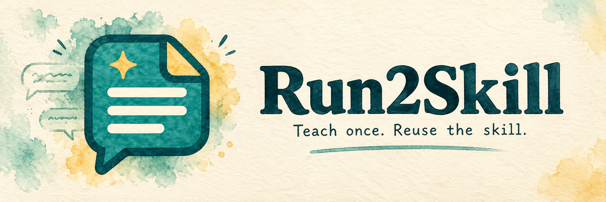
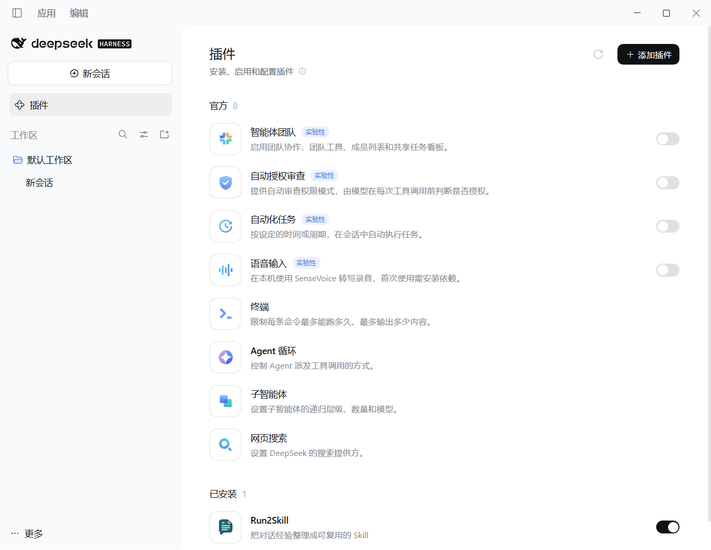
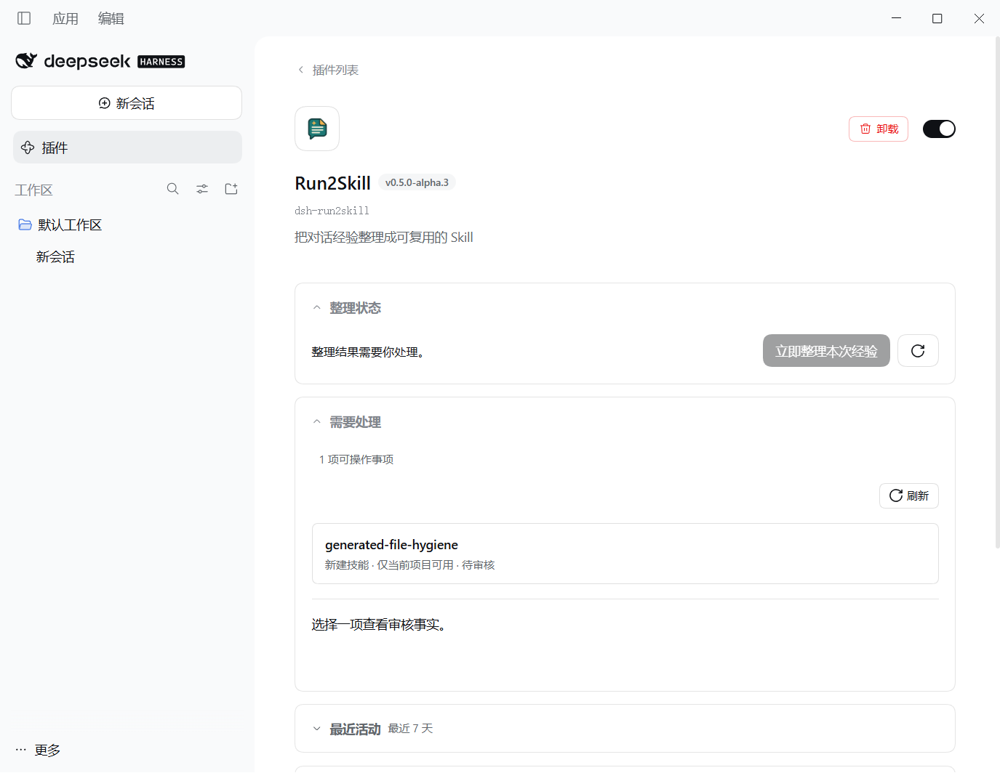
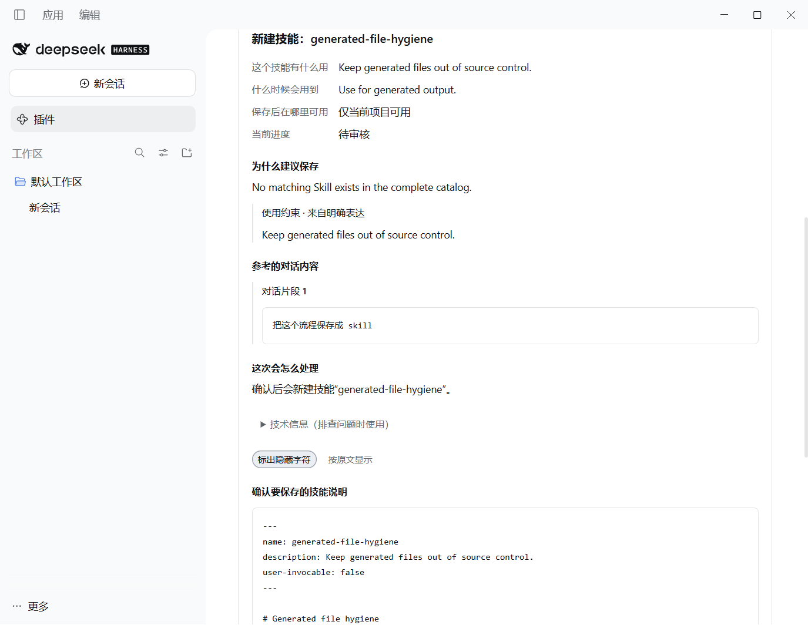
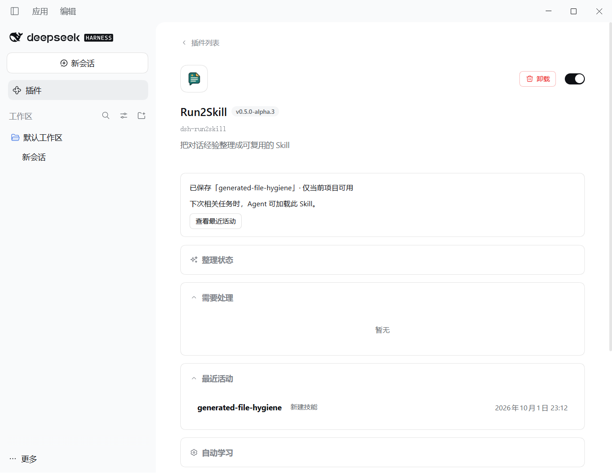

<p align="center">
  
</p>

<p align="center"><strong>Turn today's lessons into tomorrow's skills.</strong></p>

<p align="center">
  <a href="https://www.npmjs.com/package/dsh-run2skill"></a>
  <a href="docs/compatibility.md"></a>
  <a href="https://github.com/qkycir-123/dsh-run2skill/actions/workflows/ci.yml"></a>
  <a href="LICENSE"></a>
</p>

<p align="center">
  <a href="#install">Install</a> · <a href="#see-the-complete-flow">Full flow</a> · <a href="docs/compatibility.md">Compatibility</a> · <a href="CHANGELOG.md">Changelog</a> · <a href="README.md">中文</a>
</p>

Run2Skill turns the corrections, constraints, and workflows you teach an Agent in DeepSeek Harness (DSH) into reusable Skills. Review a draft, request changes, and approve it to save.

## See the complete flow



*Main-branch interface · sample draft walkthrough*

1. Open **Sidebar → Plugins → Run2Skill**.
2. Review the draft’s purpose, scope, source conversation, and full content.
3. Request changes or **approve and save**.
4. Check **Recent activity**. The Skill is ready for a related task.

<details>
<summary>View key screens</summary>







</details>

## Install

Supports DSH **0.2.0-rc.2** on Windows Desktop and Web.

**Desktop**: set up the command through **Manage dsh Command…** in the app. Complete the first launch, exit the app, and run:

```bash
dsh plugin --profile desktop add dsh-run2skill
```

**Web**: install Node.js `^22.19.0 || >=24.0.0` and make sure `pnpm` and `dsh` are available. Then run:

```bash
dsh plugin --profile web add dsh-run2skill
```

Restart DSH after installation. Run2Skill uses the model selected in the current session. See [Compatibility](docs/compatibility.md) for version details.

## Use

Work with your Agent as usual and describe the practices you want to reuse:

- **Correction**: “Write a failing test before changing the implementation.”
- **Constraint**: “Use Chinese for GitHub copy in this project.”
- **Workflow**: “Check the upstream version, then run compatibility checks.”
- **Save request**: “Save this workflow as a Skill for reuse.”

Run2Skill organizes lessons when the session is idle or you request a save. DSH notifies you when a draft needs review. You can also open the plugin and choose **Organize this session now**.

Each draft includes its source conversation. Approve it, request changes, or discard it. Save Skills for the **current project** or **all projects**, using DSH’s default Skill directories.

## Settings

- **Automatic learning**: organize lessons from conversations automatically. When off, explicit “save as a Skill” requests still work.
- **Recent activity**: see Skills created or updated in the last seven days.
- **Clear all caches**: preview and clear pending drafts and intermediate data, keeping saved Skills, conversations, and DSH settings.

Run2Skill manages drafts locally and sends selected, redacted conversation excerpts to the current model. See [Storage and upgrades](docs/storage-and-upgrades.md).

## Update and uninstall

Update, then restart DSH:

```bash
dsh plugin --profile desktop add dsh-run2skill
```

Uninstall:

```bash
dsh plugin --profile desktop remove dsh-run2skill
```

For Web, replace `desktop` with `web`. Saved Skills and plugin data remain after uninstalling. To clear caches, use the plugin’s cleanup action before uninstalling.

## Help and contribute

- [Report an issue](https://github.com/qkycir-123/dsh-run2skill/issues)
- [Compatibility](docs/compatibility.md) · [Changelog](CHANGELOG.md)
- [Contributing](CONTRIBUTING.md) · [Maintainer probes](probes/README.md)
- [Product requirements](docs/product/prd.md) · [Architecture and design](docs/architecture/baseline.md)

[MIT License](LICENSE) · [Third-party licenses](THIRD_PARTY_NOTICES.md)
