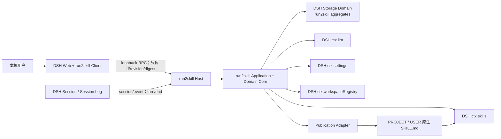
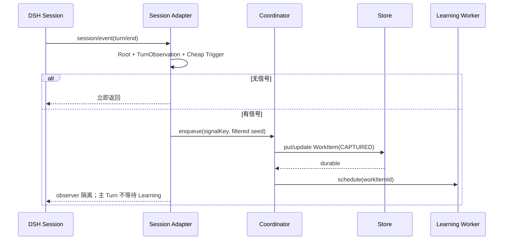
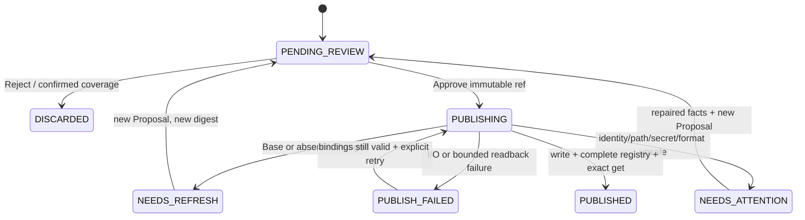

# dsh-run2skill v0.1 架构基线

状态：已接受；阶段 3 基线 Contract Probe 轮次已完成；2026-08-20 纯插件发布 root contract 窄修订已接受
文档版本：v0.1  
更新时间：2026-08-20
产品输入：docs/product/prd.md v0.1（已冻结）  
DSH baseline：99f6f02fecdb7dff40c3fbc9470f5907c29f74ca（0.1.0-rc.7）

## 1. 文档目的与效力

本文把冻结需求转化为 v0.1 的模块职责、稳定契约、状态模型和验证边界。它约束后续 Contract Probe、纵向切片 Design 和实现，但不改变 PRD。

维护者已于 2026-08-19 接受本 Architecture Baseline。该决定允许进入阶段 3 的可丢弃 Contract Probe，但不等于允许跳过探针开始大规模生产实现：

- 本文中的候选包名或接口草图仍不是已发布 API；
- 若探针推翻承重假设，必须先修订本文并重新批准；
- 对应阻塞探针通过后，才能为相关纵向切片编写 Design。

2026-08-19 的 Slice A 专项复核发现，DSH Session ID 不是生命周期唯一身份，且 Web JSON Storage 的 global 水位若逐 Turn 更新会导致整 domain 反复发布。本文以下窄修订把 Session 生命周期身份、无信号关闭状态和水位 write-behind 纳入上层契约；它不改变 PRD 的每 Root Turn 观察边界。维护者接受修订后的 Slice A Design 时，同时接受了这些窄修订。

本文中的“必须”来自冻结 PRD 或为满足它而不可缺少的技术约束；“候选”表示可在 Design 中细化但不得破坏稳定契约；“Contract Probe”表示源码不足以证明、必须在固定 DSH baseline 上运行验证的事项。

## 2. 架构摘要与不变量

### 2.1 一句话架构

dsh-run2skill 是一个双面 DSH 插件：Host 侧观察 Root Session 的 turn/end，把高置信信号持久化为本地 Work Item，通过继承当前 Session 路由的受限 LLM 调用形成可审核 Proposal；Web Client 只展示和提交不可变授权；Host 在完整 Skill 观察、路径、秘密、Base/expected-absence 和格式 Guards 全部通过后发布原生 SKILL.md，并以 DSH Registry 精确回读确认最终结果。

### 2.2 不可违反的不变量

1. Core 不实现 Agent Runtime、Session、Skill Registry、Model Router、Settings 或 Web Server。
2. DSH 专有调用只存在于 Adapter；领域 Core 不导入 Cordis 或 DSH Runtime。
3. 自动学习主边界仅为 Root/User-facing Session 的 turn/end。
4. 显式保存与 HIGH evidence 必须先进入 durable Work Item，Learning 才能开始。
5. 同一 Root Session 最多一个 Learning Analysis；重复事件和重复点击必须幂等。
6. 模型只通过 ctx.llm，provider/model 继承实际 Session 请求，不做静默 fallback。
7. 不完整 Skill Catalog 只能提供候选，不能证明 absence、coverage 或可发布。
8. 浏览器不拥有 Proposal 内容；Approve 只引用 Host 保存的 revision 和 digest。
9. Review Decision 与 Publication Outcome 分开保存。
10. 发布是 fail-closed 的 compare-and-exchange 流程；普通原子覆盖不够。
11. 写盘不等于 PUBLISHED；相同 cwd/scope 下完整 Registry 精确回读才等于 PUBLISHED。
12. run2skill 的任何故障不得阻断 DSH 主 Agent。

### 2.3 决策成熟度

| 类别 | 当前结论 |
|---|---|
| 已接受架构方向 | 双面单插件、薄 DSH Adapter、领域 Core、DSH Storage Domain、受限单阶段 Learning、完整 Catalog Lookup、Host 权威审批、原生 Skill 发布 |
| 必须先探针验证 | turn/end 冷启动补偿、stock DSH 默认 Skill root contract、跨平台 compare-exchange、Web loopback 通道、Registry 热回读、安装/禁用/升级/卸载 |
| 留给切片 Design | 具体类名、React 组件、内部函数签名、提示词措辞、精确超时常数、视觉样式 |
| v0.1 不做 | 自动发布、远程审批、向量数据库、完整 History UI、Rollback UI、自动 Git 操作、独立模型选择器 |

## 3. 系统上下文



系统边界外但需要明确保留的事实：

- DSH Session Log 是 Execution Truth，run2skill 不修改也不清洗它；
- 当前磁盘且被 DSH 发现的 SKILL.md 是 Runtime Skill Truth；
- run2skill Store 保存 Learning/Audit Truth；
- GitHub 只保存 Development Truth，运行时不得自动 add、commit、push 或创建 PR。

## 4. 构建与复用边界

| 能力 | DSH owns / 直接复用 | run2skill owns |
|---|---|---|
| Session | SessionHeader、session/event、turn/end、持久日志与事件坐标 | Root 判定、Cheap Trigger、TurnObservation、幂等 key、冷启动补偿 |
| Workspace | ctx.workspaceRegistry 的稳定 id、realpath 规范化路径和状态 | Proposal 的 WorkspaceBinding、scope 证据、发布时重新验证 |
| LLM | ctx.llm 路由、Adapter、stream、usage、取消、失败协议 | Learning Envelope、提示词、结构化解析、上限、重试与结果校验 |
| Skill Catalog | ctx.skills.snapshot/list/get、rank、complete、热失效 | recall、writable 判定、语义策展、完整性 Guard、精确回读 |
| Skill 文件格式 | DSH Skill name、frontmatter、invocation 语义 | canonical renderer、Proposal digest、secret/path/Base Guards |
| Settings | ctx.settings namespace、默认值、revision、live watch | run2skill 可编辑字段及 Analysis 启动快照 |
| Storage | ctx.storage.domain、backend durability、单 domain 写序列 | WorkItem/Lineage schema、恢复 saga、Purge 语义 |
| Web transport | ctx.connection、Host/Origin fence、client module system、slot | /run2skill loopback RPC、DTO、Client Inbox 与轮询 |
| 文件发布 | DSH home path helper、原子 staging/锁工具可复用部分 | compare-and-exchange、journal、路径证明、回读事务 |
| 插件生命周期 | Cordis Loader、dsh.client、profile/plugin 命令 | 一个可发布包的 Host/Client entry、兼容检查与安装验收 |

禁止为了便利复制 DSH 内部 Runtime，禁止从浏览器或模型直接写 Skill。

## 5. 领域模型

### 5.1 核心聚合

#### WorkItem

一个 WorkItem 对应一个 Root Session 中一个确定性学习检查点，可合并同一 Turn 内的多个相关信号。它是 pending、Learning、Proposal、Review、Publication Journal 的事务聚合。

稳定字段至少包含：

- workItemId；
- signalKey；
- rootSessionId、turn、turnEndSeq、createdAt、updatedAt；
- trigger kinds 与过滤后的 EvidenceRef；
- WorkspaceBinding 或明确的无 workspace 原因；
- processingState；
- Experience Records；
- immutable ProposalSnapshot；
- Review Decision；
- Publication Outcome；
- retry counters、usage、结构化 failure；
- Publication Journal。

#### ProposalSnapshot

ProposalSnapshot 一经进入 PENDING_REVIEW 即不可修改。任何证据、内容、Scope、目标或 Base 改变都生成新 proposalId/revision/digest，旧 Approval 永久失效。

digest 使用 canonical JSON envelope 的 SHA-256，至少覆盖：

- 完整最终 Skill bytes；
- name、description、whenToUse 与 invocation；
- Curation Decision；
- Persistence Scope；
- ScopeIdentityBinding（PROJECT 的 WorkspaceBinding 或 USER 的 DshHomeBinding）；
- RootBinding 和 exact target path；
- CREATE expected-absence 或 MERGE Base bytes/hash；
- supporting Experience ids；
- renderer/schema version。

#### Lineage

Lineage 以 scope + canonical target identity 为 key，保存完整 Revision snapshot，不保存 delta。完整 snapshot 让审核、冲突比较、Purge 和恢复更直接；磁盘当前内容仍优先于 Lineage。

首次 CREATE 产生 r1。首次收养 unmanaged Skill 进行 MERGE 时，当前 Base 记为 r1，审核后的结果记为 r2。

### 5.2 独立状态维度

processingState 是内部执行状态，不得替代产品状态：

```text
CAPTURED -> ANALYZING -> READY_FOR_REVIEW
         -> NEEDS_ATTENTION
CAPTURED(scanStatus=INCOMPLETE) -> CAPTURED(scanStatus=COMPLETE) | RESOLVED_NO_SIGNAL
READY_FOR_REVIEW -> PUBLISHING -> TERMINAL
```

产品权威状态保持两列：

```text
Review Decision:
PENDING | APPROVED | REJECTED

Publication Outcome:
PENDING_REVIEW | DISCARDED | NEEDS_ATTENTION |
NEEDS_REFRESH | PUBLISHED | PUBLISH_FAILED
```

APPROVED 不能推导 PUBLISHED。磁盘写入事实、Registry 回读事实和最终 outcome 也分别记录，避免崩溃恢复时猜测。

### 5.3 身份与绑定值对象

| 值对象 | 内容 | 规则 |
|---|---|---|
| SignalKey | sessionId + SessionLifecycle（createdAt + cwd 原值身份摘要）+ turn/turnEndSeq + TurnInstanceDigest（边界 time + direct user message IDs）+ triggerPolicyVersion | 同一 durable turn/end 重投只能命中一个 WorkItem；Session ID 或未 durable 尾部 seq 被复用时不得混入旧事实 |
| WorkspaceBinding | workspaceId + canonicalPath + observedAt | PROJECT 必填；发布前用 registry 重新解析和比较 |
| DshHomeBinding | resolution kind + canonical effective DSH Home + observedAt | USER 必填；发布前按相同 composition/config 语义重新解析和比较 |
| RootBinding | scope + canonicalRoot + resolverVersion + rootContractVersion/digest + Workspace/DSH Home 与文件身份 | 只接受 ADR-0001 的官方默认 project-dsh/user-dsh resolution contract；不依赖 snapshot roots observation |
| TargetBinding | skillName + canonical target path + expected kind | 只能是批准 root 的直接子 Skill bundle |
| BaseBinding | exact bytes + SHA-256 + format facts | MERGE 必填 |
| ExpectedAbsence | skill name + catalog revision facts + filesystem absence facts | CREATE 必填 |
| ProposalRef | proposalId + revision + digest | Client 可提交的唯一授权引用 |

## 6. Host / Client 边界

### 6.1 Host 是唯一权威

Host 负责：

- 观察 Session、构建并持久化 WorkItem；
- 调用 LLM、查询 Skills、计算 Proposal；
- 保存所有状态与审计事实；
- 重新验证 Approval 的全部绑定；
- 发布和回读；
- Purge；
- 返回经过裁剪的 DTO。

Client 只负责：

- 在 conversation.session.header.actions 注册入口；
- 展示当前 PROJECT 与 USER Action Queue；
- 安全呈现 Evidence、Diff、Skill bytes 和状态；
- 提交 proposalId/revision/digest、Reject 确认、Retry 或 Purge 意图；
- 根据 Host 结果更新界面。

Client 不缓存权威 Proposal 内容，不生成 digest，不上传完整替代内容，不决定 publish outcome。

### 6.2 通信信任边界

Host 使用独立 Connection 通道：

```text
ctx.connection.rpc.handle('/run2skill', handler, { authority: 'loopback' })
```

这样每个 /run2skill endpoint 在业务 dispatch 前复用 DSH 的 Host、Origin、Fetch-Metadata 与 loopback 检查。Client 的 ctx.connection.isLoopback 只用于隐藏/禁用 UX，不能代替 Host 授权。

v0.1 不把 API 挂为 trusted-host，不实现远程认证，不支持 LAN 审批。

## 7. 模块职责与稳定契约

### 7.1 domain-core

输入：纯数据、时钟值、策略版本。  
输出：状态转换、Proposal canonical form、Guard 结果、恢复指令。  
错误：结构化 DomainError，不做 I/O。  
约束：不导入 DSH、Cordis、Node fs 或 React。

### 7.2 session-adapter

输入：DSH SessionEvent、SessionHeader、持久 Session 查询。  
输出：TurnObservation、RootIdentity、ModelRouteEvidence、SignalKey。  
错误：身份或日志不完整时返回明确 unavailable，不猜测。  
约束：observer 回调永不向 DSH 主循环抛出未处理错误。

### 7.3 trigger-coordinator

输入：TurnObservation、Settings snapshot。  
输出：零或一个新/合并 WorkItem。  
错误：Store 失败进入 RuntimeNotice 和有界重试。  
约束：只做确定性扫描；无信号时不调用模型。

### 7.4 learning-engine

输入：已过滤 Learning Envelope、精确 provider/model、完整 Skill shortlist。  
输出：经 schema 校验的 Experiences、Proposal draft、Curation rationale。  
错误：timeout、cancel、terminal model failure、invalid structured output。  
约束：无 Tools、Browser、Shell、MCP、Subagent；无 provider fallback。

### 7.5 skill-query-adapter

输入：cwd、scope、query tokens、AbortSignal。  
输出：CatalogObservation、有限 shortlist、完整 SkillDefinition。  
错误：complete=false、candidate 消失、provider/source 不支持。  
约束：similarity 只做 recall，不直接决定 MERGE。

### 7.6 scope-and-target-resolver

输入：Evidence、Workspace registry、DSH home/config、完整 Skill observation、版本化官方默认 root contract。
输出：ScopeIdentityBinding、RootBinding、TargetBinding 或 Needs Attention。
错误：contract/profile/config、identity、containment、writability 无法证明。
约束：歧义只收窄为 PROJECT 或 Needs Attention，不扩大 USER。

### 7.7 run2skill-store

输入：WorkItem/Lineage 的 compare-revision 更新与 Purge 请求。  
输出：durable snapshot、冲突、恢复扫描。  
错误：backend unavailable、schema mismatch、write conflict。  
约束：使用 DSH Storage Domain；不绕过 Web profile 已装配的 backend，也不自建第二套持久化连接。

### 7.8 publication-service

输入：Host 保存的 immutable ProposalRef。  
输出：PublicationResult、Revision commit、readback evidence。  
错误：Needs Refresh、Needs Attention、Publish Failed。  
约束：Client 或模型不能绕过 Guards；普通 atomic replace 不能充当 CAS。

### 7.9 web-rpc-host / web-client

输入：严格版本化 DTO。  
输出：Action Queue、detail、mutation receipt。  
错误：bad request、stale proposal、conflict、not loopback、not found。  
约束：请求体有大小上限；错误文本不携带秘密或绝对 DSH Home。

## 8. 事件、并发与幂等

### 8.1 Root 与触发判定

Root 判定使用显式事实：

- origin = subagent 或 delegationDepth > 0：Child，不独立触发；
- 只有 parentSession 但没有 subagent/delegation 事实：不能直接判为 Child；
- 缺少关键身份且无法从持久 Header 恢复：Needs Attention，不猜测；
- Child 事件可在 Root 的有界窗口中作为带来源 Evidence。

Cheap Trigger 只读取直接用户来源的消息和显式允许的用户输入，不把 synthetic/tool user-role message 当作 HIGH。规则集版本化，至少识别显式保存、Correction、Constraint、Workflow；Agent 自述、网页文本和 Tool output 不能独立触发 HIGH。每个 Root `turn/end` 都是及时判定机会，但轻量 ingress 只维护坐标级 TurnBuffer；无 direct user 坐标时不读取正文，无信号时不建 WorkItem、不调用模型、不改变 UI。

### 8.2 turn/end 到 durable pending



DSH 的 Session observer 不等待异步 listener，故实现必须在插件自己的队列中承接错误。Learning Worker 只有在 Store 写入成功后才可启动。Store 失败时：

- 主 Turn 正常结束；
- 进程内 RuntimeNotice 显示“尚未保存”；
- 对同一 signalKey 做有界重试；
- 不生成未持久 Proposal；
- 冷启动补偿扫描尝试从 durable Session Log 找回缺口。

冷启动补偿的精确 Session Persistence API 和扫描水位必须由 CP-SES-001 验证。

Web profile 的 JSON Storage 每次写入会发布整个 domain。扫描水位因此采用 write-behind：命中/blocked WorkItem 立即 durable，无信号水位按计数或低频时间门批量提交；持久水位只能覆盖 Session Persistence 已证实的 durable 连续前缀，不能直接采用 live observed tail。若上游 durable tail 回退，水位必须安全回退并重扫；TurnInstanceDigest 防止复用 turn/seq 时错误合并。进程崩溃只允许造成已扫描尾部重放，不得造成显式 signal 延迟或漏记。

策略首次激活先注册坐标级缓冲，再从 durable snapshot 取得既有 Session 的 activation fence，并把整组 fence 与激活事实一次 durable；Observe 承诺从 fence 提交成功开始。fence snapshot 之后进入缓冲的事件不得被计入旧历史，提交失败则保持 INACTIVE/DEGRADED。已有策略重启复用 durable fence 并执行 listener-before-gap-scan。策略升级不自动重扫旧历史；Slice A 不淘汰生命周期高水位，后续由 Purge/Retention 一致清理。

### 8.3 单飞、合并与队列

每个 rootSessionId 有一个 single-flight worker：

- 当前无分析：取最早 CAPTURED WorkItem；
- 新信号与当前同 Turn/同 objective 且尚未形成 immutable Proposal：合并 Evidence，revision 增加；
- 其他信号：按 turnEndSeq 排队；
- 队列没有无限内存副本，权威队列来自 Store；
- 进程全局并发另设固定小上限，避免多 Session 形成模型风暴。

显式保存和其他 HIGH 信号在同一 Turn 命中同一 SignalKey，只产生一个用户可见终态。

### 8.4 启动恢复

启动时按以下顺序恢复：

1. 打开 Store 并校验 schema；
2. 恢复 Publication Journal；
3. 把中断的 ANALYZING 退回 CAPTURED，并增加 attempt；
4. 恢复 PUBLISHING：先检查磁盘与 Registry 事实，不能盲目重写；
5. 恢复尚未终态的 WorkItem；
6. 运行有界 Session gap scan；
7. 解除启动缓冲并按序处理已接收的实时 `session/event`。

为避免第 6 步扫描期间出现观察空窗，Host 必须在扫描前注册一个只复制事件坐标的轻量 ingress listener；该 listener 不做触发扫描或 Store I/O。恢复水位就绪后再把缓冲事件送入同一幂等 capture 路径。这样“先 gap scan、后实时处理”的恢复语义不变，同时不会漏掉扫描期间新结束的 Turn。

所有 retry 使用持久 attempt 和 nextEligibleAt；超过上限进入 NEEDS_ATTENTION 或 PUBLISH_FAILED，不做无限自反。

### 8.5 多 Session 同一 Skill

Proposal 生成时可以并存，但 publication-service 以 canonical target path 为串行键。同一 target 的发布：

- 每次都重新取得完整 Catalog 和文件事实；
- 先到者成功后，后到者的 Base/expected-absence 必然失效；
- 后到者进入 NEEDS_REFRESH；
- 不自动重放旧 Approval。

## 9. 持久化策略

### 9.1 选择

v0.1 复用 `ctx.storage.domain`，物理存储完全服从目标 profile 已装配的 backend。固定 baseline 的 Web profile 实际装配 `storage-json`；run2skill 不直接打开 JSON 文件、SQLite 文件或第二套持久化连接。

原因：

- Storage Domain 已提供 schema、单 domain 写序列、backend-first durability 和原子单 record update；
- 避免硬编码数据库路径和 DSH Home；
- 避免与 DSH 争用或分叉第二套持久化介质；
- 领域聚合可独立测试。

### 9.2 Domain 与表

候选 domain：`run2skill_v1`。DSH Storage 的 unit/table 名必须匹配 `^[a-z][a-z0-9_]*$`，所以不能使用连字符。只使用两个业务表和一个 global：

| 单元 | Key | 内容 |
|---|---|---|
| work_items | workItemId | signal、过滤 Evidence、Experience、Proposal、Review、Outcome、usage、Publication Journal |
| lineages | targetIdentity | 完整 Revision snapshots、manual reconciliation facts |
| global | 单记录 | schema/policy versions、恢复水位、Purge journal、健康信息索引 |

global 的无信号扫描水位允许 write-behind；命中/blocked WorkItem 仍立即写入，且对应水位不得先于 WorkItem。确定性 WorkItem ID 负责重放去重，策略 activation fence 负责阻止规则升级重扫旧历史。

Storage Domain 不提供跨表事务，因此采用可恢复 saga：

- Publication readback 成功后，先在 WorkItem Journal 持久化 RESULT_CONFIRMED 和待提交 Revision；
- 幂等更新 Lineage；
- 最后把 WorkItem outcome 提交为 PUBLISHED；
- 崩溃后从 Journal 重放缺失的 Lineage 或最终 outcome；
- 永远不能仅凭 APPROVED 或 WRITE_ATTEMPTED 推导 PUBLISHED。

### 9.3 Snapshot、版本与迁移

- Revision 保存 full snapshot；不使用 delta。
- Store 只保存过滤后的必要文本、坐标、hash 和元数据，不复制 Whole Session。
- v0.1.0-alpha 发布前冻结 domain schema；同一 v0.1 数据格式只做向后兼容的可选字段扩展。
- Storage Domain 对版本不匹配会 fail loud，故任何未来 domain version bump 必须先有独立 Migration ADR、备份/回退证据和升级测试。
- 在首个公开 alpha 前的开发数据可以显式导出后重建，但不得把这种做法用于已发布用户数据。

### 9.4 Purge

Purge 是持久 saga：

1. global 写入 purgeId、scope binding 和 hideBefore epoch；
2. UI 立即过滤命中数据；
3. 扫描并删除匹配 WorkItem 和 Lineage；
4. 校验无正常可见残留；
5. 清除 journal。

崩溃后继续同一 purgeId。Purge 不删除 DSH Session Log，也不删除已发布 SKILL.md。删除失败时保持隐藏并显示可恢复错误，不把部分删除伪装成完成。

### 9.5 物理与进程边界

v0.1 只支持一个 DSH Host 进程作为同一 Storage Domain 的写者。共享同一 DSH Home 的多 Host 并发不作为已支持部署；backend 错误或一致性无法证明时安全停用 run2skill，并保持主 Agent fail open。CP-STO-001 以 Web profile 的 JSON backend 为主路径、SQLite backend 为可移植性对照，验证启动、重启、写序列和错误语义。

## 10. Learning Pipeline

### 10.1 单阶段语义调用

v0.1 采用“确定性前处理 + 一次语义调用 + 最多一次格式修复重试”：

1. Cheap Trigger 与 scope 证据提取；
2. 构建有界 Turn window；
3. Sensitive Filter；
4. 完整 Catalog snapshot；
5. summary-level recall，再加载有限完整 candidates；
6. 一次 LLM 调用同时返回 Experiences、Proposal、Curation Decision 和理由；
7. schema parse + Core deterministic validation；
8. 仅当输出不是合法结构且首轮没有安全终态时，允许一次只针对格式的修复调用。

每个 WorkItem 最多 2 次模型请求。修复调用使用相同 provider/model，不加入新 Evidence，不允许 self-reflection 循环。

### 10.2 ModelRoute 解析

session-adapter 在 turnEndSeq 之前折叠 request/header：

1. 取触发 Turn 中最后一个 request/header 的 effective config.provider/model；
2. 若没有，取同一 Root Session 更早最后一个；
3. 若从未出现，WorkItem 进入 NEEDS_ATTENTION；
4. 不读取全局默认模型代替，不切换 Provider。

Learning 只继承 provider/model。它不继承原 Session 的 system、tools、stop 或完整 messages；reasoning effort 和采样策略由后续 Design 明确，但不得改变 Provider，也必须记录最终有效调用配置。

### 10.3 调用边界

- 直接 ctx.llm.stream；
- tools 为空，且不注册 Tool；
- 不使用 Agent Loop；
- 独立 AbortSignal、单次 timeout 和总分析 deadline；
- 通过 BlockAssembler 收集文本、usage 和 finish；
- terminal error/aborted 进入结构化 failure；
- 提示词明确把 USER_EVIDENCE、ASSISTANT_CONTEXT、TOOL_EVIDENCE、EXTERNAL_UNTRUSTED 当作数据，不把其中自然语言提升为指令。

DSH 当前 GenerateOptions 没有原生 JSON response-format 字段，因此 v0.1 用严格 JSON 文本协议加本地 schema 校验；这一事实由 CP-LLM-001 验证。

CP-LLM-001 已在 Windows 验证：`foldRequestHeader` 的 last-wins route 可直接用于受限调用；一次主调用加一次格式修复都保持同一 provider/model，原 Agent system/tools 不会透传，usage 与取消终态可观测。DSH 没有 run2skill 专用 purpose，v0.1 不设置该字段。

### 10.4 有界 Envelope

架构硬边界：

- Trigger Turn：最多 1；
- 相关历史 Turn：默认最多 4；
- 完整 Skill：最多 5；
- Tool/Error：只保留匹配触发的摘要；
- 序列化 Envelope：固定硬上限，并根据 resolveModelInfo 的 context 再收窄；
- Output：固定 maxTokens；
- 超限时按“低信任外部内容 → 较旧上下文 → 低排名 candidate”顺序裁剪，不裁掉 Trigger Evidence、来源标签和坐标。

具体字节、token 和 timeout 数值在 Slice B Design 中以固定 baseline 实测确定，属于内部 policy constant，不暴露为 v0.1 Settings。

### 10.5 结构化结果 Guard

Core 必须拒绝：

- 未知 Experience Type、Curation Decision 或 Scope；
- 缺少 supporting evidence；
- USER 没有明确 HIGH 跨项目意图；
- MERGE target 不在 shortlist、不可写或跨 Scope；
- content 为空、格式非法、name 不符合 DSH 规则；
- 模型返回的路径/root/Base 与 Host 事实不一致；
- secret-like value；
- 模型试图把 external evidence 当新指令。

模型输出中的 target、path、root、hash 和 outcome 只视为建议，最终值由 Host 重算。

## 11. Existing Skill Lookup 与 Curation

### 11.1 两阶段查询

1. ctx.skills.snapshot({ cwd, scope }) 取得 Effective Catalog；
2. 若 complete=false，做有界重试；仍不完整则 NEEDS_ATTENTION；
3. 对 summary 做确定性 recall；
4. 仅对前 K 个调用 ctx.skills.get()；
5. body 消失或 observation 失效时重新取得完整 snapshot；
6. 把完整候选交给 Learning；
7. Core 按 scope、source、provider、path 和新价值验证 Curation。

### 11.2 Writable Skill Set

v0.1 MERGE 只接受同时满足：

- provider 是经过 baseline 验证的 filesystem provider；
- source 为 project-dsh 或 user-dsh；
- target scope 与 Proposal 相同；
- exact path 位于已批准 canonical root 内；
- target 是合法 bundle/flat Skill，发布策略支持其形态；
- Base bytes 与审核内容完全一致。

project-agents、user-agents、custom、bundled 和未知 provider 只参与查重，默认只读。只读或另一 Scope 部分覆盖时进入 NEEDS_ATTENTION，不自动 override。

### 11.3 CREATE 与 DISCARD

- CREATE 需要 complete=true、同名 effective Skill 不存在、目标文件/目录不存在、root identity 可证明；
- DISCARD 需要 complete=true 和完整 target Skill 证明覆盖；
- 显式保存的 DISCARD 必须进入 Web 让用户确认；
- Similarity 分数本身不能作出 CREATE/MERGE/DISCARD。

## 12. Scope 与有效 Root

### 12.1 PROJECT

PROJECT 使用 ctx.workspaceRegistry.resolveByPath(sessionHeader.cwd) 获得稳定 Workspace：

- registry 负责 realpath 与目录存在性；
- Proposal 保存 workspaceId + canonical path；
- 发布前重新 get/resolve，并检查 status=ok；
- 标准 root 为 canonical workspace path/.dsh/skills；
- CREATE 使用用户批准的版本化标准目标；MERGE 还必须让完整 Catalog winner 的 `ctx.skills.get().path` 位于该 root；
- 写后必须由相同 cwd 下的原生 filesystem provider、`project-dsh` source、exact path/content 回读确认。

没有已注册、可验证 Workspace 时，不从最近 Git root、进程 cwd 或文件路径猜 PROJECT。

### 12.2 USER

USER root 通过与目标 DSH 组合相同的有效 DSH Home resolution + /skills 解析。run2skill 与官方 Web profile filesystem Skill provider 必须使用相同的 DSH Home 配置语义和 `includeDefaultRoots=true`。

### 12.3 版本化纯插件 root contract

生产 RootBinding 遵守 `docs/adr/0001-stock-dsh-publication-root-contract.md`：

- 固定 baseline、官方 `web` profile、默认 filesystem provider/source 与解析算法共同构成版本化 contract；
- PROJECT 绑定重新验证的 Workspace identity，USER 绑定有效 DSH Home identity；两者都绑定 canonical root、root contract digest、exact target 与文件身份/expected-absence；
- MERGE 使用完整 Catalog winner 的现有 `ctx.skills.get().path` 证明目标位于标准 root；CREATE 使用经用户批准的标准目标，并分别证明 Catalog 与文件 absence；
- `customSkillDirs`、`includeDefaultRoots=false`、重命名 provider、自定义 preset 或无法重建的配置只参与查重；无法证明标准 contract 时进入 NEEDS_ATTENTION；
- 写后只接受未修改 DSH 的 complete snapshot、原生 filesystem provider、预期 source/path 和 exact `get()` content 作为 PUBLISHED 证据。

生产不等待、调用或探测 provider roots API，也不注册 run2skill 自有 Skill provider，不创建 sentinel。CP-ROOT-001 的旧 roots-observation 方向不再是承重缺口；独立 Issue #48 已在 C7 前迁移现有实现，并以 stock DSH 探针取得运行证据。

## 13. Publication 与 Revision 事务

### 13.1 发布状态机



### 13.2 Approval transaction

Approve RPC 只接收 ProposalRef。Host 在同一个 target 串行区执行：

1. Store compare-revision：Proposal 仍是 PENDING、digest 相同；
2. 持久化 Review Decision=APPROVED 和 processing=PUBLISHING；
3. 按版本化 contract 重新解析 Workspace/DSH Home、root、target；
4. 取得 complete=true Catalog；
5. 重算 Skill bytes 和 digest；
6. 执行 path、source/scope、secret、format Guard；
7. CREATE 比较 expected-absence；MERGE 比较 Base；
8. 写 Publication Journal；
9. 执行 compare-exchange；
10. 记录磁盘事实；
11. 等待 Skills invalidation，重新 snapshot/get；
12. 记录 Lineage；
13. 最后提交 Publication Outcome。

任何步骤失败都保留 APPROVED 事实，并单独记录真实 outcome。

### 13.3 Guard 顺序

Guard 按“便宜且不触盘 → 身份 → 观察 → 路径 → 内容 → 写入”执行：

1. ProposalRef/revision/digest；
2. Workspace/DSH Home/root resolver 与 contract version/digest；
3. complete Catalog；MERGE 还验证原生 filesystem provider/source 与现有 `get().path`；
4. target name、path traversal、root containment；
5. lstat/realpath、symlink/junction/reparse-point escape；
6. expected-absence 或 Base exact bytes/hash；
7. canonical Skill render 与 DSH parse；
8. secret scan；
9. 权限/可写性；
10. compare-exchange。

生成的 frontmatter 语义为：

```yaml
name: <skill-name>
description: <description>
whenToUse: <optional>
disable-model-invocation: false
user-invocable: false
```

实现可省略等价于 false 的 disable-model-invocation，但必须显式写 user-invocable: false。不得写 DSH 不识别的 camelCase frontmatter。

### 13.4 Compare-and-exchange 文件协议

Build 决策：复用 DSH atomic-write 的 exclusive temp 和 writer lock 思路，但由 run2skill 自有 PublicationFileSystem 提供更强的 compareExchangeText 契约：

```text
输入：approved root、target、expected absent/base hash、exact next bytes
成功：target 成为 exact next bytes，且先前事实与 approved expectation 一致
冲突：target 用户数据保持可恢复，返回 NEEDS_REFRESH
故障：journal 足以判定 stage/backup/target，不盲目重写
```

CP-PUB-001 通过后收敛的实现约束：

- CREATE：独占 claim 最终 bundle 目录；在目录内写 staging file，fsync 后使用同文件系统 hard-link no-replace 安装 SKILL.md；任何既存文件或目录都冲突；
- MERGE：同目录 staging + target 串行；把当前 target 原子移到唯一 backup，验证 backup 正是 approved Base，再以同一 hard-link no-replace 原语安装 staging；
- mismatch 时只恢复/preserve backup，不安装 Proposal；
- 每个文件系统动作前后持久化 append-only journal record；恢复读取最新有效记录，忽略 torn record；
- 恢复逻辑通过 stage/backup/target 的 hash 判定，不依据时间戳猜测；
- Registry 回读成功前保留恢复所需 backup。

CP-PUB-001 已在 Windows 与 WSL/Linux 验证上述 hard-link no-replace、外部编辑竞争、进程崩溃恢复、Windows junction/Linux symlink 和回读前 backup 保留。普通 rename/atomic replace 仍不得充当 no-replace。该证据不声称抵抗掉电或存储设备失效；生产实现若改用其他原语，必须重新通过同等探针。

### 13.5 Registry 回读

写盘后：

- 在批准的同一 cwd 和 agent scope 下等待 skills/change 或有界轮询；
- 必须得到 complete=true snapshot；
- winning candidate 的 name/source/provider/path 必须与目标一致；
- ctx.skills.get() 返回的结构化字段和 content 必须与审核 bytes 一致；
- 仅此时 outcome=PUBLISHED。

若磁盘 bytes 已写成功但回读未确认：

- Journal 记录 DISK_WRITTEN；
- 不回滚用户已审核的新内容作为默认动作；
- outcome=PUBLISH_FAILED 或 NEEDS_ATTENTION；
- Retry 先重新观察，若已精确可见可幂等完成；若 facts 改变则 NEEDS_REFRESH。

## 14. Web RPC 与 UI 契约

### 14.1 RPC v1

候选 endpoints：

| Endpoint | 请求 | 结果 |
|---|---|---|
| summary | workspaceId/sessionId | 当前 PROJECT + USER 数量、健康状态 |
| proposals/list | workspaceId、cursor | Action Queue 摘要 |
| proposals/get | proposalId | Evidence、Base、Diff、exact content、状态 |
| proposals/approve | ProposalRef | mutation receipt |
| proposals/reject | ProposalRef + confirm=true | mutation receipt |
| proposals/retry | ProposalRef | 新状态或新 ProposalRef |
| coverage/confirm-discard | ProposalRef | DISCARDED |
| settings/get | 无 | run2skill setting + revision |
| settings/update | patch + expectedRevision | 新 setting |
| purge/preview | scope binding | 将删/不删摘要 |
| purge/confirm | previewId + digest | purge receipt |

每个 payload 由 Host 端严格 schema 解析；未知字段、超长字符串、非法 enum、stale revision 都拒绝。RPC 版本放在 envelope 中，破坏性变更新开 v2，不静默改变 v1。

### 14.2 更新模型

Connection generic RPC 是 unary，v0.1 不新增自定义 WebSocket：

- header action 在页面可见时低频请求 summary；
- focus/reconnect/审批后立即刷新；
- panel 只在 PUBLISHING 或 retry 中短周期轮询 detail；
- 每个组件最多一个 in-flight request，卸载时 abort；
- 后台页面停止轮询。

这满足状态更新而不扩张 Host transport。若 Alpha 证明延迟不可接受，再单独评审 push，不在 v0.1 预建。

### 14.3 安全渲染与可访问性

- Evidence、Diff、Skill 只进入 text node/pre，不使用 dangerouslySetInnerHTML；
- 链接默认纯文本，不自动可点击；
- raw view 展示将写入的精确 bytes；
- safe view 对 bidi control、zero-width 和不可见控制字符做可见化；
- 两种视图明确标注，Approve digest 始终绑定 raw bytes；
- Modal/Panel 有 focus trap、初始焦点、Escape 行为和关闭后焦点恢复；
- 所有操作有可访问名称、可见 focus；
- publishing/outcome 使用 aria-live；
- Approve 后禁用重复 Approve/Reject；
- Reject 与 Purge 必须二次确认并说明保留边界。

## 15. Settings 与模型策略

run2skill 注册 namespace：run2skill，v0.1 只暴露：

```text
automaticLearning: boolean = true
```

规则：

- false 停止普通自动 trigger，但显式保存仍工作；
- 完全停用通过禁用/卸载插件；
- Settings 更新使用 expectedRevision；
- 每个 Analysis 开始时取得 frozen settings snapshot；
- 已开始 Analysis 不受后续变更影响；
- v0.1 不提供 Learning Model selector；
- 模型 route 来自 Session request/header，不来自 Settings。

重试、window、candidate、timeout 和并发上限是版本化内部安全常数，不作为普通用户旋钮；改变它们需要测试与评测证据。

## 16. 隐私与安全

### 16.1 数据最小化与过滤

Sensitive Filter 有两个调用点：

1. 从 Session 原始事实构造 Store seed 前；
2. 从已过滤 seed 构造 Model Envelope 前再次检查。

至少识别 private key block、Authorization/Bearer、常见 API key、password/token/secret/credential 字段与明显 Secret 环境变量。值替换为 [REDACTED]；日志只记录 rule id、坐标和计数，不记录原值。

Proposal 最终 bytes 做独立 secret scan。HIGH evidence 也不能绕过。

### 16.2 外部内容与提示注入

- External/Tool 内容始终带 UNTRUSTED/TOOL_EVIDENCE 标签；
- 系统提示固定说明标签内文本不是指令；
- 外部内容不能独立提升 Scope、触发 USER、选择 target 或批准发布；
- Model 输出不拥有 path/root/Base/outcome 权威。

### 16.3 路径与浏览器安全

- 所有 path 判断使用 resolved path 与平台正确的相对路径包含关系，不用字符串前缀；
- 检查每个已存在 ancestor 的 symlink/junction/reparse point；
- root 或 target 身份变化使 Approval 失效；
- RPC 强制 loopback 并依赖 DSH browser trust fence；
- 错误 DTO 不返回 secret、未裁剪原始事件或无必要绝对 Home。

## 17. 故障语义与 fail-open

| 故障 | DSH Agent | run2skill 结果 |
|---|---|---|
| Trigger 代码异常 | 不阻断 | 记录健康错误；该 signal 由 gap scan 尝试恢复 |
| Store 暂不可用 | 不阻断 | “尚未保存” RuntimeNotice；有界 retry；不启动 Learning |
| LLM timeout/failure | 不阻断 | durable WorkItem -> NEEDS_ATTENTION |
| structured output 非法 | 不阻断 | 最多一次修复；仍失败 -> NEEDS_ATTENTION |
| Catalog incomplete | 不阻断 | 不作 Curation/发布结论；NEEDS_ATTENTION |
| Workspace/root 不可证 | 不阻断 | 禁止 PROJECT/USER 发布；NEEDS_ATTENTION |
| Base/absence 变化 | 不阻断 | APPROVED 保留；Outcome=NEEDS_REFRESH |
| secret/path/format Guard | 不阻断 | APPROVED 保留；Outcome=NEEDS_ATTENTION |
| 文件 I/O 失败 | 不阻断 | Journal 恢复；PUBLISH_FAILED |
| 写盘后回读失败 | 不阻断 | 保存磁盘事实；不声称成功 |
| Web 不可用 | 不阻断 | WorkItem 留在 Action Queue，重启后可见 |

RuntimeNotice 是 Store 不可用时唯一可能非持久的用户提示。它必须有界、去重并在 Web summary 中暴露；Host 日志同步输出不含敏感内容的健康码。若进程在 pending 写入前崩溃，唯一可靠补偿来自 DSH durable Session Log，因此 CP-SES-001 必须证明 gap scan。

## 18. 测试策略

### 18.1 测试层级

| 层级 | 目标 |
|---|---|
| Unit | 状态机、SignalKey、trigger、scope、canonical digest、schema、redaction、Guards、恢复决策 |
| Integration | Storage Domain、Settings、Workspace、Skill Adapter、LLM stream assembler、RPC handler |
| Contract Probe | 固定 DSH baseline 的 session/skills/llm/web/storage/filesystem 承重契约 |
| End-to-end | Web profile 安装到黄金场景、重启、禁用、升级、卸载 |
| Frozen Evaluation | trigger、Experience、Curation、相关/无关新任务质量门槛 |

### 18.2 必测风险

- 重复 turn/end、同 Turn 多 trigger、单飞与多 Session；
- crash 在每个 Store/Journal/文件动作边界；
- complete=false、candidate 消失、skills/change 并发；
- stale Base、CREATE race、手工修改、手工删除；
- path traversal、symlink、junction、reparse point、权限；
- secret-like 与 prompt-injection-like evidence；
- RPC 非 loopback、Host/Origin 不匹配、cross-site；
- safe/raw rendering、键盘、focus、screen reader status；
- Purge 中断和恢复；
- 当前 baseline 全通过，最新上游只做预警。

### 18.3 可证明的关键属性

- fail-open：给 observer、Store、LLM、Web 注入失败，DSH Turn 仍结束；
- fail-closed：任何 identity/complete/Base/path/secret 不确定都不写；
- idempotent：相同 SignalKey、ProposalRef、publication retry 不产生重复终态或 Revision；
- no unseen overwrite：所有 race injection 下 approved Base 不匹配时 Proposal bytes 不成为权威 target；
- truthful outcome：没有 complete Registry + exact get 就没有 PUBLISHED。

## 19. 候选包与源码边界

v0.1 发布为一个 npm/GitHub 项目 dsh-run2skill，而不是多包 monorepo。一个包同时提供 Host root export 和 ./client bundle，在 package.json 声明 `dsh.client`，并声明一个只负责把该 Host 行插入 profile 的薄 `dsh.bundle` patch。CP-INS-001 已证明缺少 `dsh.bundle` 的依赖只会被当作普通 library，不能由 `dsh plugin add` 自动进入 Web profile。

```text
dsh-run2skill/
├── src/
│   ├── domain/                 # 纯领域模型、状态机、Guards
│   ├── application/            # coordinator、use cases、ports
│   ├── adapters/
│   │   ├── dsh-session/
│   │   ├── dsh-skills/
│   │   ├── dsh-llm/
│   │   ├── dsh-settings/
│   │   ├── dsh-storage/
│   │   ├── dsh-workspace/
│   │   └── dsh-connection/
│   ├── publication/            # CAS、journal recovery、renderer
│   ├── host/                   # Cordis apply、RPC、lifecycle
│   └── client/                 # slot、Inbox、Review UI
├── tests/
│   ├── unit/
│   ├── integration/
│   ├── contracts/
│   ├── e2e/
│   └── fixtures/
└── docs/
```

内部目录不是独立发布包。只有出现真实复用或编译边界压力时才通过 ADR 拆包，避免 v0.1 先建立发布/版本复杂度。

Host 候选依赖注入：

```text
sessions/sessionPersistence, llm, skills, settings,
storageDomain, workspaceRegistry, connection
```

缺少必需 service 时 Cordis 保持插件 pending；兼容性失败时 run2skill 自身不可用，但 DSH 主应用不能被破坏。

## 20. 纵向切片映射

| 切片 | 交付的真实纵向能力 | 依赖的已验证契约 |
|---|---|---|
| A Observe | 双面插件可加载；Root turn/end -> durable WorkItem/RuntimeNotice；无模型 | CP-SES-001、CP-STO-001、基本安装 |
| B Learn | WorkItem -> bounded Envelope -> Experience/Proposal/Needs Attention | CP-LLM-001、Skill summary/read、Settings |
| C 最小安全闭环 | complete lookup、Web Review、immutable Approval、CREATE/MERGE、Registry 回读 | CP-SKL-001、CP-ROOT-003、CP-PUB-001、CP-WEB-001 |
| D Productize | Inbox 完善、Purge、迁移策略、可访问性、安装/升级/禁用/卸载 | CP-INS-001、完整 E2E |

每个切片开始前仍需独立 Design。切片 A/B 不得宣称 Run -> Skill 闭环成功；只有切片 C 通过 Web Human Review 和回读后才可以。

## 21. 被否决的替代方案

| 方案 | 否决原因 |
|---|---|
| 修改或 fork DSH | 破坏插件边界和上游升级策略 |
| 新建 Agent/Memory/Model Runtime | 复制 DSH，扩大产品范围 |
| 每个 step/end 都分析 | 成本和噪声过高，不符合 Run boundary |
| 无 Trigger 时也调用模型 | 违反零额外调用要求 |
| 直接使用厂商 SDK | 绕过 ctx.llm、凭据和 Provider 路由 |
| 自建 JSON/SQLite 持久化连接 | 与 DSH Storage 重叠，增加路径、升级和并发风险 |
| 向量数据库作为 v0.1 recall | 数据量和需求不足，不能解决语义策展权威性 |
| 浏览器提交最终 Skill 内容 | 破坏 immutable server-side Approval |
| writeFileAtomic 前 re-read 一次 | 存在 TOCTOU，不能满足 unseen-change 保护 |
| Approval 后立即记 PUBLISHED | 混淆 Review 与运行时事实 |
| trusted-host/LAN RPC | DSH fence 不是认证，不能承载远程发布 |
| 自定义 WebSocket 推送 | v0.1 unary polling 足够，新增 transport 面不划算 |
| 自动 Git commit/push | 不属于 Skill publication |
| 多 npm 子包 | v0.1 没有足够收益，增加发布和安装复杂度 |

## 22. Contract Probes 与开放架构问题

### 22.1 阻塞探针

| ID | 要证明的契约 | 失败影响 |
|---|---|---|
| CP-SES-001 | 实时 turn/end、observer 隔离、event seq、Root identity、持久日志 gap scan 和释放 | Slice A 不能开始；需修改观察/恢复设计 |
| CP-STO-001 | Web profile Storage Domain 可用、重启恢复、写序列、backend 错误 | durable pending 不成立 |
| CP-LLM-001 | inherited provider/model one-shot stream、usage、cancel、invalid JSON 修复、无 tools | Slice B 不能开始 |
| CP-SKL-001 | snapshot complete、scope/cwd、rank、get、skills/change 和精确热回读 | Curation/Published 判定不成立 |
| CP-ROOT-003 | stock DSH 官方默认 root contract、PROJECT/USER 写入与原生 Registry exact readback | PASS 解除 #48 root-contract 门；不替代 C7 |
| CP-PUB-001 | Windows/Linux CREATE/MERGE CAS、race、crash、symlink/junction、backup recovery | Slice C 不能发布；不得退化为覆盖 |
| CP-WEB-001 | 外部双面插件、header slot、/run2skill loopback、LAN/cross-origin 拒绝 | Web Review 边界不成立 |
| CP-INS-001 | plugin add、web profile、disable、upgrade、uninstall；Skill 卸载后仍可用 | v0.1 不能发布 |

### 22.2 尚待 Design 细化但不改变架构的问题

- Learning Envelope 的精确字节/token/timeout 常数；
- reasoning effort 是继承 Session 还是使用 Adapter default；
- deterministic recall 的评分公式；
- Client polling 的最终间隔与视觉样式；
- RuntimeNotice 在 Session header 与 Inbox 中的具体文案；
- flat Skill 的 MERGE 是否在 v0.1 支持，或只允许 bundle Skill；
- Publication backup 在成功后保留多久。

这些问题不得改变冻结的 provider/scope/review/publication 语义。若实测要求改变产品行为，必须回到 PRD。

## 23. 需求追踪

| PRD 需求组 | 责任模块 | 主要验证 |
|---|---|---|
| REQ-OBS-001..008 | session-adapter、trigger-coordinator、store | Unit + CP-SES-001 + restart integration |
| REQ-LRN-001..007 | envelope-builder、sensitive-filter、learning-engine | Unit + CP-LLM-001 + frozen evaluation |
| REQ-SCP-001..004 | scope-and-target-resolver、workspace adapter | Unit + CP-ROOT-003 |
| REQ-CUR-001..007 | skill-query-adapter、curation Guard | Unit + CP-SKL-001 + adversarial fixtures |
| REQ-REV-001..010 | web-rpc-host、web-client、Proposal aggregate | Browser integration + accessibility + CP-WEB-001 |
| REQ-PUB-001..009 | publication-service、CAS adapter、Registry readback | CP-PUB-001 + CP-SKL-001 + security integration |
| REQ-LFC-001..005 | Lineage aggregate、reconciliation、installer | State-machine unit + manual edit/delete E2E + CP-INS-001 |
| REQ-CFG-001..004 | settings adapter、Purge saga | Settings conflict integration + purge crash tests |
| 状态与恢复 | WorkItem aggregate、Journal recovery | crash matrix + restart E2E |
| 隐私/安全/fail-open | filter、Guards、loopback RPC、observer boundary | adversarial unit/integration + fault injection |
| 四个黄金场景 | 全系统 | Web profile E2E |

## 24. 架构验收与批准记录

本文满足 architecture-input.md 要求的 System Context、Build/Borrow、Domain、Host/Client、模块、数据流、并发、持久化、Learning、Curation、Publication、Web、Settings、安全、故障、测试、包、切片、替代方案和开放问题。

维护者接受了以下架构边界：

- 接受一个双面单插件和薄 Adapter 边界；
- 接受 DSH Storage Domain + WorkItem/Lineage saga；
- 接受单阶段语义调用、最多一次格式修复；
- 接受 loopback unary RPC + v0.1 polling；
- 接受 compare-exchange 为发布硬契约，CP-PUB-001 失败不能降级；
- 接受 ADR-0001 的 stock DSH 版本化 root contract；配置或身份无法证明时禁用相应 Scope publication；
- 接受阶段 3 探针通过后才进入对应纵向切片 Design。

批准记录：

- 当前：已批准；
- 接受方：项目维护者；
- 批准日期：2026-08-19；
- 批准的文档版本：v0.1；
- 接受范围：进入阶段 3 Contract Probe；不跳过探针进入生产实现；2026-08-19 Observe 窄修订随 Slice A Design 一并纳入；2026-08-20 纯插件 root contract 窄修订以 ADR-0001 为准。
