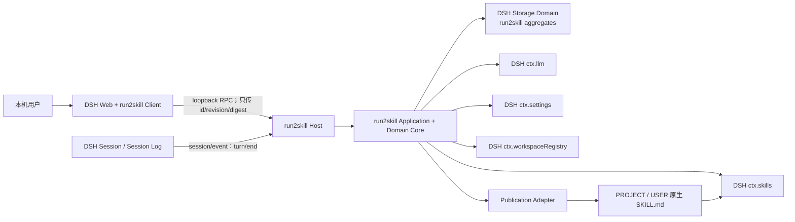
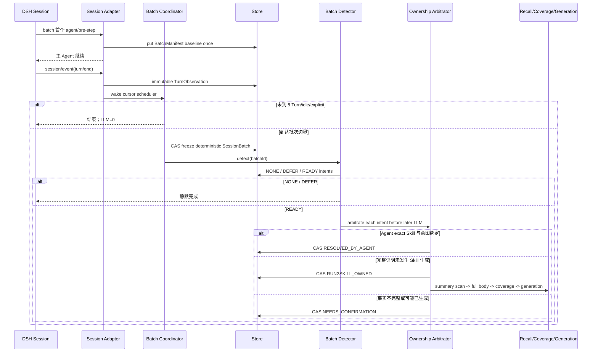
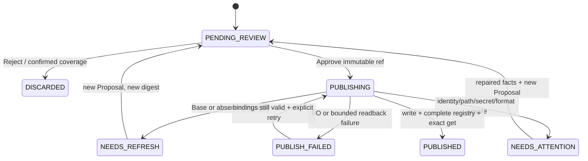

# dsh-run2skill v0.2 架构基线

状态：已接受的发布基线 + #84 核心流程修订待 Design PR 评审
文档版本：v0.2
更新时间：2026-08-22
产品输入：docs/product/prd.md v0.2
DSH baseline：99f6f02fecdb7dff40c3fbc9470f5907c29f74ca（0.1.0-rc.7）

## 1. 文档目的与效力

本文把产品需求转化为 v0.2 的模块职责、稳定契约、状态模型和验证边界。它约束后续 Contract Probe、纵向切片 Design 和实现，但不改变 PRD。

维护者已于 2026-08-19 接受本 Architecture Baseline。该决定允许进入阶段 3 的可丢弃 Contract Probe，但不等于允许跳过探针开始大规模生产实现：

- 本文中的候选包名或接口草图仍不是已发布 API；
- 若探针推翻承重假设，必须先修订本文并重新批准；
- 对应阻塞探针通过后，才能为相关纵向切片编写 Design。

2026-08-19 的 Slice A 专项复核发现，DSH Session ID 不是生命周期唯一身份，且 Web JSON Storage 的 global 水位若逐 Turn 更新会导致整 domain 反复发布。本文以下窄修订把 Session 生命周期身份、无信号关闭状态和水位 write-behind 纳入上层契约；它不改变 PRD 的每 Root Turn 观察边界。维护者接受修订后的 Slice A Design 时，同时接受了这些窄修订。

2026-08-20 的 Slice D 复核确认，固定 DSH baseline 已原生提供 Settings namespace、`expectedRevision`、loopback Settings RPC 和外部插件设置卡片 Slot。run2skill 因此直接注册 `run2skill` namespace 并复用 DSH Settings Client 接口，不再重复实现 `/run2skill` 私有 settings endpoint；该窄修订不改变 PRD 的设置字段、默认值或生效语义。

2026-08-21 的 D2 exact-HEAD 复核确认，active Purge journal 在完成后清除，不能独自阻止旧 Session gap 或迟到 Learning 在 runtime/进程重启后重新形成已清除数据。本文以下窄修订在同一 global 中增加可选、版本化、path-free 的 durable completed fences，并要求与 active journal 清除原子转换；这是同一 domain version 下的向后兼容可选字段扩展，不改变 PRD，也不增加 table、backend、History、Retention 或 migration framework。

2026-08-21，维护者进一步接受“无感自动沉淀且同一保存意图不能让 Agent 与 run2skill 各生成一次”的产品决定。显式保存和其他 `HIGH` evidence 在 run2skill Learning 前必须先做 durable ownership arbitration：有效 Agent Skill 已经与当前意图精确绑定时以 `RESOLVED_BY_AGENT` 静默完成；只有完整证据证明本回合没有发生 Skill 生成行为时，run2skill 才取得生成所有权。该窄修订不授权自动发布，也不能退化为两边生成后再去重。

2026-08-22，#84 把逐 Turn Cheap Trigger/WorkItem/单阶段 Learning 替换为 `TurnObservation -> SessionBatch -> ExperienceIntent`：每 5 个完整 Turn、idle 30 分钟或显式保存触发一次批次检测，随后依次执行 Agent-first ownership、complete Catalog 全量摘要筛选、完整候选 coverage 与独立 generation。完整状态机、调用账本和 `run2skill_v1 -> run2skill_v2` Migration ADR 见 [`docs/design/issue-84-session-batch-learning.md`](../design/issue-84-session-batch-learning.md)；与本节旧机制冲突的逐 Turn描述均以该 Design 和本文修订段落为准。

本文中的“必须”来自冻结 PRD 或为满足它而不可缺少的技术约束；“候选”表示可在 Design 中细化但不得破坏稳定契约；“Contract Probe”表示源码不足以证明、必须在固定 DSH baseline 上运行验证的事项。

## 2. 架构摘要与不变量

### 2.1 一句话架构

dsh-run2skill 是一个双面 DSH 插件：Host 在每个 durable root turn/end 只持久化最小 TurnObservation，在 5 Turn、idle 30 分钟或显式保存边界冻结 SessionBatch 并检测 ExperienceIntent；Intent 先经 Agent-first 单一所有者裁决，再用 complete Catalog 的全量摘要扫描和完整候选正文做独立 coverage，只有明确 CREATE 或唯一安全 MERGE 才进入 generation。Web Client 只展示和提交不可变授权；Host 在完整 Skill 观察、路径、秘密、Base/expected-absence 和格式 Guards 全部通过后发布原生 SKILL.md，并以 DSH Registry 精确回读确认最终结果。

### 2.2 不可违反的不变量

1. Core 不实现 Agent Runtime、Session、Skill Registry、Model Router、Settings 或 Web Server。
2. DSH 专有调用只存在于 Adapter；领域 Core 不导入 Cordis 或 DSH Runtime。
3. `turn/end` 只形成 TurnObservation；普通自动语义检测边界是 5 个完整 Turn、idle 30 分钟或显式保存。
4. READY ExperienceIntent 必须完成单一所有者裁决，recall/coverage/generation 才能开始。
5. 同一 behavior signature + scope 只能有一个生成所有者、一个 active lineage 和一个 Proposal；不得让 Agent 与 Run2Skill 都生成后再丢弃其中一个。
6. `RESOLVED_BY_AGENT` 必须由 batch baseline、全部有效 filesystem roots 的完整观察、winning Skill exact readback 和当前 Intent 的目标/行为绑定共同证明；只复用既有 Agent 回复/工具结果，不额外显示 Toast 或 Proposal。
7. baseline/root/catalog/get 不完整、意图绑定不确定或存在失败写入、完整 Skill 参数、Shell 重写等可能生成迹象时必须等待确认，后续模型调用为 0。
8. 同一 Session lifecycle 最多一个 active SessionBatch worker；重复 event、idle/threshold 竞争和重复点击必须幂等。
9. 模型只通过 ctx.llm，provider/model 继承实际 Session 请求，不做静默 fallback。
10. 不完整 Catalog 或未完整扫描的 summary 不能证明 absence、coverage、所有权或可发布；候选正文不得截断后用于 MERGE/DISCARD。
11. Detector、Catalog scan、coverage、generation 使用独立 schema、预算和 durable ledger；COVERED 不生成 Proposal。
12. 浏览器不拥有 Proposal 内容；Approve 只引用 Host 保存的 revision 和 digest。
13. Review Decision 与 Publication Outcome 分开保存。
14. 发布是 fail-closed 的 compare-and-exchange 流程；普通原子覆盖不够。
15. 写盘不等于 PUBLISHED；相同 cwd/scope 下完整 Registry 精确回读才等于 PUBLISHED。
16. Run2Skill 的任何故障不得阻断 DSH 主 Agent。

### 2.3 决策成熟度

| 类别 | 当前结论 |
|---|---|
| 已接受架构方向 | 双面单插件、薄 DSH Adapter、领域 Core、DSH Storage Domain、SessionBatch 检测、Agent-first ownership、全量 Catalog 摘要扫描、full-body coverage、独立 generation、Host 权威审批、原生 Skill 发布 |
| 必须先探针验证 | turn/end 冷启动补偿、stock DSH 默认 Skill root contract、跨平台 compare-exchange、Web loopback 通道、Registry 热回读、安装/禁用/升级/卸载 |
| 留给切片 Design | 具体类名、React 组件、内部函数签名、提示词措辞、精确超时常数、视觉样式 |
| v0.2 不做 | 自动发布、大型 Skill 自动 patch merge、远程审批、向量数据库、完整 History UI、Rollback UI、自动 Git 操作、独立模型选择器 |

## 3. 系统上下文



系统边界外但需要明确保留的事实：

- DSH Session Log 是 Execution Truth，run2skill 不修改也不清洗它；
- 当前磁盘且被 DSH 发现的 SKILL.md 是 Runtime Skill Truth；
- run2skill Store 保存 Learning/Audit Truth；
- GitHub 只保存 Development Truth，运行时不得自动 add、commit、push 或创建 PR。

## 4. 构建与复用边界

| 能力 | DSH owns / 直接复用 | run2skill owns |
|---|---|---|
| Session | SessionHeader、session/event、turn/end、持久日志与事件坐标 | Root 判定、TurnObservation、SessionBatch 水位/idle、幂等 key、冷启动补偿 |
| Workspace | ctx.workspaceRegistry 的稳定 id、realpath 规范化路径和状态 | Proposal 的 WorkspaceBinding、scope 证据、发布时重新验证 |
| LLM | ctx.llm 路由、Adapter、stream、usage、取消、失败协议 | Detector/Catalog/Coverage/Generation Envelope、独立账本、结构化解析、上限与结果校验 |
| Skill Catalog | ctx.skills.snapshot/list/get、rank、complete、热失效、stock filesystem provider 的有效 root 配置 | 全量 summary classification、完整正文能力、coverage、writable 判定、全部有效 root 的 ownership manifest、完整性 Guard、精确回读 |
| Skill 文件格式 | DSH Skill name、frontmatter、invocation 语义 | canonical renderer、Proposal digest、secret/path/Base Guards |
| Settings | ctx.settings namespace、默认值、revision、live watch | run2skill 可编辑字段及 Analysis 启动快照 |
| Storage | ctx.storage.domain、backend durability、单 domain 写序列 | v2 TurnObservation/SessionBatch/Intent/Lineage schema、v1 migration、恢复 saga、Purge 语义 |
| Web transport | ctx.connection、Host/Origin fence、client module system、slot | /run2skill loopback RPC、DTO、Client Inbox 与轮询 |
| 文件发布 | DSH home path helper、原子 staging/锁工具可复用部分 | compare-and-exchange、journal、路径证明、回读事务 |
| 插件生命周期 | Cordis Loader、dsh.client、profile/plugin 命令 | 一个可发布包的 Host/Client entry、兼容检查与安装验收 |

禁止为了便利复制 DSH 内部 Runtime，禁止从浏览器或模型直接写 Skill。

## 5. 领域模型

### 5.1 核心聚合

#### TurnObservation

一个 TurnObservation 对应一个 durable Root Turn 的不可变最小投影，保存 lifecycle/turn/event 坐标、WorkspaceBinding、脱敏 direct-user evidence、Assistant/Tool outcome 摘要、route、completeness 和 content digest。它不保存 Whole Session、原始 Tool output 或文件全文。

#### SessionBatch

一个 SessionBatch 对应 `detectedThrough + 1` 到冻结尾部的连续 Turn 范围。`batchId` 由 lifecycle、首尾 turnEndSeq 和 detector policy 派生；threshold/idle/explicit 只作为可合并 triggerReasons。聚合保存冻结 observations、manifest 前后事实、Detector 状态和阶段调用账本。

#### ExperienceIntent

一个 ExperienceIntent 对应 Detector 识别出的可复用行为，保存 behavior signature、evidence digests、scope intent、所有权、Catalog observation、候选能力、coverage、generation 和唯一 lineage。它是 Proposal 生成前的事务聚合；同一 scope + behavior signature 只能有一个 active lineage owner。

#### ProposalSnapshot

ProposalSnapshot 一经进入 PENDING_REVIEW 即不可修改。任何证据、内容、Scope、目标或 Base 改变都生成新 proposalId/revision/digest，旧 Approval 永久失效。

digest 使用 canonical JSON envelope 的 SHA-256，至少覆盖：

- 完整最终 Skill bytes；
- name、description、whenToUse 与 invocation；
- Curation Decision；
- Persistence Scope；
- ScopeIdentityBinding（PROJECT 的 WorkspaceBinding 或 USER 的 DshHomeBinding）；
- RootBinding 和 exact target path；
- CREATE expected-absence 或 MERGE Base bytes/hash；
- supporting Experience ids；
- renderer/schema version。

#### Lineage

Lineage 以 scope + canonical target identity 为 key，保存完整 Revision snapshot，不保存 delta。完整 snapshot 让审核、冲突比较、Purge 和恢复更直接；磁盘当前内容仍优先于 Lineage。

首次 CREATE 产生 r1。首次收养 unmanaged Skill 进行 MERGE 时，当前 Base 记为 r1，审核后的结果记为 r2。

### 5.2 独立状态维度

所有权裁决是 ExperienceIntent 的持久子状态，不替代完整处理生命周期：

```text
Ownership State:
ARBITRATING -> RUN2SKILL_OWNED | RESOLVED_BY_AGENT | NEEDS_CONFIRMATION
NEEDS_CONFIRMATION -> RUN2SKILL_OWNED | RESOLVED_BY_AGENT | HANDLED_BY_USER
```

`RUN2SKILL_OWNED` 表示 Intent 可以继续 recall，不是整个 Intent 的终态；`RESOLVED_BY_AGENT` 和 `HANDLED_BY_USER` 不进入后续模型或 Publication。用户动作必须以 `intentId + expectedRevision + actionId` 执行 CAS；重复 action 返回同一 receipt，stale revision 拒绝。

processingState 是内部执行状态，不得替代产品状态：

```text
SessionBatch: FROZEN -> DETECTION_CLAIMED -> COMMITTED_NONE | COMMITTED_DEFER | COMMITTED_READY | NEEDS_ATTENTION
ExperienceIntent: READY -> OWNERSHIP_ARBITRATING -> RUN2SKILL_OWNED | RESOLVED_BY_AGENT | NEEDS_CONFIRMATION
RUN2SKILL_OWNED -> RECALLING -> COVERAGE_ANALYZING -> COVERED | COVERED_NEEDS_CONFIRMATION | CREATE_AUTHORIZED | MERGE_AUTHORIZED | NEEDS_ATTENTION
CREATE_AUTHORIZED | MERGE_AUTHORIZED -> GENERATING -> READY_FOR_REVIEW | NEEDS_ATTENTION
READY_FOR_REVIEW -> PUBLISHING -> TERMINAL
```

产品权威状态保持两列：

```text
Review Decision:
PENDING | APPROVED | REJECTED

Publication Outcome:
PENDING_REVIEW | DISCARDED | NEEDS_ATTENTION |
NEEDS_REFRESH | PUBLISHED | PUBLISH_FAILED
```

APPROVED 不能推导 PUBLISHED。磁盘写入事实、Registry 回读事实和最终 outcome 也分别记录，避免崩溃恢复时猜测。

### 5.3 身份与绑定值对象

| 值对象 | 内容 | 规则 |
|---|---|---|
| ObservationId | SessionLifecycle + turnEndSeq + TurnInstanceDigest | 同一 durable turn/end 重投只能命中一个不可变 TurnObservation |
| BatchId | SessionLifecycle + first/lastTurnEndSeq + detectorPolicyVersion | threshold/idle/explicit 竞争同一范围时收敛到一个 SessionBatch |
| IntentId | SessionLifecycle + behaviorSignature + evidenceDigestSet + detectorPolicyVersion | batch replay 与 DEFER carry 不重复 Intent |
| BehaviorSignatureIndex | persistenceScope + canonical behavior signature | 跨批次/Session 同一行为最多一个 active lineage owner |
| EffectiveFilesystemRootSet | provider/config digest + project/cwd identity + 全部有效 root 的 source/rank/identity digest/completeness | 与 stock filesystem provider 的实际挂载一致；不能复用只允许发布 `.dsh/skills` 的 RootBinding |
| GenerationEvidence | 文件工具、Shell、assistant/tool 参数与结果的 path-free 结构化摘要 | 失败写入、完整 Skill 参数、同内容重写或不可归因写入都表示可能已使用生成通道 |
| IntentBinding | trigger evidence 摘要 + 显式 name/scope/target/behavior contract + matched Skill digest | 只有确定性绑定当前 SaveIntent 与 exact readback Skill 才允许 `RESOLVED_BY_AGENT` |
| WorkspaceBinding | workspaceId + canonicalPath + observedAt | PROJECT 必填；发布前用 registry 重新解析和比较 |
| DshHomeBinding | resolution kind + canonical effective DSH Home + observedAt | USER 必填；发布前按相同 composition/config 语义重新解析和比较 |
| RootBinding | scope + canonicalRoot + resolverVersion + rootContractVersion/digest + Workspace/DSH Home 与文件身份 | 只接受 ADR-0001 的官方默认 project-dsh/user-dsh resolution contract；不依赖 snapshot roots observation |
| TargetBinding | skillName + canonical target path + expected kind | 只能是批准 root 的直接子 Skill bundle |
| BaseBinding | exact bytes + SHA-256 + format facts | MERGE 必填 |
| ExpectedAbsence | skill name + catalog revision facts + filesystem absence facts | CREATE 必填 |
| ProposalRef | proposalId + revision + digest | Client 可提交的唯一授权引用 |

## 6. Host / Client 边界

### 6.1 Host 是唯一权威

Host 负责：

- 观察 Session，构建并持久化 TurnObservation、SessionBatch 与 ExperienceIntent；
- 分阶段调用 LLM、完整查询 Skills、计算 coverage 与 Proposal；
- 保存所有状态与审计事实；
- 重新验证 Approval 的全部绑定；
- 发布和回读；
- Purge；
- 返回经过裁剪的 DTO。

Client 只负责：

- 在 conversation.session.header.actions 注册入口；
- 展示当前 PROJECT 与 USER Action Queue；
- 安全呈现 Evidence、Diff、Skill bytes 和状态；
- 提交 proposalId/revision/digest、Reject 确认、Retry 或 Purge 意图；
- 根据 Host 结果更新界面。

Client 不缓存权威 Proposal 内容，不生成 digest，不上传完整替代内容，不决定 publish outcome。

### 6.2 通信信任边界

Host 使用独立 Connection 通道：

```text
ctx.connection.rpc.handle('/run2skill', handler, { authority: 'loopback' })
```

这样每个 /run2skill endpoint 在业务 dispatch 前复用 DSH 的 Host、Origin、Fetch-Metadata 与 loopback 检查。Client 的 ctx.connection.isLoopback 只用于隐藏/禁用 UX，不能代替 Host 授权。

v0.2 不把 API 挂为 trusted-host，不实现远程认证，不支持 LAN 审批。

## 7. 模块职责与稳定契约

### 7.1 domain-core

输入：纯数据、时钟值、策略版本。
输出：状态转换、Proposal canonical form、Guard 结果、恢复指令。
错误：结构化 DomainError，不做 I/O。
约束：不导入 DSH、Cordis、Node fs 或 React。

### 7.2 session-adapter

输入：DSH SessionEvent、SessionHeader、持久 Session 查询。
输出：TurnObservation、RootIdentity、ModelRouteEvidence、SignalKey。
错误：身份或日志不完整时返回明确 unavailable，不猜测。
约束：observer 回调永不向 DSH 主循环抛出未处理错误。

### 7.3 trigger-coordinator

输入：TurnObservation、Settings snapshot。
输出：幂等 TurnObservation 写入、Session cursor 推进、零或一个 frozen SessionBatch。
错误：Store 失败进入 RuntimeNotice 和有界重试。
约束：普通 turn/end 不调用模型；threshold/idle/explicit 竞争通过同一 batchId 和 CAS 收敛。

### 7.4 ownership-arbitrator

输入：BatchManifest baseline/end、ExperienceIntent、EffectiveFilesystemRootSet、完整前后 manifest/catalog、GenerationEvidence 和 IntentBinding。
输出：`RUN2SKILL_OWNED`、`RESOLVED_BY_AGENT` 或 `NEEDS_CONFIRMATION` 的 revision-CAS 状态转换。
错误：任一 root/config/manifest/catalog/readback/intent 事实不完整时返回 `NEEDS_CONFIRMATION`，不调用模型。
约束：只有能够证明无 Skill 生成行为且完整 manifest 无变化时才授予 Run2Skill 所有权；Agent 已生成的结论必须由 exact readback 和当前 ExperienceIntent 绑定证明。

### 7.5 staged-learning-engine

输入：冻结的 stage-specific Envelope、精确 provider/model、durable StageCallLedger。
输出：Detector 的 NONE/DEFER/READY、Catalog summary classification、full-body coverage 或已授权 generation 的 Proposal draft。
错误：timeout、cancel、terminal model failure、invalid structured output。
约束：各阶段 schema/预算独立；无 Tools、Browser、Shell、MCP、Subagent；无 provider fallback。

### 7.6 skill-query-adapter

输入：cwd、scope、ExperienceIntent、route budget、AbortSignal。
输出：complete CatalogObservation、每个 summary 的完整分类、相关候选 exact body 与 capability。
错误：complete=false、summary scan 不完整、candidate 消失/changed/read failure/body 超总预算。
约束：不得用 Top N 或未扫描项证明不存在；候选正文不静默截断。

### 7.7 scope-and-target-resolver

输入：Evidence、Workspace registry、DSH home/config、完整 Skill observation、版本化官方默认 root contract。
输出：ScopeIdentityBinding、RootBinding、TargetBinding 或 Needs Attention。
错误：contract/profile/config、identity、containment、writability 无法证明。
约束：歧义只收窄为 PROJECT 或 Needs Attention，不扩大 USER。

### 7.8 run2skill-store

输入：TurnObservation/SessionBatch/ExperienceIntent/Lineage 的 compare-revision 更新、v1 migration 与 Purge 请求。
输出：durable snapshot、冲突、恢复扫描。
错误：backend unavailable、schema mismatch、write conflict。
约束：使用 DSH Storage Domain；不绕过 Web profile 已装配的 backend，也不自建第二套持久化连接。

### 7.9 publication-service

输入：Host 保存的 immutable ProposalRef。
输出：PublicationResult、Revision commit、readback evidence。
错误：Needs Refresh、Needs Attention、Publish Failed。
约束：Client 或模型不能绕过 Guards；普通 atomic replace 不能充当 CAS。

### 7.10 web-rpc-host / web-client

输入：严格版本化 DTO。
输出：Action Queue、detail、mutation receipt。
错误：bad request、stale proposal、conflict、not loopback、not found。
约束：请求体有大小上限；错误文本不携带秘密或绝对 DSH Home。

## 8. 事件、并发与幂等

### 8.1 Root 与观察边界

Root 判定使用显式事实：

- origin = subagent 或 delegationDepth > 0：Child，不独立触发；
- 只有 parentSession 但没有 subagent/delegation 事实：不能直接判为 Child；
- 缺少关键身份且无法从持久 Header 恢复：Needs Attention，不猜测；
- Child 事件可在 Root 的有界窗口中作为带来源 Evidence。

每个 Root `turn/end` 只形成脱敏、限长的 TurnObservation。direct-user evidence 可以确定性标记显式保存并触发 immediate batch flush；Correction、Constraint、Workflow 的普通语义归类由 Batch Detector 完成。Agent 自述、网页文本和 Tool output 只能作为带来源数据，不能独立成为指令。1～4 个完整 Turn 且未 idle 30 分钟时不调用额外模型。

### 8.2 Batch baseline 到 durable ownership



BatchManifest baseline 在一个新批次的首次 Agent 执行前只建立一次，不做 LLM，也不为每个 Turn 重复扫描。缺 baseline、策略 mismatch 或 identity conflict 不影响 TurnObservation/Detector，但 READY Intent 只能进入 `NEEDS_CONFIRMATION`，不得授予 Run2Skill ownership。

DSH 的 Session observer 不等待异步 listener，故实现必须在插件自己的队列中承接错误。后续 worker 只有在 Intent 写入成功且 ownership CAS 为 `RUN2SKILL_OWNED` 后才可启动。Store 失败时：

- 主 Turn 正常结束；
- 进程内 RuntimeNotice 显示“尚未保存”；
- 对同一 observationId/batchId 做有界、幂等重试；
- 不生成未持久 Proposal；
- 冷启动补偿扫描尝试从 durable Session Log 找回缺口。

冷启动补偿的精确 Session Persistence API 和扫描水位必须由 CP-SES-001 验证。

Web profile 的 JSON Storage 每次写入会发布整个 domain。TurnObservation 使用有界 write-behind，但显式保存 observation、frozen SessionBatch、StageCallLedger reserve、Intent ownership 和 Proposal 必须立即 durable。持久水位只能覆盖 Session Persistence 已证实的 durable 连续前缀，不能直接采用 live observed tail。若上游 durable tail 回退，水位必须安全回退并重扫；ObservationId 防止复用 turn/seq 时错误合并。

策略首次激活先注册坐标级缓冲，再从 durable snapshot 取得既有 Session 的 activation fence，并把整组 fence 与激活事实一次 durable；Observe 承诺从 fence 提交成功开始。fence snapshot 之后进入缓冲的事件不得被计入旧历史，提交失败则保持 INACTIVE/DEGRADED。已有策略重启复用 durable fence 并执行 listener-before-gap-scan。策略升级不自动重扫旧历史；Slice A 不淘汰生命周期高水位，后续由 Purge/Retention 一致清理。

### 8.3 单飞、合并与队列

每个 Session lifecycle 有一个 SessionBatch single-flight worker：

- 当前无 batch：按 detectedThrough 后的连续观察判断 threshold/idle/explicit；
- threshold、idle 和 explicit 对相同连续范围派生同一 batchId；
- 已 claim batch 使用冻结尾部继续，新 Turn 进入下一批；
- READY Intent 只有 ownership 为 `RUN2SKILL_OWNED` 才进入 recall；
- BehaviorSignatureIndex 处理 exact signature；进程全局 ProposalGenerationLease 串行全部 scope 的 Proposal generation；
- 队列没有无限内存副本，权威队列来自 Store；
- 进程全局并发另设固定小上限，避免多 Session 形成模型风暴。

同一 batch/intent 只产生一个用户可见终态。`NONE`、`DEFER`、普通自动 Intent 的 `COVERED` 和 `RESOLVED_BY_AGENT` 静默收口；显式保存 Intent 的 COVERED 必须进入确认项并展示目标/理由，其他确需用户恢复或决策的状态进入统一 Action Queue。

### 8.4 启动恢复

启动时按以下顺序恢复：

1. 打开 v2 Store 并校验 schema/migration journal；未 COMMITTED 前不启用新 worker；
2. 应用 active Purge journal 的 visibility/quiesce fence，但不等待物理删除；普通 generation 继续禁用；
3. 恢复 `proposalCatalogMutationJournal`，扫描 Proposal body、sealed GenerationResult 和 unresolved barriers；
4. 对当前 ProposalGenerationLease 只做 outcome reconciliation：按 call ledger 补成且只补成 sealed result 或 unresolved barrier，不调用模型、不复制 Proposal body；
5. owner outcome durable 后完成 Purge 物理删除与被隐藏 owner/index/lease 清理；
6. 重扫 purge-visible authoritative rows并修复 BehaviorSignatureIndex；
7. 以受限恢复例外收敛 Publication Journal/PUBLISHING：只按既有 journal、磁盘 hash 与 Registry 事实完成或回滚在途 publication并立即提交 membership receipt，不能发起新的 Publication，也不能因 generation lease 排队；
8. 刷新 Runtime Catalog并重建 complete PendingProposalCatalog；不完整时保持 generation disabled；Publication receipt 必须进入 epoch/digest；
9. 穷尽收敛全部残留 ProposalGenerationLease：`NOT_CALLED` 校验后保留给恢复门结束后的同一 owner/revision 首次调用，恢复阶段本身不调用模型；`RESULT_COMMITTED` / `PROPOSAL_COMMIT_AUTHORIZED` 使用当前 Runtime/Pending catalogs 重做排除 self 的写前复核与 CAS；`BODY_COMMITTED_INDEX_PENDING` 修复 index/journal并释放；`ACTIVE_COMPLETE` 校验 completion receipt并释放；失败/unknown 只有 barrier receipt durable 后才释放。停机前授权不能直接复用，Publication receipt 属于 external mutation并使旧 result stale；
10. 恢复 Session cursor、已冻结 batch、idle deadlines 和 ownership/recall/coverage/generation 的未终态 Intent；generation 必须经过已恢复的全局 lease；durable 尾部已 idle 30 分钟则走同一 claim 路径；
11. `DETECTION_CLAIMED` 或其他非 generation stage call 已 reserved 但无 terminal record 时标记 `CALL_OUTCOME_UNKNOWN`，不自动重复相同调用；
12. 运行有界 Session gap scan并幂等补齐 TurnObservation；
13. 解除启动缓冲并按序处理已接收的实时 `session/event`。

为避免第 12 步 gap scan 期间出现观察空窗，Host 必须在扫描前注册一个只复制事件坐标的轻量 ingress listener；该 listener 不做触发扫描或 Store I/O。恢复水位就绪后再把缓冲事件送入同一幂等 capture 路径。这样“先 gap scan、后实时处理”的恢复语义不变，同时不会漏掉扫描期间新结束的 Turn。

所有 retry 使用持久 attempt 和 nextEligibleAt；超过上限进入 NEEDS_ATTENTION 或 PUBLISH_FAILED，不做无限自反。

### 8.5 多 Session 同一 Skill

Proposal 生成前先以 `(scope, behaviorSignature)` 的 BehaviorSignatureIndex 处理 exact 冲突，再以进程全局唯一的 durable ProposalGenerationLease 串行全部 scope generation。全部 PendingProposalCatalog membership mutation（Proposal、sealed result、unresolved barrier、legacy、Purge/终态）经过 ProposalCatalogCoordinator 的单写序列和 `proposalCatalogMutationJournal + proposalCatalogEpoch` saga；派生 Catalog 仅在 journal 为空且 epoch-before/after 相同才 complete。唯一 self-exclusion 是 stale refresh revision 按精确 intent/prior revision/barrier receipt 从自身 effective view 排除自己的 refresh barrier，调用仍绑定完整 catalog digest 与 exclusion digest，其他 Intent 始终看见该 barrier。持有 lease 后及模型返回、写 body 前都必须重新取得 Runtime Catalog 与 complete PendingProposalCatalog；digest stale 或派生不完整时不得提交 Proposal。Proposal body 先落 authoritative lineage，index 后提交，启动时由 body/journal 对账修复 index/epoch；不同 target 的 publication 仍按 canonical target path 串行：

- 每次都重新取得完整 Catalog 和文件事实；
- 先到者成功后，后到者的 Base/expected-absence 必然失效；
- 后到者进入 NEEDS_REFRESH；
- 不自动重放旧 Approval。

## 9. 持久化策略

### 9.1 选择

v0.2 继续复用 `ctx.storage.domain`，物理存储完全服从目标 profile 已装配的 backend。固定 baseline 的 Web profile 实际装配 `storage-json`；Run2Skill 不直接打开 JSON 文件、SQLite 文件或第二套持久化连接。

原因：

- Storage Domain 已提供 schema、单 domain 写序列、backend-first durability 和原子单 record update；
- 避免硬编码数据库路径和 DSH Home；
- 避免与 DSH 争用或分叉第二套持久化介质；
- 领域聚合可独立测试。

### 9.2 Domain 与表

新主 domain 为 `run2skill_v2`，Domain version `1`。已发布 `run2skill_v1` 保留只读，不原地 bump。v2 单元：

| 单元 | Key | 内容 |
|---|---|---|
| turn_observations | observationId | 最小脱敏 Turn 投影、completeness、route、digest |
| session_batches | batchId | 连续范围、triggerReasons、manifest、Detector 与阶段账本 |
| experience_intents | intentId | behavior signature、evidence、ownership、recall、coverage、generation |
| proposal_lineages | lineageId | 唯一活动 lineage、Proposal/Review/Publication Journal、完整 Revision snapshots |
| legacy_items | legacy id | v1 pending/Proposal 的兼容处置，不自动重新 Learning |
| global | 单记录 | schema/policy、Session cursors、BehaviorSignatureIndex、ProposalGenerationLease、proposalCatalogEpoch/mutation journal、migration journal、Purge fences、健康索引 |

Session cursor 只能在对应 TurnObservation/SessionBatch 结果 durable 后推进。NONE 提交后可回收观察；DEFER 只保留有界 carry；READY 的必要证据转入 Intent 后可回收旧观察。BatchManifest 不保存绝对路径或 Session 原文；同版本重放只能读取原记录，不能刷新 baseline。ObservationId、BatchId、IntentId 和 BehaviorSignatureIndex 分别负责事件、调度、经验和 Proposal 去重。

Storage Domain 不提供跨表事务，因此采用可恢复 saga：

- Publication readback 成功后，先在 Proposal Lineage Journal 持久化 RESULT_CONFIRMED 和待提交 Revision；
- 幂等更新 Lineage；
- 最后把 Proposal outcome 提交为 PUBLISHED；
- 崩溃后从 Journal 重放缺失的 Lineage 或最终 outcome；
- 永远不能仅凭 APPROVED 或 WRITE_ATTEMPTED 推导 PUBLISHED。

### 9.3 Snapshot、版本与迁移

- Revision 保存 full snapshot；不使用 delta。
- Store 只保存过滤后的必要文本、坐标、hash 和元数据，不复制 Whole Session。
- 已发布 `run2skill_v1` schema 不改写；旧记录字段缺失不能解释为 `RUN2SKILL_OWNED`。
- D2 的 `completedPurgeFences` 是 GlobalV1 可选字段，domain version 保持不变；fence 只含版本、purgeId、时间边界和最小 scope identity digest，不含路径、Evidence、候选 ID 或删除审计内容。
- #84 Migration ADR 选择独立 `run2skill_v2` Domain version 1，按 `NOT_STARTED -> COPYING -> VALIDATING -> COMMITTED` journal copy/validate/commit；COMMITTED 前 v2 对 worker/UI 不可见。
- v1 的 `RESOLVED_NO_SIGNAL`、`CAPTURED`、`ANALYZING`、`LEARNED`、`READY_FOR_REVIEW`、`PUBLISHING`、两类 `NEEDS_ATTENTION` 与两类 `TERMINAL` 必须按 Migration ADR 穷尽映射；遗漏或非法组合使迁移 fail closed。
- v1 active Proposal 经完整校验导入 legacy envelope；COMMITTED 前必须证明从 active v2/legacy authoritative rows 派生的 PendingProposalCatalog 完整覆盖它们。能规范化 behavior signature 时同时预占 BehaviorSignatureIndex，不能精确规范化时仍作为不可写 summary/full-body candidate 参与每个新 Intent 的 coverage。未形成 Proposal 的旧项进入 legacy Action Queue，不按新策略静默重放。
- v1 Lineage、completed Purge fences 和 scope identity 先于 observer activation 迁移；v1 不删除、不改写。
- migration COMMITTED 后禁止在同一 DSH Home 上启动不支持 v2 的旧插件；只允许前向修复，或停止 DSH 后恢复完整迁移前备份再安装旧版。
- Storage Domain 对版本不匹配会 fail loud，故任何未来 domain version bump 必须先有独立 Migration ADR、备份/回退证据和升级测试。
- 在首个公开 alpha 前的开发数据可以显式导出后重建，但不得把这种做法用于已发布用户数据。

### 9.4 Purge

Purge 是持久 saga：

1. global 写入 purgeId、scope binding 和 hideBefore epoch；
2. UI 和所有 worker 立即应用 visibility/quiesce fence，命中数据不再对普通流程可见；
3. 若命中当前 generation owner，尚无 call slot 时直接清除未消费 reservation/lease；已有 call slot 时只运行受限 outcome reconciliation，按 durable call ledger 提交且只提交 sealed result 或 unresolved barrier；该步骤不调用模型、不写 Proposal body，也不等待普通 generation worker；
4. outcome durable 后扫描并删除/隐藏匹配的 v2 Observation/Batch/Intent/Lineage/legacy item，清理对应 GenerationResult/barrier、BehaviorSignatureIndex/ProposalGenerationLease，并保持 v1 legacy 视图不可见；
5. 从 purge-visible authoritative rows 重建 PendingProposalCatalog，校验无正常可见 Proposal、dangling index/lease 或其他残留；
6. 在同一次 authoritative global update 中 upsert durable completed fence 并清除 journal。

RPC scope contract 与作用域身份一致：PROJECT preview 必须携带当前有效 `workspaceId`，由 Host 重新解析 canonical workspace/root facts；USER preview 只绑定 effective DSH Home，请求不依赖也不接受 `workspaceId`。`status`、`confirm` 与 `retry` 只使用各自的 journal/immutable preview 标识，不携带 workspace identity。

崩溃后继续同一 purgeId。active journal 与 durable completed fences 共同定义所有 create/update/claim/query 的 visibility：`createdAt/first committedAt <= hideBefore` 的匹配旧事实在 runtime/进程重启后仍不能重新进入，边界后的新事实仍允许。USER fence 为单例；PROJECT fence 以 canonical workspace path 的平台规范化身份 digest 为确定性 key，同 scope 只保留最大 `hideBefore`。

PROJECT completed fences 固定最多 1024 个且不得淘汰。达到上限时已有 scope 可更新，新 PROJECT 必须在 preview/confirm 写 journal 前以 `PURGE_FENCE_LIMIT` fail closed。任何未来 retention/compaction 必须先独立证明旧 Session gap 与迟到 mutation 不可重放，并经过 Design/迁移门。

Purge 不删除 DSH Session Log，也不删除已发布 SKILL.md。删除失败时保持隐藏并显示可恢复错误，不把部分删除伪装成完成。

### 9.5 物理与进程边界

v0.2 只支持一个 DSH Host 进程作为同一 Storage Domain 的写者。共享同一 DSH Home 的多 Host 并发不作为已支持部署；backend 错误或一致性无法证明时安全停用 Run2Skill，并保持主 Agent fail open。CP-STO-001 以 Web profile 的 JSON backend 为主路径、SQLite backend 为可移植性对照，验证启动、重启、写序列和错误语义。

## 10. Learning Pipeline

### 10.1 分阶段语义调用

v0.2 使用四类独立阶段：

1. `DETECTION`：冻结 SessionBatch -> `NONE | DEFER | READY`；正常每 batch 1 次。
2. `CATALOG_SCAN`：完整 Catalog 中所有无法确定性分类的 summaries -> `RELEVANT | POSSIBLE | UNRELATED`；稳定分页，不生成正文。
3. `COVERAGE`：完整候选正文 -> `UNRELATED | COVERED | PARTIAL | AMBIGUOUS`；不生成正文。
4. `GENERATION`：只接受 Host 已提交的 CREATE 或唯一安全 MERGE target；1 次主调用，最多 1 次格式/截断恢复。

各阶段有不同 schema、Envelope、planned calls、硬上限和 durable StageCallLedger。预算不能跨阶段借用。NONE/DEFER/RESOLVED_BY_AGENT/COVERED 后续调用数为 0。

### 10.2 ModelRoute 解析

session-adapter 在 batch frozen tail 之前折叠 request/header：

1. 取冻结 batch 中最后一个 request/header 的 effective config.provider/model；
2. 若没有，取同一 Root Session 更早最后一个；
3. 若从未出现，SessionBatch/Intent 进入 NEEDS_ATTENTION；
4. 不读取全局默认模型代替，不切换 Provider。

各阶段只继承 provider/model。它们不继承原 Session 的 system、tools、stop 或完整 messages；不得改变 Provider，也必须记录最终有效调用配置。

### 10.3 调用边界

- 直接 ctx.llm.stream；
- tools 为空，且不注册 Tool；
- 不使用 Agent Loop；
- 独立 AbortSignal、单次 timeout 和总分析 deadline；
- 通过 BlockAssembler 收集文本、usage 和 finish；
- terminal error/aborted 进入结构化 failure；
- 提示词明确把 USER_EVIDENCE、ASSISTANT_CONTEXT、TOOL_EVIDENCE、EXTERNAL_UNTRUSTED 当作数据，不把其中自然语言提升为指令。

DSH 当前 GenerateOptions 没有原生 JSON response-format 字段，因此 v0.2 用各阶段严格 JSON 文本协议加本地 schema 校验；这一事实由 CP-LLM-001 验证。

CP-LLM-001 已在 Windows 验证：`foldRequestHeader` 的 last-wins route 可直接用于受限调用；同一阶段的主调用和允许的 generation recovery 保持同一 provider/model，原 Agent system/tools 不会透传，usage 与取消终态可观测。DSH 没有 Run2Skill 专用 purpose，v0.2 不设置该字段。

### 10.4 有界 Envelope

架构硬边界：

- Detector 只接收冻结 TurnObservation 与最多 3 个有界 DEFER carry；
- Catalog summary 必须全量分类，超限稳定分页，未完整扫描时 CREATE=0；
- 候选正文无固定单体 8 KiB 上限，必须完整读取并按 route 总安全输入预算分组；
- 一个大候选可以独占 coverage Envelope；正文不得静默截断；
- Tool/Error 只保留与 ExperienceIntent 相关的摘要；
- Output 使用 stage-specific maxTokens；只有 generation 允许一次格式/截断恢复；
- 超限时先移除低信任辅助内容、较旧非必要观察和低排名候选；任一 summary 分类为 RELEVANT/POSSIBLE 的候选无法完整容纳时进入 NEEDS_ATTENTION，CREATE=0。

具体字节、token、`MAX_CATALOG_SCAN_CALLS`、`MAX_COVERAGE_CALLS` 和 timeout 在实现 PR 中以模型矩阵测试冻结，属于版本化内部 policy constant，不暴露为 v0.2 Settings。

### 10.5 结构化结果 Guard

Core 必须拒绝：

- 未知 Detector/Catalog/Coverage/Generation 枚举或 Scope；
- 缺少 supporting evidence；
- USER 没有明确 HIGH 跨项目意图；
- MERGE target 未完整读取、不是唯一 PARTIAL、不可写、跨 Scope 或无法完整安全输出；
- content 为空、格式非法、name 不符合 DSH 规则；
- 模型返回的路径/root/Base 与 Host 事实不一致；
- secret-like value；
- 模型试图把 external evidence 当新指令。

模型输出中的 target、path、root、hash 和 outcome 只视为建议，最终值由 Host 重算。

## 11. Existing Skill Lookup 与 Curation

### 11.1 完整摘要扫描与全文验证

1. `ctx.skills.snapshot({ cwd, scope })` 取得 Effective Catalog；
2. 若 complete=false，做有界重取；仍不完整则 NEEDS_ATTENTION；
3. exact name/alias 和确定性无关规则先分类；
4. 其余全部 summary 在安全输入预算内整体或稳定分页语义扫描；
5. `RELEVANT` 与 `POSSIBLE` 都调用 `ctx.skills.get()` 精确读取完整正文；
6. body 消失、identity/digest 变化或 Catalog observation stale 时本轮 fail closed；
7. 按总模型输入预算安排 full-body coverage，不截断正文；
8. Core 按完整性、scope、source、provider、writability 和 coverage 汇总 CREATE/MERGE/NEEDS_ATTENTION。

候选 capability 分为 `AVAILABLE`、`UNAVAILABLE`、`READABLE_NOT_MERGEABLE`。确定性大小、只读、scope mismatch 和 identity changed 不机械重试；只有明确瞬态 snapshot/read failure 可有界重取。任一 RELEVANT/POSSIBLE 候选在 coverage 前 UNAVAILABLE 都阻止 CREATE。

### 11.2 Ownership observation root set

单一所有者裁决使用独立的 `EffectiveFilesystemRootSet`，来源是 exact mounted stock filesystem provider 的已解析配置、当前 cwd/project root 和固定 baseline 的 root 排序语义；它不能复用只允许 run2skill 发布到 `.dsh/skills` 的 RootBinding：

| source | rank | root 来源 | ownership 要求 |
|---|---:|---|---|
| `project-dsh` | 100 | `<project-root>/.dsh/skills` | manifest + catalog/get exact readback |
| `project-agents` | 200 | `<project-root>/.agents/skills` | manifest + catalog/get exact readback；覆盖 Agent 常用写入路径 |
| `custom` | 300 | 实际 `customSkillDirs` | 每一 mounted root 都必须可映射和观察；否则整个 root set 为 `UNKNOWN` |
| `user-dsh` | 400 | effective DSH home `/skills` | manifest + catalog/get exact readback |
| `user-agents` | 500 | effective agents home `/skills`；显式配置、`DSH_AGENTS_HOME`、默认 `~/.agents` | manifest + catalog/get exact readback |
| `bundled` | 600 | mounted bundled directory | 必须纳入 effective catalog 映射；不可观察则为 `UNKNOWN` |

root 解析顺序必须复现 fixed baseline 的 stock provider：`project-dsh` / `project-agents` 只在 `includeDefaultRoots=true` 且 cwd 存在时按 `findProjectRoot(cwd)` 挂载；全部 `customSkillDirs` 始终逐项挂载；`user-dsh` / `user-agents` 只在 include-default 时挂载。DSH Home 按显式 `dshHome`、`DSH_HOME`、默认 `~/.dsh`，Agents Home 按显式 `agentsHome`、`DSH_AGENTS_HOME`、默认 `~/.agents`；bundled 按显式 `bundledSkillDir`，否则只在 include-default 时读取 `DSH_BUNDLED_SKILL_DIR`。无法从 exact mounted composition/config witness 复现任一步时，不允许用 publication contract 或进程 cwd 猜代，root set 为 `UNKNOWN`。

root set 还必须包含 provider identity、include-default-roots、resolved config digest 和每个 root 的 identity/completeness。前后 manifest 都完整且每个变化都能映射到完整 `ctx.skills.snapshot({cwd, scope})` 与 `ctx.skills.get()` readback，才允许作所有权结论；任一 root 缺失、watcher/provider 报 `complete=false`、config 漂移、winner/get 消失或 filesystem 变化无法归因时，整个裁决为 `UNKNOWN` 并进入 `NEEDS_CONFIRMATION`。

`RESOLVED_BY_AGENT` 不等于“batch 内唯一 Skill 有变化”。它还必须证明 successful write 的 exact Skill name/scope/target 或 behavior contract 与当前 ExperienceIntent 确定性绑定。无法绑定的唯一变化也进入 `NEEDS_CONFIRMATION`。失败 write、assistant/tool 参数已经包含完整 Skill、任意 Shell 同内容重写或其他不可归因写入均表示可能已使用 Agent 生成通道；即使 manifest 没有净变化也不能授予 Run2Skill 所有权。只有可以证明没有 Skill 生成行为、root set 完整且前后 manifest 无变化时，才允许 `RUN2SKILL_OWNED`。

### 11.3 Writable Skill Set

v0.2 MERGE 只接受同时满足：

- provider 是经过 baseline 验证的 filesystem provider；
- source 为 project-dsh 或 user-dsh；
- target scope 与 Proposal 相同；
- exact path 位于已批准 canonical root 内；
- target 是合法 bundle/flat Skill，发布策略支持其形态；
- Base bytes 与审核内容完全一致。

project-agents、user-agents、custom、bundled 和未知 provider 只参与查重，默认只读。只读或另一 Scope 部分覆盖时进入 NEEDS_ATTENTION，不自动 override。

### 11.4 Coverage 决策与 CREATE

- 任一完整候选 `COVERED`：不生成 Proposal；普通自动 Intent 静默结束，显式保存 Intent 展示覆盖目标/理由并等待确认 DISCARDED；
- CREATE 需要 complete Catalog、全部 summaries 已分类、所有相关正文完整且 coverage 为 UNRELATED、同名 effective Skill 不存在、目标文件/目录不存在、root identity 可证明；
- 唯一 PARTIAL 只有同 Scope、可写且能安全输出完整 merge 时才授权 MERGE；
- 多个 PARTIAL、任一 AMBIGUOUS、任一 RELEVANT/POSSIBLE 候选在 coverage 前 UNAVAILABLE，或 READABLE_NOT_MERGEABLE partial 进入 NEEDS_ATTENTION；
- Similarity 分数本身不能作出 CREATE/MERGE/COVERED。

显式保存的 COVERED 进入 `COVERED_NEEDS_CONFIRMATION`，并以 `intentId + expectedRevision + actionId` 接受两种 CAS：`CONFIRM_DISCARD -> DISCARDED`；`DISPUTE_COVERAGE -> COVERAGE_RETRY_AUTHORIZED`。异议最多授权一个新的 coverage revision/调用，必须重取两个 complete catalogs 和 exact bodies；再次 COVERED、非法输出、不完整或预算耗尽进入 NEEDS_ATTENTION，不自动循环。

## 12. Scope 与有效 Root

### 12.1 PROJECT

PROJECT 使用 ctx.workspaceRegistry.resolveByPath(sessionHeader.cwd) 获得稳定 Workspace：

- registry 负责 realpath 与目录存在性；
- Proposal 保存 workspaceId + canonical path；
- 发布前重新 get/resolve，并检查 status=ok；
- 标准 root 为 canonical workspace path/.dsh/skills；
- CREATE 使用用户批准的版本化标准目标；MERGE 还必须让完整 Catalog winner 的 `ctx.skills.get().path` 位于该 root；
- 写后必须由相同 cwd 下的原生 filesystem provider、`project-dsh` source、exact path/content 回读确认。

没有已注册、可验证 Workspace 时，不从最近 Git root、进程 cwd 或文件路径猜 PROJECT。

### 12.2 USER

USER root 通过与目标 DSH 组合相同的有效 DSH Home resolution + /skills 解析。run2skill 与官方 Web profile filesystem Skill provider 必须使用相同的 DSH Home 配置语义和 `includeDefaultRoots=true`。

### 12.3 版本化纯插件 root contract

生产 RootBinding 遵守 `docs/adr/0001-stock-dsh-publication-root-contract.md`：

- 固定 baseline、官方 `web` profile、默认 filesystem provider/source 与解析算法共同构成版本化 contract；
- PROJECT 绑定重新验证的 Workspace identity，USER 绑定有效 DSH Home identity；两者都绑定 canonical root、root contract digest、exact target 与文件身份/expected-absence；
- MERGE 使用完整 Catalog winner 的现有 `ctx.skills.get().path` 证明目标位于标准 root；CREATE 使用经用户批准的标准目标，并分别证明 Catalog 与文件 absence；
- `customSkillDirs`、`includeDefaultRoots=false`、重命名 provider、自定义 preset 或无法重建的配置只参与查重；无法证明标准 contract 时进入 NEEDS_ATTENTION；
- 写后只接受未修改 DSH 的 complete snapshot、原生 filesystem provider、预期 source/path 和 exact `get()` content 作为 PUBLISHED 证据。

生产不等待、调用或探测 provider roots API，也不注册 run2skill 自有 Skill provider，不创建 sentinel。CP-ROOT-001 的旧 roots-observation 方向不再是承重缺口；独立 Issue #48 已在 C7 前迁移现有实现，并以 stock DSH 探针取得运行证据。

## 13. Publication 与 Revision 事务

### 13.1 发布状态机



### 13.2 Approval transaction

Approve RPC 只接收 ProposalRef。Host 在同一个 target 串行区执行：

1. Store compare-revision：Proposal 仍是 PENDING、digest 相同；
2. 持久化 Review Decision=APPROVED 和 processing=PUBLISHING；
3. 按版本化 contract 重新解析 Workspace/DSH Home、root、target；
4. 取得 complete=true Catalog；
5. 重算 Skill bytes 和 digest；
6. 执行 path、source/scope、secret、format Guard；
7. CREATE 比较 expected-absence；MERGE 比较 Base；
8. 写 Publication Journal；
9. 执行 compare-exchange；
10. 记录磁盘事实；
11. 等待 Skills invalidation，重新 snapshot/get；
12. 记录 Lineage；
13. 最后提交 Publication Outcome。

任何步骤失败都保留 APPROVED 事实，并单独记录真实 outcome。

### 13.3 Guard 顺序

Guard 按“便宜且不触盘 → 身份 → 观察 → 路径 → 内容 → 写入”执行：

1. ProposalRef/revision/digest；
2. Workspace/DSH Home/root resolver 与 contract version/digest；
3. complete Catalog；MERGE 还验证原生 filesystem provider/source 与现有 `get().path`；
4. target name、path traversal、root containment；
5. lstat/realpath、symlink/junction/reparse-point escape；
6. expected-absence 或 Base exact bytes/hash；
7. canonical Skill render 与 DSH parse；
8. secret scan；
9. 权限/可写性；
10. compare-exchange。

生成的 frontmatter 语义为：

```yaml
name: <skill-name>
description: <description>
whenToUse: <optional>
disable-model-invocation: false
user-invocable: false
```

实现可省略等价于 false 的 disable-model-invocation，但必须显式写 user-invocable: false。不得写 DSH 不识别的 camelCase frontmatter。

### 13.4 Compare-and-exchange 文件协议

Build 决策：复用 DSH atomic-write 的 exclusive temp 和 writer lock 思路，但由 run2skill 自有 PublicationFileSystem 提供更强的 compareExchangeText 契约：

```text
输入：approved root、target、expected absent/base hash、exact next bytes
成功：target 成为 exact next bytes，且先前事实与 approved expectation 一致
冲突：target 用户数据保持可恢复，返回 NEEDS_REFRESH
故障：journal 足以判定 stage/backup/target，不盲目重写
```

CP-PUB-001 通过后收敛的实现约束：

- CREATE：独占 claim 最终 bundle 目录；在目录内写 staging file，fsync 后使用同文件系统 hard-link no-replace 安装 SKILL.md；任何既存文件或目录都冲突；
- MERGE：同目录 staging + target 串行；把当前 target 原子移到唯一 backup，验证 backup 正是 approved Base，再以同一 hard-link no-replace 原语安装 staging；
- mismatch 时只恢复/preserve backup，不安装 Proposal；
- 每个文件系统动作前后持久化 append-only journal record；恢复读取最新有效记录，忽略 torn record；
- 恢复逻辑通过 stage/backup/target 的 hash 判定，不依据时间戳猜测；
- Registry 回读成功前保留恢复所需 backup。

CP-PUB-001 已在 Windows 与 WSL/Linux 验证上述 hard-link no-replace、外部编辑竞争、进程崩溃恢复、Windows junction/Linux symlink 和回读前 backup 保留。普通 rename/atomic replace 仍不得充当 no-replace。该证据不声称抵抗掉电或存储设备失效；生产实现若改用其他原语，必须重新通过同等探针。

### 13.5 Registry 回读

写盘后：

- 在批准的同一 cwd 和 agent scope 下等待 skills/change 或有界轮询；
- 必须得到 complete=true snapshot；
- winning candidate 的 name/source/provider/path 必须与目标一致；
- ctx.skills.get() 返回的结构化字段和 content 必须与审核 bytes 一致；
- 仅此时 outcome=PUBLISHED。

若磁盘 bytes 已写成功但回读未确认：

- Journal 记录 DISK_WRITTEN；
- 不回滚用户已审核的新内容作为默认动作；
- outcome=PUBLISH_FAILED 或 NEEDS_ATTENTION；
- Retry 先重新观察，若已精确可见可幂等完成；若 facts 改变则 NEEDS_REFRESH。

## 14. Web RPC 与 UI 契约

### 14.1 RPC v1

候选 endpoints：

| Endpoint | 请求 | 结果 |
|---|---|---|
| summary | workspaceId/sessionId | 当前 PROJECT + USER 数量、健康状态 |
| proposals/list | workspaceId、cursor | Action Queue 摘要 |
| proposals/get | proposalId | Evidence、Base、Diff、exact content、状态 |
| proposals/approve | ProposalRef | mutation receipt |
| proposals/reject | ProposalRef + confirm=true | mutation receipt |
| proposals/retry | ProposalRef | 新状态或新 ProposalRef |
| ownership/resolve | workItemId + expectedRevision + actionId + decision | `RUN2SKILL_OWNED`、重新观察后的 `RESOLVED_BY_AGENT` 或 `HANDLED_BY_USER` receipt |
| coverage/confirm-discard | ProposalRef | DISCARDED |
| purge/preview | PROJECT：scope + workspaceId；USER：仅 scope | 将删/不删摘要 |
| purge/confirm | previewId + digest | purge receipt |

`automaticLearning` 通过 DSH 原生 `settings.describe/update/mutate` 读写；run2skill 只注册 namespace、schema、默认值和运行时 watch，不复制 Settings transport 或 persistence。

每个 payload 由 Host 端严格 schema 解析；未知字段、超长字符串、非法 enum、stale revision 都拒绝。RPC 版本放在 envelope 中，破坏性变更新开 v2，不静默改变 v1。

正常路径不展示 ownership 状态：`RESOLVED_BY_AGENT` 由既有 Agent 回复/工具结果满足用户可见结果，插件不额外显示 Toast、header 计数或 Proposal；`RUN2SKILL_OWNED` 继续既有自动技能草稿流程。只有 `NEEDS_CONFIRMATION` 才在统一待办入口显示一个可操作提示，详细持久记录进入 run2skill 设置/插件详情；“已处理/不再沉淀”必须提交 `HANDLED_BY_USER`，不能只做易失 UI dismiss。

### 14.2 更新模型

Connection generic RPC 是 unary，v0.2 不新增自定义 WebSocket：

- header action 在页面可见时低频请求 summary；
- focus/reconnect/审批后立即刷新；
- panel 只在 PUBLISHING 或 retry 中短周期轮询 detail；
- 每个组件最多一个 in-flight request，卸载时 abort；
- 后台页面停止轮询。

这满足状态更新而不扩张 Host transport。若 Alpha 证明延迟不可接受，再单独评审 push，不在 v0.2 预建。

### 14.3 安全渲染与可访问性

- Evidence、Diff、Skill 只进入 text node/pre，不使用 dangerouslySetInnerHTML；
- 链接默认纯文本，不自动可点击；
- raw view 展示将写入的精确 bytes；
- safe view 对 bidi control、zero-width 和不可见控制字符做可见化；
- 两种视图明确标注，Approve digest 始终绑定 raw bytes；
- Modal/Panel 有 focus trap、初始焦点、Escape 行为和关闭后焦点恢复；
- 所有操作有可访问名称、可见 focus；
- publishing/outcome 使用 aria-live；
- Approve 后禁用重复 Approve/Reject；
- Reject 与 Purge 必须二次确认并说明保留边界。

## 15. Settings 与模型策略

Run2Skill 注册 namespace：run2skill，v0.2 只暴露：

```text
automaticLearning: boolean = true
```

规则：

- false 停止普通自动 trigger，但显式保存仍工作；
- 完全停用通过禁用/卸载插件；
- Settings 更新使用 expectedRevision；
- 每个 Analysis 开始时取得 frozen settings snapshot；
- 已开始 Analysis 不受后续变更影响；
- v0.2 不提供 Learning Model selector；
- 模型 route 来自 Session request/header，不来自 Settings。

重试、window、candidate、timeout 和并发上限是版本化内部安全常数，不作为普通用户旋钮；改变它们需要测试与评测证据。

## 16. 隐私与安全

### 16.1 数据最小化与过滤

Sensitive Filter 有两个调用点：

1. 从 Session 原始事实构造 Store seed 前；
2. 从已过滤 seed 构造 Model Envelope 前再次检查。

至少识别 private key block、Authorization/Bearer、常见 API key、password/token/secret/credential 字段与明显 Secret 环境变量。值替换为 [REDACTED]；日志只记录 rule id、坐标和计数，不记录原值。

Proposal 最终 bytes 做独立 secret scan。HIGH evidence 也不能绕过。

### 16.2 外部内容与提示注入

- External/Tool 内容始终带 UNTRUSTED/TOOL_EVIDENCE 标签；
- 系统提示固定说明标签内文本不是指令；
- 外部内容不能独立提升 Scope、触发 USER、选择 target 或批准发布；
- Model 输出不拥有 path/root/Base/outcome 权威。

### 16.3 路径与浏览器安全

- 所有 path 判断使用 resolved path 与平台正确的相对路径包含关系，不用字符串前缀；
- 检查每个已存在 ancestor 的 symlink/junction/reparse point；
- root 或 target 身份变化使 Approval 失效；
- RPC 强制 loopback 并依赖 DSH browser trust fence；
- 错误 DTO 不返回 secret、未裁剪原始事件或无必要绝对 Home。

## 17. 故障语义与 fail-open

| 故障 | DSH Agent | run2skill 结果 |
|---|---|---|
| Trigger 代码异常 | 不阻断 | 记录健康错误；该 signal 由 gap scan 尝试恢复 |
| BatchManifest baseline / root manifest 写入或读取不完整 | 不阻断 | READY Intent ownership=`NEEDS_CONFIRMATION`；不启动后续模型阶段 |
| Agent write 失败、完整 Skill 参数或 Shell/不可归因写入 | 不阻断 | 视为可能已生成；`NEEDS_CONFIRMATION`；不启动 Learning |
| Agent Skill exact readback 且与 ExperienceIntent 精确绑定 | 不阻断 | durable `RESOLVED_BY_AGENT`；复用既有 Agent 结果，不额外 Toast/Proposal |
| Store 暂不可用 | 不阻断 | “尚未保存” RuntimeNotice；有界 retry；不启动 Learning |
| LLM timeout/failure | 不阻断 | durable Batch/Intent stage -> NEEDS_ATTENTION |
| Detector/Catalog/Coverage structured output 非法 | 不阻断 | 不做格式修复；直接 NEEDS_ATTENTION |
| Generation structured output 非法或截断 | 不阻断 | 输入/target 未变化时最多一次针对性恢复；仍失败 -> NEEDS_ATTENTION |
| Catalog incomplete | 不阻断 | 不作 Curation/发布结论；NEEDS_ATTENTION |
| Workspace/root 不可证 | 不阻断 | 禁止 PROJECT/USER 发布；NEEDS_ATTENTION |
| Base/absence 变化 | 不阻断 | APPROVED 保留；Outcome=NEEDS_REFRESH |
| secret/path/format Guard | 不阻断 | APPROVED 保留；Outcome=NEEDS_ATTENTION |
| 文件 I/O 失败 | 不阻断 | Journal 恢复；PUBLISH_FAILED |
| 写盘后回读失败 | 不阻断 | 保存磁盘事实；不声称成功 |
| Web 不可用 | 不阻断 | Intent/legacy item 留在 Action Queue，重启后可见 |

RuntimeNotice 是 Store 不可用时唯一可能非持久的用户提示。它必须有界、去重并在 Web summary 中暴露；Host 日志同步输出不含敏感内容的健康码。若进程在 pending 写入前崩溃，唯一可靠补偿来自 DSH durable Session Log，因此 CP-SES-001 必须证明 gap scan。

## 18. 测试策略

### 18.1 测试层级

| 层级 | 目标 |
|---|---|
| Unit | 状态机、SignalKey、trigger、scope、canonical digest、schema、redaction、Guards、恢复决策 |
| Integration | Storage Domain、Settings、Workspace、Skill Adapter、LLM stream assembler、RPC handler |
| Contract Probe | 固定 DSH baseline 的 session/skills/llm/web/storage/filesystem 承重契约 |
| End-to-end | Web profile 安装到黄金场景、重启、禁用、升级、卸载 |
| Frozen Evaluation | trigger、Experience、Curation、相关/无关新任务质量门槛 |

### 18.2 必测风险

- 重复 turn/end、同 Turn 多 trigger、单飞与多 Session；
- `project-dsh`、`project-agents`、`custom`、`user-dsh`、`user-agents`、`bundled` 的 root 解析、优先级、complete/UNKNOWN 与 exact readback；
- Agent 相关 Skill 写入、同回合无关唯一 Skill 变化、失败 write、完整 Skill 工具参数、Shell 同内容重写和不可归因写入；
- ownership revision CAS、重复 actionId、stale confirmation、dismiss/已处理与崩溃恢复；
- crash 在每个 Store/Journal/文件动作边界；
- complete=false、candidate 消失、skills/change 并发；
- stale Base、CREATE race、手工修改、手工删除；
- path traversal、symlink、junction、reparse point、权限；
- secret-like 与 prompt-injection-like evidence；
- RPC 非 loopback、Host/Origin 不匹配、cross-site；
- safe/raw rendering、键盘、focus、screen reader status；
- Purge 中断和恢复；
- 当前 baseline 全通过，最新上游只做预警。

### 18.3 可证明的关键属性

- fail-open：给 observer、Store、LLM、Web 注入失败，DSH Turn 仍结束；
- fail-closed：任何 identity/complete/Base/path/secret 不确定都不写；
- idempotent：相同 SignalKey、ProposalRef、publication retry 不产生重复终态或 Revision；
- single owner：同一 SaveIntent 只能是 exact `RESOLVED_BY_AGENT` 或 `RUN2SKILL_OWNED`，歧义时两者都不能生成；
- no unseen overwrite：所有 race injection 下 approved Base 不匹配时 Proposal bytes 不成为权威 target；
- truthful outcome：没有 complete Registry + exact get 就没有 PUBLISHED。

## 19. 候选包与源码边界

v0.2 继续发布为一个 npm/GitHub 项目 dsh-run2skill，而不是多包 monorepo。一个包同时提供 Host root export 和 ./client bundle，在 package.json 声明 `dsh.client`，并声明一个只负责把该 Host 行插入 profile 的薄 `dsh.bundle` patch。CP-INS-001 已证明缺少 `dsh.bundle` 的依赖只会被当作普通 library，不能由 `dsh plugin add` 自动进入 Web profile。

```text
dsh-run2skill/
├── src/
│   ├── domain/                 # 纯领域模型、状态机、Guards
│   ├── application/            # coordinator、use cases、ports
│   ├── adapters/
│   │   ├── dsh-session/
│   │   ├── dsh-skills/
│   │   ├── dsh-llm/
│   │   ├── dsh-settings/
│   │   ├── dsh-storage/
│   │   ├── dsh-workspace/
│   │   └── dsh-connection/
│   ├── publication/            # CAS、journal recovery、renderer
│   ├── host/                   # Cordis apply、RPC、lifecycle
│   └── client/                 # slot、Inbox、Review UI
├── tests/
│   ├── unit/
│   ├── integration/
│   ├── contracts/
│   ├── e2e/
│   └── fixtures/
└── docs/
```

内部目录不是独立发布包。只有出现真实复用或编译边界压力时才通过 ADR 拆包，避免 v0.2 先建立发布/版本复杂度。

Host 候选依赖注入：

```text
sessions/sessionPersistence, llm, skills, settings,
storageDomain, workspaceRegistry, connection
```

缺少必需 service 时 Cordis 保持插件 pending；兼容性失败时 run2skill 自身不可用，但 DSH 主应用不能被破坏。

## 20. 纵向切片映射

| 切片 | 交付的真实纵向能力 | 依赖的已验证契约 |
|---|---|---|
| A Observe | 双面插件可加载；Root turn/end -> durable TurnObservation；无模型 | CP-SES-001、CP-STO-001、基本安装 |
| B Batch Detect | 5 Turn/idle/explicit -> SessionBatch -> NONE/DEFER/READY Intent | CP-LLM-001、scheduler/restart probes |
| B2 Recall/Coverage | ownership -> complete summary scan -> exact body -> coverage | CP-SKL-001、dynamic budget、duplicate probes |
| B3 Generation | authorized CREATE/MERGE -> Proposal；独立 ledger | CP-LLM-001、output/truncation guards |
| C 最小安全闭环 | complete lookup、Web Review、immutable Approval、CREATE/MERGE、Registry 回读 | CP-SKL-001、CP-ROOT-003、CP-PUB-001、CP-WEB-001 |
| D Productize | Inbox 完善、Purge、迁移策略、可访问性、安装/升级/禁用/卸载 | CP-INS-001、完整 E2E |

每个切片开始前仍需独立 Design。切片 A/B 不得宣称 Run -> Skill 闭环成功；只有切片 C 通过 Web Human Review 和回读后才可以。

## 21. 被否决的替代方案

| 方案 | 否决原因 |
|---|---|
| 修改或 fork DSH | 破坏插件边界和上游升级策略 |
| 新建 Agent/Memory/Model Runtime | 复制 DSH，扩大产品范围 |
| 每个 turn/end/step-end 都语义分析 | 成本和噪声过高，不符合 SessionBatch boundary |
| 1～4 Turn 且未 idle 时调用模型 | 违反零额外调用要求 |
| Agent 与 run2skill 都生成后再去重 | 已经重复消耗模型 token，且无法安全判断应保留哪份，不满足单一所有者 |
| 直接使用厂商 SDK | 绕过 ctx.llm、凭据和 Provider 路由 |
| 自建 JSON/SQLite 持久化连接 | 与 DSH Storage 重叠，增加路径、升级和并发风险 |
| 向量数据库作为 v0.2 recall | 数据量和需求不足，不能解决 Catalog 完整性和 coverage 权威性 |
| Top N summary 作为 absence proof | 未扫描 Catalog 可能已有覆盖 Skill，重复风险不可接受 |
| 固定单候选 8 KiB 上限 | 把正常大 Skill 粗粒度标成不可用，且与 route 实际总预算无关 |
| 截断候选后 MERGE/DISCARD | 模型没有看到完整目标，不能证明覆盖或安全生成完整结果 |
| 浏览器提交最终 Skill 内容 | 破坏 immutable server-side Approval |
| writeFileAtomic 前 re-read 一次 | 存在 TOCTOU，不能满足 unseen-change 保护 |
| Approval 后立即记 PUBLISHED | 混淆 Review 与运行时事实 |
| trusted-host/LAN RPC | DSH fence 不是认证，不能承载远程发布 |
| 自定义 WebSocket 推送 | v0.1 unary polling 足够，新增 transport 面不划算 |
| 自动 Git commit/push | 不属于 Skill publication |
| 多 npm 子包 | v0.1 没有足够收益，增加发布和安装复杂度 |

## 22. Contract Probes 与开放架构问题

### 22.1 阻塞探针

| ID | 要证明的契约 | 失败影响 |
|---|---|---|
| CP-SES-001 | 实时 turn/end、observer 隔离、event seq、Root identity、持久日志 gap scan 和释放 | Slice A 不能开始；需修改观察/恢复设计 |
| CP-STO-001 | Web profile Storage Domain 可用、重启恢复、写序列、backend 错误 | durable pending 不成立 |
| CP-LLM-001 | inherited provider/model one-shot stream、usage、cancel、无 tools；Detector/Catalog/Coverage invalid JSON 直接失败，只有 Generation 可做一次格式/截断恢复 | Slice B/B2/B3 不能开始 |
| CP-SKL-001 | snapshot complete、scope/cwd、rank、get、skills/change 和精确热回读 | Curation/Published 判定不成立 |
| CP-ROOT-003 | stock DSH 官方默认 root contract、PROJECT/USER 写入与原生 Registry exact readback | PASS 解除 #48 root-contract 门；不替代 C7 |
| CP-PUB-001 | Windows/Linux CREATE/MERGE CAS、race、crash、symlink/junction、backup recovery | Slice C 不能发布；不得退化为覆盖 |
| CP-WEB-001 | 外部双面插件、header slot、/run2skill loopback、LAN/cross-origin 拒绝 | Web Review 边界不成立 |
| CP-INS-001 | plugin add、web profile、disable、upgrade、uninstall；Skill 卸载后仍可用 | v0.2 不能发布 |

### 22.2 尚待 Design 细化但不改变架构的问题

- 各 stage Envelope 的精确字节/token/timeout 和调用硬上限；
- reasoning effort 是继承 Session 还是使用 Adapter default；
- summary deterministic classification 的规则；
- Client polling 的最终间隔与视觉样式；
- RuntimeNotice 在 Session header 与 Inbox 中的具体文案；
- flat Skill 的 MERGE 是否在 v0.2 支持，或只允许 bundle Skill；
- Publication backup 在成功后保留多久。
- batch baseline manifest 的性能预算、缓存和测量阈值；不得退化为每个 Turn 全量扫描。

这些问题不得改变冻结的 provider/scope/review/publication 语义。若实测要求改变产品行为，必须回到 PRD。

## 23. 需求追踪

| PRD 需求组 | 责任模块 | 主要验证 |
|---|---|---|
| REQ-OBS-001..008 | session-adapter、batch-coordinator、store | Unit + 5-Turn/idle/explicit + CP-SES-001 + restart integration |
| REQ-OBS-009..010 | ownership-arbitrator、skill-query-adapter、store | 全 root contract + BatchManifest replay/policy-mismatch + intent-binding + generation-evidence + restart/CAS integration |
| REQ-LRN-001..007 | stage envelope builders、sensitive-filter、staged-learning-engine | Unit + stage-ledger/call-budget + CP-LLM-001 + frozen evaluation |
| REQ-SCP-001..004 | scope-and-target-resolver、workspace adapter | Unit + CP-ROOT-003 |
| REQ-CUR-001..007 | skill-query-adapter、coverage/generation Guards | complete summary pagination + 9/14/20 KiB candidates + CP-SKL-001 + adversarial fixtures |
| REQ-REV-001..010 | web-rpc-host、web-client、Proposal aggregate | Browser integration + accessibility + CP-WEB-001 |
| REQ-PUB-001..009 | publication-service、CAS adapter、Registry readback | CP-PUB-001 + CP-SKL-001 + security integration |
| REQ-LFC-001..005 | Lineage aggregate、reconciliation、installer | State-machine unit + manual edit/delete E2E + CP-INS-001 |
| REQ-CFG-001..004 | settings adapter、Purge saga | Settings conflict integration + purge crash tests |
| 状态与恢复 | SessionBatch/Intent aggregates、migration/publication journals | migration + crash matrix + restart E2E |
| Generation lease 恢复 | call ledger、sealed result、commit authorization、body/index、unresolved barrier 八类组合 | crash matrix：不重复调用、不丢去重屏障、全局 lease 不永久阻塞 |
| 隐私/安全/fail-open | filter、Guards、loopback RPC、observer boundary | adversarial unit/integration + fault injection |
| 五个黄金场景 | 全系统 | Web profile E2E；场景 E 证明 Agent `.agents/skills` 写入只产生 `RESOLVED_BY_AGENT` 且 Learning/Proposal 为 0 |

## 24. 架构验收与批准记录

本文满足 architecture-input.md 要求的 System Context、Build/Borrow、Domain、Host/Client、模块、数据流、并发、持久化、Learning、Curation、Publication、Web、Settings、安全、故障、测试、包、切片、替代方案和开放问题。

维护者接受了以下架构边界：

- 接受一个双面单插件和薄 Adapter 边界；
- 接受 DSH Storage Domain + v2 SessionBatch/Intent/Lineage saga，以及 v1 copy/validate/commit migration；
- 接受 Detector/Catalog/Coverage/Generation 分阶段调用，只有 generation 最多一次格式/截断恢复；
- 接受 loopback unary RPC + v0.2 polling；
- 接受 compare-exchange 为发布硬契约，CP-PUB-001 失败不能降级；
- 接受 ADR-0001 的 stock DSH 版本化 root contract；配置或身份无法证明时禁用相应 Scope publication；
- 接受 ownership observation 与 publication RootBinding 分离：前者覆盖全部有效 filesystem roots，并以 exact readback + IntentBinding 支持 durable `RESOLVED_BY_AGENT`；
- 接受正常 `RESOLVED_BY_AGENT` 复用 Agent 既有回复/工具结果且不额外显示 Toast/Proposal；歧义只进入统一待处理入口；
- 接受阶段 3 探针通过后才进入对应纵向切片 Design。

批准记录：

- 当前：已批准；
- 接受方：项目维护者；
- 批准日期：2026-08-19；
- 批准的原基线版本：v0.1；#84 v0.2 修订待对应 Design PR 评审；
- 接受范围：原发布与安全边界继续有效；2026-08-22 #84 以 `docs/design/issue-84-session-batch-learning.md` 作为批次核心流程和 migration gate，实施按该文档切片推进。
