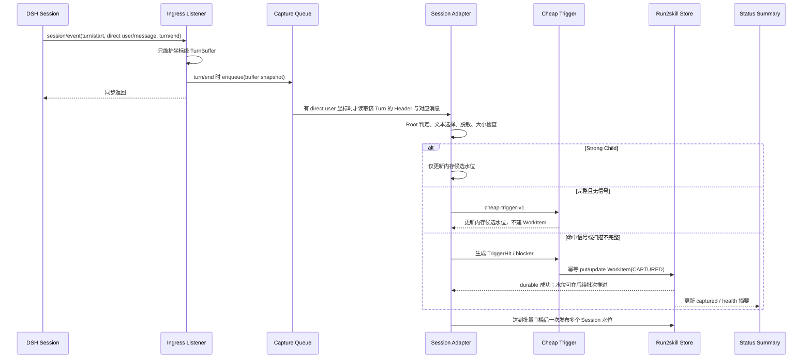

# 切片 A：Observe 设计

状态：已接受；等待拆分 Issues，生产实现尚未开始  
日期：2026-08-19  
适用版本：dsh-run2skill v0.1  
DSH baseline：`99f6f02fecdb7dff40c3fbc9470f5907c29f74ca`（0.1.0-rc.7）

## 1. 结论

切片 A 只建立一条可信的“观察并记账”链路：每个 Root Session 的 `turn/end` 都是一次及时、轻量的判定机会，插件只检查本 Turn 的直接用户输入；命中明确保存、纠正、长期约束或可复用流程后，立即把最小且已脱敏的 WorkItem 持久化为 `CAPTURED`。普通无信号 Turn 不调用模型、不建立 WorkItem、不在 `turn/end` 同步发布 Storage 文件，也不改变用户界面；扫描水位采用写后批处理。本切片不生成 Proposal、不查询或写入 Skill。

这条链路必须同时满足：

- run2skill 的任何异常都不能阻断 DSH 主 Turn；
- 同一 `turn/end` 被实时观察、重启补扫或重复投递时，只得到一个 WorkItem；
- Store 暂不可用时明确说“尚未保存”，不伪装成功，并在恢复后从 DSH Session Log 找回；
- 不长期复制完整 Session、Agent 回复、Tool 输出或未过滤原文；
- Child Session 不独立触发；失败、取消、无模型调用的 Root Turn 仍可记录用户明确表达的经验；
- 无信号热路径只做常数时间 ingress 和有界本 Turn 文本判定；不得读取完整 Session、逐 Turn 写 Store 或显示“正在检查”；
- 内部状态页只显示数量和健康状态，不在本切片提前实现 Proposal Inbox 或审批。

## 2. 范围与阶段门

### 2.1 本切片交付

1. 可由 DSH Web profile 加载、禁用和释放的 Host + Client 双面插件骨架。
2. Root `turn/end` 的实时 ingress 与持久日志 gap scan。
3. 版本化、确定性 Cheap Trigger v1。
4. 写入 DSH Storage Domain 的 durable `CAPTURED` WorkItem。
5. 幂等去重、写后批处理扫描水位、启动恢复、有界重试和 RuntimeNotice。
6. Header 中一个只读状态入口：显示“已记录待处理数量 / 尚未保存 / 恢复中 / 不兼容”。
7. 单元、集成、重启、故障注入、安装生命周期和冻结触发评测。

### 2.2 明确非目标

- 不注入或调用 `ctx.llm`；
- 不生成 Experience、Proposal 或 Curation Decision；
- 不查询 Skill Catalog，不决定 `CREATE/MERGE/DISCARD`；
- 不决定 PROJECT/USER publication，不写 `SKILL.md`；
- 不实现审批、Purge、完整 Inbox、Settings UI 或远程访问；
- 不把 Child Session 内容纳入 Evidence；该能力留给后续有界 Learning Window；
- 不宣称已经完成 Run → Skill 闭环。

### 2.3 已解除与仍保留的门

| 契约 | 状态 | 对切片 A 的意义 |
|---|---|---|
| CP-SES-001 | PASS（Windows） | 可实时观察、区分强 Child、用持久 Session Log 补扫 |
| CP-STO-001 | PASS（Windows） | Web profile JSON backend 可重启恢复和串行更新；SQLite 仅为对照 |
| CP-WEB-001 | PASS（Windows） | 可加载外部 Client、使用 Header slot 和 loopback RPC |
| CP-INS-001 | PASS（探针包） | 单包、`dsh.client`、薄 `dsh.bundle` 的安装形态成立 |
| CP-ROOT-001 | PARTIAL | 不阻塞 Observe；继续锁住后续 PROJECT/USER publication |

## 3. 本设计冻结的关键决策

| ID | 决策 | 原因 |
|---|---|---|
| A-D01 | 每个 Root `turn/end` 都是轻量判定机会，但不是逐轮模型调用、完整日志扫描或 Store 写入点 | 显式保存应及时捕获；性能问题应通过缩小热路径解决，不能靠延迟到第 N 轮而制造漏记窗口 |
| A-D02 | 只扫描 `user/message` 且 `source.kind=user` 的文本 | synthetic、plugin、tool、Agent 和网页内容不能伪装成 HIGH 用户意图 |
| A-D03 | observer 回调只为 `turn/start`、direct `user/message`、`turn/end` 复制坐标/来源事实并维护有界 TurnBuffer，不复制正文，不做正则、文件或 Store I/O | 先用事件类型做常数时间 L0 过滤；DSH 不等待异步 listener，主 Turn 必须 fail open |
| A-D04 | WorkItem ID 由包含 Session 生命周期与 Turn-instance 摘要的 SignalKey 确定性派生 | 实时、补扫、重启和重复事件自然落到同一条记录；上游未 durable 尾部复用 seq 时不会误合并 |
| A-D05 | WorkItem durable 后才算“已记录” | 内存排队或 RuntimeNotice 不能伪装为持久化成功 |
| A-D06 | 物理存储服从 `ctx.storageDomain`；Web baseline 使用 JSON backend | 插件不硬编码 DSH Home、JSON 路径或 SQLite 连接 |
| A-D07 | Store 写失败采用单 signal 有界重试 + 全局低频恢复探测 | 避免无限重试风暴，同时在 backend 恢复后继续 gap scan |
| A-D08 | Slice A Client 只读显示状态摘要，不展示证据正文 | 先证明观察链路，不提前制造半成品审批体验 |
| A-D09 | 触发策略版本固定为 `cheap-trigger-v1`，每个策略带 Session activation fence，版本升级不自动重扫旧历史 | 评测可复现，避免规则升级或水位变化凭空制造重复待处理项 |
| A-D10 | 已确认 Root 生命周期与 Turn 边界但无法完整扫描时，生成 metadata-only blocked WorkItem；身份本身不可证时只记健康状态并重试 | 宁可明确“无法完整判断”，但也不能在身份未知时制造不安全或无法幂等的记录 |
| A-D11 | 命中/blocked WorkItem 立即 durable；无信号水位按“计数或时间”写后批处理 | Web JSON Storage 每次发布都会重写整个 domain，逐轮写水位会把轻量检查变成持续磁盘放大 |
| A-D12 | Slice A 不淘汰 Session 高水位；策略升级使用 activation fence，清理交给后续 Purge | 确定性 ID 只能去重同一策略，不能证明被淘汰水位在新策略下不会重复制造历史记录 |

## 4. 数据流



## 5. 观察边界

### 5.1 Root 判定

- `origin = subagent` 或 `delegationDepth > 0`：强 Child，切片 A 不建 WorkItem；`origin != subagent` 且 `delegationDepth` 缺失或为 `0` 才可按 Root 继续；
- 只有 `parentSession`：不能单凭这一字段判成 Child，仍按 User-facing Root 处理；
- live Session 与持久 Header 都无法提供必要身份：不猜测，记录 `ROOT_IDENTITY_UNAVAILABLE` 健康事件并等待后续 gap scan；
- Root 的 `cwd` 缺失不阻止 USER 意图的观察，但 WorkspaceBinding 记为 `NO_CWD`，后续不得据此推导 PROJECT publication。

### 5.2 Turn 切片

对一个 `turn/end`，Session Adapter 只读取：

1. 同一 Session 中最近的、`turn` 值相同的 `turn/start`；
2. 从该 `turn/start` 到当前 `turn/end` 的闭区间事件；
3. 其中所有 `user/message` 且 `source.kind=user` 的文本 block，按 event seq 和 block 顺序排列。

不读取前一 Turn，不读取附件、resource、图片、Agent message、Tool input/output、plugin 或 synthetic user-role message。`turn/end.reason` 只作为事实记录，不作为成功 Workflow 的证据。

如果日志缺少匹配的 `turn/start`、seq 不连续或 `turn/end` 坐标不一致，本次不猜测文本边界。只有 Session 生命周期身份和目标 `turn/end` 已可确定时，才保存 metadata-only blocked WorkItem，`captureBlockers` 包含 `TURN_BOUNDARY_INCOMPLETE`；否则只记录健康状态、置 `catchupNeeded` 并等待后续 gap scan，水位不推进。

### 5.3 SignalKey 与 WorkItem ID

```text
SignalKey = {
  rootSessionId,
  sessionCreatedAt,
  sessionCwdDigest,
  turn,
  turnEndSeq,
  turnInstanceDigest,
  triggerPolicyVersion: "cheap-trigger-v1"
}

workItemId = "wi_" + sha256(canonicalJson(SignalKey))
```

`sessionCreatedAt + cwd` 是 DSH 当前持久 Header 可提供的 Session 生命周期强身份。`sessionCreatedAt` 保持 DSH 原生的非负安全整数；`sessionCwdDigest` 对带显式 `present/missing` 标签的 Header `cwd` 原始 UTF-8 值计算 SHA-256，不在生命周期身份中做路径规范化，也不持久化绝对路径。路径规范化只属于独立的 WorkspaceBinding。这样即使 DSH 重用同一个 Session ID，也不会与旧生命周期碰撞。`canonicalJson` 使用固定键顺序和 UTF-8。

`turnInstanceDigest` 对 `turn/start` 与 `turn/end` 的 seq/time、按序排列的 direct user message ID 计算摘要，不包含正文。即使上游未 durable 的尾部在硬崩溃后复用相同 turn/seq，新 Turn 也不会错误合并到旧 WorkItem；实时与持久日志看到同一 Turn 时仍得到相同 digest。

策略版本属于 key。新策略首次激活与已有策略重启使用不同协议：首次激活先注册坐标级缓冲、打开 Store、从 durable Session snapshot 取得每个既有生命周期的 `activationFenceSeq`，再把整组 fence 与策略激活事实一次 durable；只有提交成功后，才处理缓冲中 `seq >= fence` 的事件并开始 Observe 承诺。fence 取自 snapshot 时不能把之后进入缓冲的事件算入旧历史。提交失败则保持 `INACTIVE/DEGRADED`，不丢弃缓冲坐标、不宣称正在观察。已有策略重启直接复用已 durable fence，继续 listener-before-gap-scan。新策略不自动重扫 fence 之前的历史；历史重评必须以后续显式 Migration/Backfill 设计执行。

## 6. Cheap Trigger v1

### 6.1 预处理顺序

```text
直接用户文本
-> 去除不可见控制字符并执行 Unicode NFKC
-> 去除规范化后的 fenced code 与引用行
-> URL 凭据编码规范化
-> Sensitive Data Filter
-> 空白归一化、大小写归一化
-> 版本化规则扫描
-> 只截取命中附近的已脱敏证据窗口
```

触发判断可以在进程内读取原消息，但任何 durable 字段和 RPC DTO 都只能使用过滤后结果。摘要 hash 也只对过滤后的规范文本计算，不保存原文 hash。

### 6.2 Trigger 类型与判定

同一 Turn 最多建立一个 WorkItem，可包含多个 TriggerHit。优先级只决定展示顺序，不创建多条记录。

| 类型 | 必须具备的确定性事实 | 正例意图 | 主要负例 |
|---|---|---|---|
| `EXPLICIT_SAVE` | 保存动词 + skill/规则/流程/以后复用等目标，或固定的同义短语 | “把这个流程保存成 Skill” | “文档说‘保存成 Skill’”的引用块 |
| `CORRECTION` | 明确纠错锚点 + 对 Agent 行为的替代/禁止表达 | “不对，以后这里必须先校验” | 普通事实陈述“这个结果不对称” |
| `CONSTRAINT` | 持续范围锚点 + 必须/禁止/只允许等约束 | “这个项目后续只能用中文文档” | 只针对当前一步的临时命令 |
| `WORKFLOW` | 可复用范围锚点 + 明确流程词，或至少两个有序步骤 | “以后遇到 X，先 A，再 B” | 单次任务中的普通待办列表 |

规则词表、邻近窗口和负例排除必须作为版本化 fixture 随代码提交，不散落在组件里。中英文均进入冻结评测；v0.1 不做模糊向量匹配或模型补判。

### 6.3 大小上限与不完整扫描

- 每个直接用户 message 最多扫描 64 KiB UTF-8；
- 每个 Turn 最多扫描 256 KiB UTF-8；
- 每个 EvidenceRef 窗口最多 512 bytes；
- 每个 WorkItem 最多 4 个 EvidenceRef，持久化摘录合计最多 2 KiB。

达到扫描上限时不能把“未看到信号”当成无信号。系统建立 `captureReason=SCAN_INCOMPLETE` 的 metadata-only WorkItem，标记 `TEXT_LIMIT_EXCEEDED`，不持久化被截断正文；后续 Slice B 不得对 blocked WorkItem 启动模型分析。

blocked capture 后续重扫完整时必须收敛：确认有信号则同一 WorkItem 转为 `CHEAP_TRIGGER/CAPTURED` 并清除相应 blocker；确认无信号则转为内部 `RESOLVED_NO_SIGNAL`，不计入 captured/blocked 数量，也不进入 Slice B。不能让已经证明无信号的记录永久占用用户待处理计数。

### 6.4 Sensitive Data Filter

在进入 Store 前至少识别并替换：

- private key block；
- `Authorization` header、Bearer token；
- 常见 API key 形态；
- password/token/secret/credential 键值；
- 明显 Secret 环境变量赋值；
- URL userinfo 中的凭据。

替换值统一为 `[REDACTED]`，并只保存 redaction kind/count，不保存命中的 secret 或其 hash。若过滤器异常，证据正文一律不落盘，WorkItem 标记 `REDACTION_UNAVAILABLE`。

## 7. Durable 数据契约

### 7.1 Storage Domain

```text
domain: run2skill_v1
version: 1
tables: work_items, lineages
global: enabled
```

DSH Storage 名称必须匹配 `^[a-z][a-z0-9_]*$`，所以使用下划线。Slice A 只读写 `work_items` 和 global；`lineages` 保持空表，为已批准 Architecture 的后续切片保留。插件只通过 `ctx.storageDomain`，不直接访问 Web profile 的 JSON 文件。

### 7.2 CaptureWorkItemV1

```ts
interface CaptureWorkItemV1 {
  schemaVersion: 1
  revision: number
  workItemId: string
  signalKey: {
    rootSessionId: string
    sessionCreatedAt: number
    sessionCwdDigest: string
    turn: number
    turnEndSeq: number
    turnInstanceDigest: string
    triggerPolicyVersion: 'cheap-trigger-v1'
  }
  captureReason: 'CHEAP_TRIGGER' | 'SCAN_INCOMPLETE'
  createdAt: string
  updatedAt: string
  turnOutcomeKind: string
  rootIdentity: {
    status: 'ROOT'
    parentSessionId?: string
  }
  workspaceBinding:
    | { status: 'BOUND'; workspaceId: string; canonicalPath: string; observedAt: string }
    | { status: 'NO_CWD' | 'UNREGISTERED' | 'UNAVAILABLE'; observedAt: string }
  scanStatus: 'COMPLETE' | 'INCOMPLETE'
  triggerHits: Array<{
    kind: 'EXPLICIT_SAVE' | 'CORRECTION' | 'CONSTRAINT' | 'WORKFLOW'
    messageSeq: number
    ruleId: string
    confidence: 'HIGH'
  }>
  evidenceRefs: Array<{
    source: 'USER_DIRECT'
    messageSeq: number
    excerpt: string
    excerptDigest: string
    redactionKinds: string[]
    truncated: boolean
  }>
  captureBlockers: Array<
    | 'TURN_BOUNDARY_INCOMPLETE'
    | 'TEXT_LIMIT_EXCEEDED'
    | 'REDACTION_UNAVAILABLE'
  >
  processingState: 'CAPTURED' | 'RESOLVED_NO_SIGNAL'
}
```

切片 A 不写伪造的 Proposal、Review Decision 或 Publication Outcome。那些字段只有在后续切片真的产生对应事实后才出现。`CAPTURED` 是内部处理状态，不对用户声称 `PENDING_REVIEW`；`RESOLVED_NO_SIGNAL` 只是关闭一次曾经不完整的观察，不是产品结果。

### 7.3 GlobalV1

global 保存：

- `schemaVersion` 与 `activeTriggerPolicyVersion`；
- 每个 Session 生命周期、策略版本对应的 `activationFenceSeq`、仅覆盖上游 durable 前缀的 `durableNextSeq`、进程内 observed tail、最后扫描时间和 Header revision/digest；
- 最近健康码的聚合计数，不含正文、秘密或 DSH Home；
- 恢复任务的 cursor 与 `recoveryLag`；
- 最后一次成功 Store 写入时间；
- `checkpointDirty`、待提交水位数量和最近批量 checkpoint 时间。

Slice A 不淘汰已记录的 Session 生命周期水位。后续 Slice D 必须在 Purge/Retention 设计中同时处理 WorkItem、策略 fence 与高水位；在这之前，不能把“重新扫描后 ID 会去重”当作跨策略不重复的证明。

### 7.4 写入顺序与幂等合并

1. 由 SignalKey 计算确定性 `workItemId`；
2. 不存在则 `put`，已存在则校验 SignalKey 完全相同并做单调合并；
3. WorkItem durable 成功后，只在内存中推进 observed tail；无信号与强 Child 也只更新 observed tail；
4. 更新只允许 trigger/evidence 集合去重并集、blocker 减少、完整性提高，以及 `SCAN_INCOMPLETE` 单向收敛到 `CHEAP_TRIGGER/CAPTURED` 或 `RESOLVED_NO_SIGNAL`；不能覆盖 `createdAt`、重新打开已关闭无信号项或缩短既有证据；
   A1 的领域 merge 在同一条共同合法的单调观察链上做可交换、幂等的事实协调，只携带输入中最大的已持久 revision 与最新 `updatedAt`；它不猜测下一次 Store revision。A3 在 compare-revision 写入确认 facts 发生变化后，才分配下一 durable revision。两个 `INCOMPLETE` 观察若 blocker 交集为空，表示输入互相矛盾、不属于同一条合法观察链，而不是“已经完整”；这种输入必须双向结构化失败，不能借合并顺序推导无信号。`NO_CWD`/`UNREGISTERED` 等可演进的非绑定 Workspace 观察按 `observedAt` latest-wins，同时间用固定状态序稳定收敛。
5. 水位采用 write-behind：候选默认达到 32 个已完整扫描的 Root Turn，或距上次 checkpoint 30 秒时，一次提交所有 dirty Session 水位；持久 `durableNextSeq` 只能推进到 `sessionPersistence.listSnapshots/readFrom` 已证明 durable 的连续前缀，绝不能直接采用 live observed tail；这两个批量值是实现候选值，A3 性能探针必须在固定 Web JSON backend 上测量后冻结；
6. 命中或 blocked WorkItem 不等待 checkpoint 批次，立即写入；为避免 JSON domain 连续整文件发布，WorkItem durable 后的水位仍可留到批次提交；
7. WorkItem 成功、水位未成功时，重启会再次扫描并命中同一 ID；水位先于对应 WorkItem 写入是禁止路径。

启动时若发现 Store 的 `durableNextSeq` 高于当前上游 durable tail，说明上游日志发生回退或介质不一致。插件记录 `SESSION_LOG_ROLLBACK`，把水位安全回退到当前 durable tail（不越过 activation fence）并重扫；不能继续用超前水位跳过未来可能复用的 seq。

Storage Domain 没有跨记录事务，所以此顺序以“允许重复扫描、不允许漏记录”为原则。进程在无信号 checkpoint 前崩溃只会重扫一段已完成 Turn；不会延迟当轮的显式保存记录。

## 8. 队列、启动与恢复

### 8.1 进程内队列

- `session/event` listener 只接受 `turn/start`、direct `user/message` 和 `turn/end`；只复制 `sessionId/turn/seq/source.kind` 与必要 Header 坐标，不复制正文；没有 direct user 坐标的 Turn 在 L0 直接结束；
- TurnBuffer 按活动 Session 有界保存当前 Turn 坐标，`turn/end` 后移交队列并清除；异常序列不猜测，交由 gap scan 重建；
- ingress 上限 1024 个坐标；同 SignalKey 在内存中先去重；
- 队列满时不阻断 DSH，合并记录 `INGRESS_SATURATED` RuntimeNotice，置 `catchupNeeded=true`；队列降到低水位后必须立即调度 gap scan，直到持久水位追上，不等待进程重启；
- Capture worker 全局并发为 1。Slice A 没有模型并发，也不为每个 Session 建无限内存队列；
- 队列对象不构成权威状态，进程崩溃后以 Session Log + Store 水位恢复。

### 8.2 无观察空窗的启动顺序

1. 注入 `sessions`、`sessionPersistence`、`storageDomain`、`workspaceRegistry`、`connection`；
2. 注册轻量 ingress listener，并把新坐标暂存在有界启动缓冲；
3. 打开 `run2skill_v1`，校验 schema 和 active policy；
4. 已有策略读取 durable fence/水位；首次策略激活从 durable snapshots 取得 fence 并先持久化整组激活事实；
5. 校验水位不高于上游 durable tail，必要时按 `SESSION_LOG_ROLLBACK` 回退；
6. 对持久 Session 和当前 live Session 执行有界 gap scan；
7. 只把启动缓冲中位于 activation fence 之后的坐标送入同一幂等 capture 路径；
8. 状态从 `RECOVERING` 变为 `READY`，继续实时处理。

如果第 3 步失败，插件进入 `DEGRADED`，保留轻量观察和健康提示，但不宣称任何 signal 已保存；Store 恢复后重新从第 3 步开始。

### 8.3 有界 gap scan

gap scan 先用 `listSnapshots()` 的 revision 跳过未变化 Session；只有 revision 变化时才调用顺序读取。单个调度批次最多处理：

- 64 个发生变化的 Session；
- 返回并处理 10,000 个事件；
- 每处理一个 Session 后检查 50 ms 调度时间片并主动让出事件循环。

DSH Web JSONL 的 `readFrom` 可能为返回一个后缀而解析整个 Session artifact，因此这里不承诺“物理读取不超过 8 MiB”；单次 backend 调用也无法被插件抢占。实现必须用 revision 避免无变化读取，并通过大日志性能/内存测试量化单次最坏成本。到达事件或调度上限即保存 recovery cursor、让出事件循环并调度下一批。存在剩余时状态为 `RECOVERING`，Header 摘要显示恢复中但 DSH 可正常使用。水位只在完整处理一个 Turn 后推进。

### 8.4 Store 失败与重试

每个 Signal 初次写失败后再尝试 3 次，间隔 250 ms、1 s、4 s；同 Signal 同时只允许一个 retry chain。每次失败：

- 主 Turn 保持正常；
- RuntimeNotice 显示“有学习请求尚未保存”；
- 不创建仅在内存里的伪 pending；
- 不启动任何后续 Learning；
- Host 日志只输出结构化健康码和坐标，不输出摘录、路径或异常中的潜在秘密。

单 Signal 重试耗尽后停止该 chain。`DEGRADED` 状态下每 30 秒最多做一次全局 backend 健康探测；探测成功即重新打开 domain 并运行 gap scan。这个探测是全局低频恢复机制，不是对每条 signal 的无限重试。

### 8.5 释放

插件 dispose 时立即停止接收新坐标、取消 retry/scan timer；给尚未提交 Store 的 capture 工作最多 2 秒收口，超时部分留给下次 gap scan。已经提交给 Storage Domain 的写入必须按 DSH backend 的 close 语义排空，不能为了缩短卸载时间把已接收的持久写静默丢弃。实现不得依赖多个 Session 的 dispose 顺序。

## 9. 最小 Web 状态面

Slice A 使用 CP-WEB-001 已验证的 Header action slot 和 loopback RPC，但只提供摘要：

```ts
interface ObserveSummaryV1 {
  apiVersion: 1
  status: 'READY' | 'RECOVERING' | 'DEGRADED' | 'INCOMPATIBLE'
  capturedCount: number
  blockedCaptureCount: number
  unsaved: {
    completeness: 'KNOWN' | 'UNKNOWN'
    knownCount: number
  }
  recoveryLag: boolean
  lastRecoveryProgressAt?: string
  lastHealthCode?: string
}
```

约束：

- RPC 使用 `/run2skill/observe-summary` 且 `authority='loopback'`；
- DTO 不返回 Evidence、Session 原文、绝对路径、DSH Home、异常 stack 或 token；
- Client 首次 mount、窗口重新获得 focus 时刷新；可见时每 10 秒轮询，隐藏时停止；同一时刻最多一个请求；加载中、旧快照和 RPC 不可用必须有不同状态，失败时保留上次值并标记可能过期；
- 文案区分事实：`已记录 n 条待处理事项`、`至少有 n 条尚未保存，完整数量未知`、`正在恢复历史观察`、`当前版本不兼容`；`UNKNOWN` 时绝不能显示“0 条尚未保存”；
- 总状态优先级固定为 `INCOMPATIBLE > DEGRADED > RECOVERING > READY`；高优先级告警不能被较低优先级恢复状态遮住；
- 无信号 Turn 不改变摘要，也不显示逐轮“检查中”；状态入口具备可读标签、键盘焦点和非颜色唯一表达；
- 本切片没有 Approve/Reject/Retry/Purge 按钮，也不把 `CAPTURED` 写成“待审核 Proposal”。

RuntimeNotice 是内存态且按 `healthCode + sessionId + turnEndSeq` 去重；同一 Session 的重复恢复异常按时间窗聚合，避免错误风暴。对应 WorkItem durable 后立即清除该 signal 的 unsaved notice。恢复尚未完成或 RuntimeNotice 可能因重启丢失时，`unsaved.completeness` 必须为 `UNKNOWN`。

## 10. 代码边界与 DSH 装配

### 10.1 目录

```text
src/
├── domain/observe/          # SignalKey、trigger policy、schema、redaction、合并规则
├── application/capture/    # queue、capture use case、recovery、ports
├── adapters/
│   ├── dsh-session/        # event/header/log -> TurnObservation
│   ├── dsh-storage/        # run2skill_v1 domain
│   ├── dsh-workspace/      # WorkspaceBinding
│   └── dsh-connection/     # summary RPC
├── host/                   # Cordis apply、lifecycle、health
└── client/                 # 只读 Header 状态入口
```

### 10.2 Host 注入

Slice A Host 只声明：

```text
sessions, sessionPersistence, storageDomain, workspaceRegistry, connection
```

不得声明或读取 `llm`、`skills`、`settings`。测试 fixture 会提供一个“一旦调用即抛错”的 LLM 哨兵，证明正常、命中、失败恢复路径都没有模型调用。

### 10.3 单包装配

继续采用 Architecture Baseline 已批准的单包：

- root export：Host plugin；
- `./client`：Client bundle；
- `package.json` 的 `dsh.client`；
- 薄 `dsh.bundle` patch：只把 Host 行插入 Web profile；
- 不修改或 fork DSH，不把外部 DSH checkout 纳入发布仓库。

## 11. 故障语义

| 故障 | DSH Agent | Observe 结果 |
|---|---|---|
| observer/trigger 异常 | 不阻断 | 健康码；由 gap scan 重试 |
| Store 不可用 | 不阻断 | 尚未保存 + 有界重试；不伪造 pending |
| Session 日志暂不可读或 durable tail 回退 | 不阻断 | RECOVERING/DEGRADED；水位不前移或安全回退，记录结构化健康码后重扫 |
| Root 身份不可证 | 不阻断 | 仅记健康状态、置 catchupNeeded 并等待补扫；不建 WorkItem、不猜 Child/Root、不推进水位 |
| 文本超限 | 不阻断 | metadata-only blocked capture，不当作无信号 |
| redaction 异常 | 不阻断 | 不保存正文；blocked capture |
| Workspace 无法解析 | 不阻断 | 保存 UNREGISTERED/UNAVAILABLE；不推导 PROJECT |
| Client/RPC 不可用 | 不阻断 | durable WorkItem 保留；Host 健康日志可诊断 |
| 插件 disable/uninstall | 不阻断 | 停止新观察；不删除 DSH Session、run2skill 数据或原生 Skill |

恢复保证从 DSH Session Log 已 durable flush 的事件开始成立。如果进程在上游日志 durable 之前崩溃，且 run2skill 也尚未形成 WorkItem，插件没有独立事实来源可以承诺找回；实现和 UI 不得把这个上游边界描述为“绝不丢失”。若 WorkItem 已先 durable，则 `turnInstanceDigest` 防止上游尾部回退后复用 turn/seq 时误合并；持久水位仍不得领先上游 durable 前缀。

## 12. 测试与可复核证据

### 12.1 Unit

- Root/Child 判定矩阵，覆盖 live 缺失 `delegationDepth` 与 Web JSONL 重载后归一化为 `0`；
- Turn 切片、多 direct user message、failed/cancelled/no-model reason；
- SignalKey canonicalization、Session 生命周期与 turn-instance digest、确定性 WorkItem ID；
- 四类 Trigger 的中英文正/负样例、引用/code/synthetic/tool 排除；
- redaction、文本上限和 evidence byte cap；
- 单调合并、重复事件和非法同 ID/不同 SignalKey 冲突；
- 水位不早于对应 durable WorkItem，write-behind 重放仍幂等；策略 activation fence 阻止升级后重扫旧历史；
- Unicode NFKC、全角/编码 URL 凭据和 synthetic/invalid secret fixture，证明先规范化再脱敏；仓库 secret scanner 通过。
- 为 Store、Session reader 和 redaction 注入包含 synthetic secret、绝对路径、摘录与 stack 的异常，捕获 Host 日志并断言只出现 allowlist 中的 healthCode、不可逆会话坐标摘要与计数；禁止记录原始 Error、message 或 stack。

### 12.2 Integration

- 真实 DSH Session Store + Session Persistence：实时与 gap scan 汇合为一条记录；
- 真实 Storage Domain + Web JSON backend：写入、重启、重复补扫、故障恢复；
- Store 首次失败、三次 retry、全局恢复探测；
- 启动 gap scan 期间注入新的 `turn/end`，证明无观察空窗；
- queue saturation 后无需重启，队列降到低水位即从日志恢复；
- blocked capture 重扫后分别收敛为 `CHEAP_TRIGGER/CAPTURED` 或 `RESOLVED_NO_SIGNAL`；
- 使用真实 Web Session JSONL 与 SQLite 对照后端，验证生命周期 key、revision skip 和 gap reader；
- 硬崩溃子进程分别停在“上游 durable 前”“turn/end 已 durable、WorkItem 前”“WorkItem 已 durable、上游 tail 未 durable”“WorkItem 后、checkpoint 前”，并覆盖同 lifecycle 复用 seq，验证恢复边界、digest 去重和水位回退；
- 首次策略激活在 snapshot、fence commit 与缓冲处理各点注入并发事件和崩溃，证明 fence 之前明确忽略、fence 之后不漏记；
- loopback summary 成功，LAN/cross-origin 仍在业务 handler 前拒绝；
- LLM 哨兵调用次数始终为 0。

### 12.3 无信号热路径性能门

在固定 Web profile JSONL Session + JSON Storage backend 上，以插件禁用为基线，运行不少于 10,000 个普通无信号 Root Turn 和混合多 Session soak：

- 同步 ingress listener 只复制坐标，记录相对基线的 p95/p99 增量；当前候选验收线为 p99 不超过 1 ms。若测试环境无法稳定分辨，A3 PR 必须提交 Slice A Design amendment 并取得明确批准后才能改变验收判据；
- 普通无信号 Turn 的 WorkItem 写入与 UI 更新均为 0；Storage publish 只能来自批量 checkpoint，不能与 Turn 数一一对应；
- 记录 worker CPU、单次 JSONL `readFrom` 延迟/峰值内存、队列最大滞后、catch-up 时间和 30 分钟 heap 趋势；不得出现无界增长；
- 用结果确认或调整“32 Turn / 30 秒”checkpoint 候选值。调整只能改变无信号水位批次，不能延迟命中/blocked WorkItem 的立即持久化。

### 12.4 Frozen Evaluation

由维护者评审并冻结版本化 fixture，至少分层覆盖：

- `EXPLICIT_SAVE/CORRECTION/CONSTRAINT/WORKFLOW`；
- 中文、英文、混合语言；
- direct user、引用外部文本、代码、synthetic/tool 来源；
- 失败/取消 Turn；
- 长文本和含 secret 文本；
- 明确正例、硬负例和边界例。

切片 A 验收门槛直接采用 PRD：显式保存召回率 100%，Cheap Trigger precision ≥ 90%，recall ≥ 90%，普通无信号 Turn 不产生 WorkItem 的比例 ≥ 95%。评测脚本输出版本、样本数、混淆矩阵和失败样例 ID，不输出秘密正文。

### 12.5 E2E

在真实 Web profile：

1. 安装候选包并看到 Header 状态；
2. 普通 Turn 不产生 WorkItem；
3. 明确“保存成 Skill”后显示 1 条已记录；
4. 重启 DSH 后数量仍为 1；
5. 人工重复投递同一 `turn/end` 仍为 1；
6. 注入 Store 不可用，显示“尚未保存”，主 Turn 正常；恢复后 gap scan 形成 1 条；
7. Child Session 不增加数量；
8. disable 后不再观察；upgrade 保留数据；uninstall 不删除 DSH Session 或已有 Skill。
9. 连续普通 Turn 不逐轮发布 Storage；明确保存所在 Turn 仍立即显示为已记录。

## 13. 切片 A 验收标准

全部满足才可以进入切片 B Design/Implementation：

- 双面插件在固定 DSH baseline 的 Web profile 可安装、加载、禁用、升级、卸载；
- Root 明确信号先形成 durable `CAPTURED`，且 Client 文案不把它冒充 Proposal；
- 同一 SignalKey 在实时、gap、重启、重复投递和写后水位失败场景下始终只有一个 WorkItem；
- 每个 Root Turn 仍被及时判定，但普通无信号 Turn 不在 `turn/end` 同步发布 Storage，10,000 Turn 压测中 checkpoint publish 不得与 Turn 一一对应；热路径性能门和 catch-up soak 通过；
- Store/trigger/Client 故障均不阻断正常 DSH Turn；
- Store 未确认写入时一定显示“尚未保存”，恢复后可补回；
- Child 不独立触发；失败/取消 Turn 的直接用户信号可捕获；
- Store/RPC 没有未过滤原文、Whole Session、Tool output、秘密值或无必要绝对路径；
- 所有路径的 LLM 调用数为 0；
- 冻结评测达到 PRD 门槛；
- CP-SES、CP-STO、CP-WEB、CP-INS 在最终候选包上复跑通过；
- DSH 核验 checkout 仍位于固定 commit、状态 clean，且没有本地 patch。

切片 A 的全部验收项通过并冻结 WorkItem/ObserveSummary 契约后，才开始切片 B 的独立 Design。切片 B 不能在切片 A 仍有未收口恢复或性能风险时并行进入生产实现。

## 14. Design 批准后的候选 Issue 拆分

本设计接受后创建 Issues，建议按以下依赖顺序：

1. **A1 Domain contracts**：SignalKey、CaptureWorkItemV1、schema、redaction、trigger fixture。
2. **A2 Session adapter**：Root 判定、TurnObservation、live ingress、gap reader。
3. **A3 Durable capture**：Storage Domain、幂等 merge、write-behind 水位、activation fence、RuntimeNotice 与无信号性能基线。
4. **A4 Recovery lifecycle**：启动缓冲、有界扫描、retry、degraded recovery、dispose。
5. **A5 Observe summary**：loopback RPC 与只读 Header UI。
6. **A6 Package/E2E**：单包 manifest、薄 bundle patch、安装生命周期、硬崩溃矩阵、secret scan 和冻结评测门。

每个 Issue 都必须带独立验收测试；A1 → A2 → A3 为主依赖链，A4/A5 可在 A3 契约冻结后并行，A6 最后收口。这里形成 issue-ready breakdown；Issue 创建与实现仍按公开仓库的维护流程推进。

## 15. 已知取舍

- Web baseline 的 JSON backend 每次写入会原子重写整个 domain 文件，所以普通无信号 Turn 的水位必须批量发布；HIGH/blocked WorkItem 仍立即发布。E2E 必须加入 500 条 WorkItem 的写入/重启基准并记录结果。若实际延迟不可接受，先形成 Storage ADR，不得在插件内私开 SQLite。
- 在极低流量下，30 秒时间门可能为一个孤立 Turn 单独做一次延迟 checkpoint；它不处于用户 Turn 热路径，且最多每 30 秒一次。A3 用真实数据决定是否把时间门调大；不能为了减少这类低频写入而延迟显式 signal 的立即持久化。
- 本地 deterministic trigger 不理解所有自然语言，质量靠冻结评测和版本化规则提升；不能用隐式 LLM 补判破坏“无信号不调用模型”。
- metadata-only blocked WorkItem 会在极端长文本或日志损坏时暂时增加一个需关注事项，这是为了避免把不完整观察错误解释为“没有信号”；完整重扫后必须关闭无信号项。
- Slice A 只显示摘要，用户暂时不能处理 CAPTURED；它是开发切片，不作为独立完整产品发布。
- Slice A 暂不提供用户可操作的 Retention/Purge；公开 Alpha 必须等切片 D 的数据保留、配额与 Purge 验收通过。测试 Secret 必须全部是 synthetic/invalid 值。

## 16. 接受记录

维护者于 2026-08-19 接受本 Design，并同时接受 Architecture Baseline 中标记为 2026-08-19 的 Observe 频率/身份窄修订，以及 A-D01 至 A-D12、数据/恢复契约、最小状态 UI、验收标准和候选 Issue 划分。后续仍按 `Design → Review → Issues → Implementation → Tests → PR` 逐门推进；本记录不等于产品发布，也不允许跳过切片 A 验收直接进入切片 B/C 生产实现。
