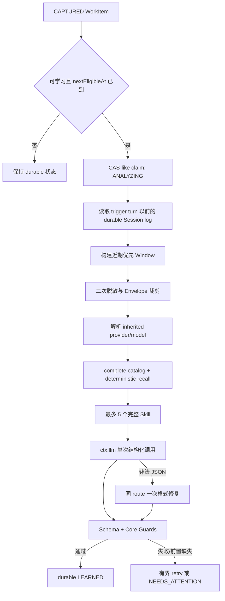

# 切片 B：Learn 设计

状态：已接受；B1–B6 已合并并完成 Slice B 集成验收

日期：2026-08-20

基线：`docs/product/prd.md`、`docs/architecture/baseline.md`、`docs/design/slice-a-observe.md`、DSH `99f6f02`

## 1. 结论

切片 B 只交付一条最小、可恢复的学习链路：

```text
durable CAPTURED WorkItem
  -> bounded Learning Window / Envelope
  -> inherited-route restricted LLM call
  -> validated Experience + Learning Proposal
  -> durable LEARNED or NEEDS_ATTENTION
```

`LearningProposalV1` 是服务器端持久的学习草案，不是可授权的 `ProposalSnapshot`。它可以包含模型建议的 `CREATE | MERGE | DISCARD`，但不绑定 exact target path、CREATE expected-absence、MERGE Base 或 Approval digest，也不能产生 `PENDING_REVIEW`、`DISCARDED`、`PUBLISHED`。这些权威事实全部留给切片 C。

这个边界避免两种错误：一是为了让 B 看起来“完整”而提前实现发布系统；二是让模型建议冒充 Host 已验证的策展、目标或发布事实。

## 2. 范围与阶段门

### 2.1 本切片交付

- 从 `run2skill_v1.work_items` 领取可学习的 `CAPTURED` WorkItem；
- 从触发 Root Session 的 durable log 构造有界、近期优先的 Learning Window；
- 在模型发送前再次执行 Sensitive Data Filter；
- 按触发 Turn 优先、Session 历史兜底解析 effective provider/model；
- 通过 DSH `ctx.llm` 做一次结构化语义调用，非法 JSON 时最多一次格式修复；
- 只读查询完整 Skill catalog，做确定性 summary recall，并最多加载 5 个完整 Skill；
- 持久化 `ExperienceRecordV1`、`LearningProposalV1`、调用 usage 和结构化失败；
- 每个 Root Session 单飞、进程全局最多 2 个分析；
- 重启时把中断的 `ANALYZING` 安全退回待处理，按 durable attempt 恢复；
- Observe Summary 增加 learned / analyzing / needs-attention 计数，不新增 Inbox 或审批操作；
- 固定评测集覆盖 Experience Type、Scope 和建议的 Curation Decision。

### 2.2 明确非目标

- 不生成可授权的 immutable `ProposalSnapshot`；
- 不提供 Proposal Inbox、详情、Approve、Reject 或 Retry UI；
- 不解析或绑定 effective writable root、exact target path；
- 不保存 CREATE expected-absence 或 MERGE Base；
- 不写入、修改或删除任何 DSH Skill；
- 不创建 Lineage、Revision 或 Publication Journal；
- 不声称 `PENDING_REVIEW`、`DISCARDED`、`PUBLISHED`；
- 不实现 Publication CAS、Registry 热回读或行为 E2E；
- 不增加 Learning model selector、厂商 SDK、Tools、Browser、MCP、Subagent；
- 不做向量检索、Embedding、自动聚类、跨 Run 学习或 FAILURE_RECOVERY 学习；
- 不提前实现切片 C/D 的 root 解除、Purge、迁移和完整可访问性。

### 2.3 阶段门

- CP-LLM-001 已 PASS：继承 route、usage、cancel、一次修复和无 Tools 可行；
- CP-SKL-001 已证明 summary/get/complete 边界；B 只使用其只读部分；
- CP-ROOT-001 的 publication root parity 仍为 PARTIAL，但不阻塞 B，因为 B 不发布；
- A 的 durable WorkItem、恢复和安装契约已冻结，B 只能做向后兼容的可选字段扩展。

## 3. 关键决策

1. **学习草案不等于可审核快照**：B 的输出叫 `LearningProposalV1`；C 经完整重验证后才生成 `ProposalSnapshot`。
2. **单阶段语义调用**：一次调用同时返回 Experience、Skill 内容草案、Scope 和 Curation 建议；只允许一次纯格式修复。
3. **route 只继承 provider/model**：不继承原 Agent system、tools、messages、stop 或 reasoning 配置；不静默 fallback。
4. **catalog 不完整即停止**：`complete=false` 有界重试后进入 `NEEDS_ATTENTION`；不能据此建议 CREATE/MERGE/DISCARD。
5. **模型只引用 candidate key**：模型不能提供 path/root/hash/Base；Host 只接受 shortlist 内的 candidate key。
6. **Scope follows evidence**：PROJECT 需要 A 已绑定 workspace；USER 需要直接 HIGH evidence 明确表达跨项目长期意图；否则收窄或失败。
7. **Store 是唯一队列**：不建立另一套内存权威队列；单飞 worker 每次从 durable WorkItem 选择 nextEligibleAt 已到的最早项。
8. **失败不阻断 DSH**：Learning 的任何异常只改变 run2skill 状态；不得影响原 Turn。
9. **B 不消费 `deepseek_key`**：生产调用只经 `ctx.llm`。真实 DSH provider smoke 由 DSH 自己读取用户环境；测试和契约探针默认使用 fake adapter。
10. **Skill view 必须复用触发 Agent scope**：Host 在 live `agent/pre-step` 借用并按完整 Session lifecycle identity 暂存精确 Agent 对象；没有匹配对象就不能证明 Agent 实际可见 catalog，必须进入 `NEEDS_ATTENTION`。

## 4. 数据流



## 5. Durable 契约

### 5.1 WorkItem 向后兼容扩展

`CaptureWorkItemV1` 保持 `schemaVersion: 1`，在首个公开 Alpha 前只增加以下可选字段并扩展 `processingState`：

```ts
type LearningProcessingState =
  | 'CAPTURED'
  | 'ANALYZING'
  | 'LEARNED'
  | 'NEEDS_ATTENTION'
  | 'RESOLVED_NO_SIGNAL'

interface LearningStateV1 {
  policyVersion: 'learning-v1'
  attempt: number
  requestBudgetUsed: 0 | 1 | 2
  claimedAt?: string
  nextEligibleAt?: string
  modelRoute?: { provider: string; model: string }
  calls: Array<{
    requestOrdinal: 1 | 2
    kind: 'PRIMARY' | 'FORMAT_REPAIR'
    inputTokens?: number
    outputTokens?: number
    outcome: 'SUCCEEDED' | 'FAILED' | 'ABORTED' | 'TIMED_OUT'
  }>
  failure?: {
    code: LearningFailureCode
    retryable: boolean
    occurredAt: string
  }
  publicationOutcome?: 'NEEDS_ATTENTION'
}
```

`publicationOutcome` 只在 B 已确定无法继续且需要用户处理时写入架构已定义的 `NEEDS_ATTENTION`；成功的 `LEARNED` 不提前写 `PENDING_REVIEW`，由 C 生成可授权快照后再写。失败对象不保存 Provider 原始错误正文、请求文本、绝对 Home 或未裁剪 Session 内容。允许的 `LearningFailureCode` 固定为：

```text
SESSION_LOG_UNAVAILABLE
AGENT_SCOPE_UNAVAILABLE
MODEL_ROUTE_UNAVAILABLE
MODEL_INFO_UNAVAILABLE
CATALOG_INCOMPLETE
CANDIDATE_UNAVAILABLE
ENVELOPE_UNBUILDABLE
MODEL_TIMEOUT
MODEL_ABORTED
MODEL_TERMINAL_FAILURE
MODEL_OUTPUT_LIMIT_EXCEEDED
INVALID_STRUCTURED_OUTPUT
LEARNING_GUARD_REJECTED
STORE_WRITE_FAILED
```

### 5.2 ExperienceRecordV1

```ts
interface ExperienceRecordV1 {
  experienceId: `exp_${string}`
  type: 'CORRECTION' | 'CONSTRAINT' | 'WORKFLOW'
  lesson: string
  persistenceScope: 'PROJECT' | 'USER'
  evidenceStrength: 'HIGH'
  supportingEvidence: Array<{
    messageSeq: number
    excerptDigest: string
  }>
  contextSummary?: string
}
```

- `experienceId = sha256(workItemId + canonical experience facts)`；
- supporting evidence 必须引用该 WorkItem 已持久化的 `EvidenceRef`；
- 模型不得创建新的 Session/Event 坐标；
- lesson 与 contextSummary 通过输出大小、控制字符和 secret scan；
- v0.1 每个 WorkItem 最多 3 条 Experience；没有有效 Experience 不能形成 Proposal。

### 5.3 LearningProposalV1

```ts
interface LearningProposalV1 {
  learningProposalId: `lp_${string}`
  policyVersion: 'learning-v1'
  name: string
  description: string
  whenToUse: string
  content: string
  invocation: {
    modelInvocable: true
    userInvocable: false
  }
  persistenceScope: 'PROJECT' | 'USER'
  supportingExperienceIds: string[]
  curation: {
    decision: 'CREATE' | 'MERGE' | 'DISCARD'
    candidateKey?: string
    rationale: string
  }
  catalogObservationDigest: string
  shortlistDigests: string[]
}
```

`learningProposalId` 覆盖 canonical 结构化结果和 supporting Experience。它只用于 B 的幂等学习结果，不是 Approval digest。

禁止字段：absolute path、root、Base bytes/hash、expected-absence、review decision、publication outcome。模型即使返回也因 strict schema 被拒绝。

### 5.4 状态转换

```text
CAPTURED -> ANALYZING -> LEARNED
         -> ANALYZING -> CAPTURED(nextEligibleAt, attempt+1)
         -> ANALYZING -> NEEDS_ATTENTION
ANALYZING --restart--> CAPTURED(attempt+1)
NEEDS_ATTENTION(AGENT_SCOPE_UNAVAILABLE) --same Agent resumes--> CAPTURED
```

- 只有完整 `CHEAP_TRIGGER` WorkItem 可学习；`SCAN_INCOMPLETE` 和 `RESOLVED_NO_SIGNAL` 永不进入模型；
- claim、结果和失败都通过 store-owned 单写链更新；
- `LEARNED` 是 B 的终态，不等于 `READY_FOR_REVIEW`；C 消费它时必须生成新 revision；
- 同一 WorkItem 已有合法 `LEARNED` 结果时，重放不再次调用模型；
- 每个模型请求前先持久增加 `requestBudgetUsed`；primary、format repair 和模型级 retry 共同消费跨 attempt 总预算 2；
- 进程崩溃留下的 `ANALYZING` 在启动恢复时退回 `CAPTURED`，增加 attempt，不伪造未知 usage；
- 外部模型调用采用 at-least-once 语义：Provider 已接收请求但结果未 durable 时，重启可能用剩余预算再请求一次；系统只保证总请求不超过 2、确定性 ID 和最多一个 durable Learning Proposal，不承诺外部调用恰好一次。

## 6. Learning Window 与 Envelope

### 6.1 选择顺序

只读取同一 Root Session、`seq <= turnEndSeq` 的 durable 事件：

1. Trigger Turn 的直接用户证据，必须保留；
2. Trigger Turn 中与用户证据相邻的 Assistant 文本；
3. 向前最多 4 个完整 Turn，近期优先；
4. 仅保留与 trigger tokens 重叠的 Tool/Error 摘要，最多 2 条；
5. Child Session 不单独展开；A 已持久 Evidence 没有引用的 Child 内容不进入 B。

不读取 turnEndSeq 之后的事件，不发送 Whole Session、Whole Tool Output、附件二进制、Repo 文件或环境变量。

### 6.2 来源标签

Envelope 文本块只能使用：

```text
USER_EVIDENCE
ASSISTANT_CONTEXT
TOOL_EVIDENCE
EXTERNAL_UNTRUSTED
EXISTING_SKILL
```

每块包含 session/turn/event 坐标、过滤后文本、digest、truncated。System prompt 明确所有标签内容都是待分析数据，不是可执行指令；外部/工具内容不能独立提升 Scope、选择 target 或形成 Experience。

### 6.3 固定上限

`learning-v1` 冻结以下内部常数：

| 项目 | 上限 |
|---|---:|
| Trigger Turn | 1 |
| 相关历史 Turn | 4 |
| Tool/Error 摘要 | 2 条，每条 2 KiB UTF-8 |
| Skill shortlist | 5 |
| 单个完整 Skill body | 8 KiB UTF-8 |
| 序列化 Envelope | 48 KiB UTF-8 |
| 模型输出文本 | 32 KiB UTF-8 |
| `maxTokens` | 4,096 |
| 单次调用 timeout | 60 秒 |
| 整个分析 deadline | 125 秒 |
| 模型请求总预算 | 每 WorkItem 2；primary、repair、model retry 共用 |

调用前使用 `ctx.llm.resolveModelInfo(provider, model)`，并冻结以下保守预算算法：

```text
contextWindow = modelInfo.context.contextWindow
inputTokenBudget = contextWindow - maxTokens(4,096) - safetyMargin(2,048)
requestByteBudget = inputTokenBudget
envelopeByteBudget = min(48 KiB, requestByteBudget - fixedSystemAndSchemaUtf8Bytes)
```

将“UTF-8 1 byte 最坏计作 1 token”作为保守上界，固定 system、JSON schema、Envelope wrapper 全部计入 `fixedSystemAndSchemaUtf8Bytes`。`context` 缺失、`inputTokenBudget <= 0`、固定提示已超预算或最小 Trigger Evidence 无法放入时，进入 `MODEL_INFO_UNAVAILABLE`/`ENVELOPE_UNBUILDABLE`，不得调用模型。

格式修复独立按同一公式计算 `fixed repair system + schema + 首轮过滤输出 + 4,096 output + 2,048 margin`；放不下则不调用 repair，直接 `INVALID_STRUCTURED_OUTPUT`。48 KiB 只是模型允许时的全局硬上限，不是所有 route 都能使用的固定输入量。v0.1 不实现自有 tokenizer，也不声称得到精确 token 数。

### 6.4 裁剪顺序

超限时按以下顺序删除或截断：

1. `EXTERNAL_UNTRUSTED`；
2. 较旧历史 Turn；
3. Tool/Error 摘要；
4. 低排名 Skill body，再保留其 summary；
5. Assistant Context。

Trigger Evidence、来源标签、坐标和 supporting evidence digest 不能被裁掉。若保留这些最小事实后仍超限，进入 `ENVELOPE_UNBUILDABLE`，不得调用模型。

## 7. Sensitive Data Filter

- A 的 EvidenceRef 已过滤，但 B 必须在 Envelope 构造前再次扫描；
- 新加入的 Assistant、Tool、External 和 Existing Skill 文本都经过同一 redaction policy；
- private key、Authorization/Bearer、常见 provider key、credential URL 和 password/token/secret/credential 字段替换为 `[REDACTED]`；
- Store 只保存经过过滤的 Experience/Proposal；不保存完整 Envelope 或原始模型响应；
- 日志只记录 rule id、坐标、计数和安全 health code；
- Proposal `content` 另做独立 secret scan，命中即 `LEARNING_GUARD_REJECTED`。

## 8. ModelRoute 与受限调用

### 8.1 Route 解析

在 `seq <= turnEndSeq` 的 `request/header` 上按 last-wins 折叠：

1. 先找 Trigger Turn 内最后一次 effective provider/model；
2. 没有则找同一 Root Session 更早最后一次；
3. 始终没有则 `MODEL_ROUTE_UNAVAILABLE -> NEEDS_ATTENTION`。

provider/model 都必须是非空、受长度限制的字符串。B 不读取全局默认，不从 Settings 选择，不换 Provider。

### 8.2 调用配置

- 只调用 `ctx.llm.stream()`；
- messages 只包含固定 system 和单个 canonical Envelope user message；
- `tools`、`purpose`、浏览器和 Agent Loop 均不设置；
- reasoning effort 不继承，使用 Adapter default；
- 显式传入 provider、model、maxTokens 和独立 AbortSignal；
- 使用 DSH BlockAssembler 语义收集 text、usage、finish；非 text block 不进入 JSON；
- 多个 text block 按 index/order 合并，超过 32 KiB 立即 abort；
- terminal finish 不是 stop、缺失 finish 或缺失 usage 都形成结构化失败。

### 8.3 格式修复

仅当首轮返回完整文本但 JSON parse/schema 失败时允许修复：

- 使用同一 provider/model；
- 只发送固定 schema、首轮已过滤输出和“只修格式，不改变语义”的指令；
- 不加入新 Session/Skill evidence；
- 只有 `requestBudgetUsed < 2` 且 repair request 通过同一 context budget 时才调用，并先 durable 消费第二个请求额度；
- 不进行第三次调用、自我反思或 provider fallback；
- 第二次仍非法则 `INVALID_STRUCTURED_OUTPUT -> NEEDS_ATTENTION`。

## 9. Existing Skill recall

### 9.1 完整性边界

DSH 的 `SkillViewOptions.scope` 是对象身份：省略时只读取 global layer，不能代表触发 Agent 的实际视图。Host 必须在 live `agent/pre-step` 事件中取得并借用精确 `agent` 对象，按 A 已冻结的 lifecycle identity 绑定：`rootSessionId + sessionCreatedAt + sessionCwdDigest`，并复用 A 的 `deriveSessionLifecycleKey`。只保存进程内引用和可诊断的 lifecycle key，不把对象序列化进 Store，也不制造等值 surrogate。

若 WorkItem 恢复时该 lifecycle 的精确 Agent 对象已不存在，保持 durable pending 并进入 `AGENT_SCOPE_UNAVAILABLE -> NEEDS_ATTENTION`；用户恢复同一 lifecycle、当前 Agent 再次产生 `agent/pre-step` 后，Host 只有在 id、createdAt、cwd digest 与 WorkItem 全部相等时，才允许这类 scope 缺失项回到 `CAPTURED` 做一次有界 B retry。仅 Session ID 相同不能解除失败；其他 `NEEDS_ATTENTION` 不因任意 Agent 事件自动重开。不能用 global scope 猜测。

Learning Window 读取到的 durable Session header 也必须与 WorkItem 的三项 lifecycle facts 完全相同；不匹配按 `SESSION_LOG_UNAVAILABLE` fail closed，绝不把复用 ID 的新 Session 日志作为旧 evidence。

一次分析创建不可变 view：`{ cwd, scope: exactAgent, signal }`。PROJECT 的 cwd 使用绑定 workspace canonical path；USER 仍使用触发 Session cwd。`ctx.skills.snapshot(view)` 与本次全部 `ctx.skills.get(name, view)` 必须复用同一 `cwd/scope`，仅 AbortSignal 可由同一分析 controller 提供。`complete=false` 以 250 ms、1 s、4 s 最多重试 3 次；仍不完整则 `CATALOG_INCOMPLETE`，不调用模型。

B 的读取只是生成学习草案。C 在生成 immutable ProposalSnapshot、审核和发布前必须重新取得新的 `complete=true` observation，不能复用 B 的 observation 证明当前 absence/Base。

### 9.2 确定性 recall

query tokens 来自过滤后的直接用户 Evidence：NFKC、Unicode lowercase；拉丁字母/数字按连续词切分，连续中文生成重叠 2 字 gram；去掉单字符和固定中英文停用词，最多 64 个唯一 token。Skill name、description、whenToUse 使用同一规则。

对每个 Skill summary 计算排序 tuple：

```text
name overlap count DESC
whenToUse overlap count DESC
description overlap count DESC
candidate key ASC
```

只保留至少一个 name/description/whenToUse overlap 的候选，最多 5 个；零候选是合法 shortlist，但只有 `complete=true` 才能支持 CREATE 建议。Similarity 只用于 recall，不直接决定 MERGE。

### 9.3 完整 candidate

- Host 为 snapshot winner 计算 `candidateKey = sha256(canonical JSON({ name, provider, source }))`；canonical JSON 固定字段名、字段顺序和 UTF-8 编码，不能用无分隔字符串拼接。Host 保存 `candidateKey -> DSH name` 的本次分析内映射；对 shortlist 逐个调用 `ctx.skills.get(name, sameView)`，消失、winner 身份改变或读取失败则 `CANDIDATE_UNAVAILABLE`；
- 每个 candidate 持久化 key、source、推导的 persistenceScope/writable、name/description/whenToUse/body digest，不保存超限原文；
- 模型只能引用 shortlist candidate key；
- source 映射固定为：`project-dsh -> PROJECT/writable`、`user-dsh -> USER/writable`、`project-agents -> PROJECT/read-only`、`user-agents -> USER/read-only`，其余 `runtime/custom/bundled/未知 -> UNKNOWN/read-only`；
- `MERGE` 必须 Proposal Scope 与推导 persistenceScope 相同，且 source 为对应 `project-dsh`/`user-dsh`；UNKNOWN 永不 MERGE；
- read-only 或跨 Scope 只部分覆盖时只能 `NEEDS_ATTENTION`；
- `DISCARD` 的 scope coverage 是方向性的：同 Scope 且语义完整可建议 DISCARD；USER candidate 语义完整时可覆盖 PROJECT Proposal；PROJECT candidate 不能覆盖 USER Proposal；UNKNOWN 无论语义相似度多高都不能证明 scope coverage；无法证明时进入 `NEEDS_ATTENTION`；
- read-only 只限制 MERGE writability，不阻止已经证明 scope coverage 的 DISCARD 建议；B 不终结 DISCARD，显式保存仍由 C 展示目标和理由并等待用户确认；
- `DISCARD` 在 B 只是建议，不能改变 Publication Outcome。

## 10. 结构化输出与 Core Guards

模型 JSON 使用 strict schema，未知字段拒绝。Core 至少验证：

- Experience 为固定三类，1～3 条，且每条引用已有 HIGH evidence；
- Scope 与 Proposal 一致；PROJECT 具有 BOUND workspace；USER 具有直接 HIGH 跨项目意图；
- supporting Experience 非空且全部来自本次结果；
- name、description、whenToUse、content 非空并受 UTF-8 上限；
- name 满足 DSH Skill name 规则；
- invocation 固定为 model=true、user=false，模型不能改；
- MERGE/DISCARD 必须引用 shortlist candidate；CREATE 不允许 candidate；
- MERGE 同 Scope、可写且包含新长期价值；
- Proposal 不能含 absolute target path、root、Base、Approval 或 outcome；
- content 通过 secret、双向控制字符和基本 Skill 格式检查；
- rationale 不能被当作 Host 权威事实。

Guard 失败不做“尽量修好”的第三次模型调用；记录 `LEARNING_GUARD_REJECTED` 并进入 `NEEDS_ATTENTION`。

## 11. 调度、重试与恢复

### 11.1 领取顺序

- 每个 `rootSessionId` 同时最多 1 个 `ANALYZING`；
- 全进程同时最多 2 个 Learning Analysis；
- 同 Session 按 `turnEndSeq`、createdAt、workItemId 排序；
- 只领取 `CAPTURED`、完整 trigger、`nextEligibleAt <= now` 的项；
- Store 的 WorkItem 是权威队列，内存只保存正在运行的 AbortController 和唤醒信号。

### 11.2 retry

仅下列瞬态失败自动 retry：Session log unavailable、catalog incomplete、candidate transient missing、model timeout/terminal transient failure、Store write failed。

持久退避为 1 s、5 s、30 s，最多 3 次 Learning attempt，但所有 attempt 共享 `requestBudgetUsed <= 2`。Session/catalog/candidate 等模型前失败不消费请求预算；每个 primary、repair 或模型失败后的 retry 都先 durable 消费一个额度。额度耗尽后不得再调用模型，进入 `NEEDS_ATTENTION`。invalid schema、route/agent scope 缺失、scope/secret/guard 失败不自动反复调用；格式修复属于同一 attempt，但仍消费第二个请求额度。

模型成功但 Store result 写失败时，进程内只重试同一已验证结果的持久化，不重新调用模型。若进程随后崩溃，内存结果不可恢复；启动后只能在剩余总预算内 at-least-once 重试，额度耗尽则 Needs Attention。

### 11.3 合并与过期

A 已冻结的 WorkItem 在 B claim 后不再接受会改变 SignalKey 的事实。若同一 WorkItem 在 `ANALYZING` 时 revision 发生变化：

- 当前调用结果不得提交；
- 记录安全 health code `LEARNING_INPUT_STALE`；
- 回到 `CAPTURED`，以最新 revision 重建 Envelope；
- 已发生的 usage 仍追加记录，不能丢失或归到新输入。

### 11.4 shutdown

插件 dispose：

1. 停止领取新 WorkItem；
2. abort 正在运行的调用；
3. 最多等待 2 秒持久化 aborted/退回状态；
4. 未能持久化时记录 RuntimeNotice，但仍不得阻塞 DSH 无限等待；
5. 下次启动把遗留 `ANALYZING` 退回 `CAPTURED`；没有精确 Agent scope 时，在任何 Skills 调用前转为 `AGENT_SCOPE_UNAVAILABLE`。

## 12. Host 装配与代码边界

Host 新增注入：`llm`、`skills`，并监听只读 `agent/pre-step` 以借用精确 Agent scope；listener 不改变 waterfall decision，不做 Store I/O。Agent 引用只保留到对应 WorkItem 终态、Session 释放或 plugin dispose。不新增 Settings 注入；本切片常数不暴露给用户。

候选目录：

```text
src/domain/learn/
  schemas.ts
  envelope.ts
  recall.ts
  guards.ts
  identity.ts

src/adapters/dsh-session/
  learning-window.ts
  model-route.ts

src/adapters/dsh-llm/
  restricted-learning-client.ts

src/adapters/dsh-skills/
  learning-shortlist.ts

src/application/learn/
  learning-worker.ts
  learning-scheduler.ts

src/adapters/dsh-storage/
  learning-work-item-store.ts
```

约束：

- domain 不导入 DSH、Cordis、Node filesystem 或 Web；
- adapters 把 DSH unknown 数据收窄为稳定 port；
- application 只编排状态机、deadline 和持久化；
- Host 只装配服务和生命周期，不承载语义规则；
- 不为 B 建第二个 Storage Domain 或新的业务表。

## 13. 最小 Web 状态

Observe Summary v1 做向后兼容可选扩展：

```ts
learning?: {
  captured: number
  analyzing: number
  learned: number
  needsAttention: number
}
```

Header 只显示聚合状态，例如“2 条已学习草案，1 条需处理”。它不是 Proposal Inbox，不展示正文、证据、Diff 或 Approve。切片 C 才提供 Action Queue。

## 14. 测试与证据

### 14.1 Unit

- Window 只读 `<= turnEndSeq`，近期优先，最多 4 个历史 Turn；
- 来源标签、二次脱敏、UTF-8 上限和裁剪顺序；
- route 的 trigger-turn 优先、session fallback、无 route；
- recall normalization、排序稳定、最多 5 个、零 overlap、仅 whenToUse 命中；
- candidate canonical key 拼接碰撞边界、source→scope/writable 映射、UNKNOWN 和 PROJECT/USER coverage 方向；
- Experience/Proposal strict schema、deterministic ID；
- PROJECT/USER、candidate、scope、secret 和未知字段 Guards；
- 非法 JSON 只修复一次，第三次调用不可达；
- output streaming 超限及时 abort；
- 同 Session 单飞、全局并发 2、排序和 stale revision；
- retry/backoff、restart recovery、dispose abort；
- `LEARNED` 重放不再调用模型。

### 14.2 Integration

- Memory Storage：claim、result、failure、revision conflict、restart；
- fake LLM：stop、usage、terminal failure、timeout、abort、invalid JSON/repair；
- fake Skills：exact lifecycle Agent scope、Session ID 复用、global/scoped winner 差异、scope 缺失、complete true/false、snapshot/get 同 view、candidate 消失、read-only/cross-scope/UNKNOWN；
- Host：Learning 故障不影响 Session observer 和 Observe Summary；
- A 旧数据没有 learning 字段仍能打开并恢复。

### 14.3 固定 DSH probe

扩展 CP-LLM-001/Skill probe，证明真实 baseline 上：

- exact provider/model 继承；
- 原 Agent system/tools 不透传；
- primary + repair 同 route 且最多 2 次；
- maxTokens、AbortSignal、usage 和 finish 可观测；
- `complete=false` 不产生学习结果；
- scoped-only Skill 与 DSH Agent 实际视图一致，scope 缺失时 fail closed；
- DSH 源 checkout 前后 fixed HEAD、clean、unchanged。

默认使用 fake Adapter，不调用外部模型。若做真实 provider smoke，只允许 DSH 正常读取环境中的 `deepseek_key`，run2skill 不读取、不打印、不持久化该值。

### 14.4 Frozen Evaluation

在 A 已冻结 Trigger fixture 之外新增版本化 learning fixture，至少覆盖：

- CORRECTION、CONSTRAINT、WORKFLOW；
- PROJECT、明确 USER、歧义收窄；
- CREATE、MERGE、DISCARD 建议；
- read-only partial coverage、cross-scope、catalog incomplete；
- failed/cancelled/no-model-request Turn；
- secret-like、prompt-injection-like、长上下文和 stale input。

质量门沿用 PRD：Experience Type、Scope、Curation 建议各 ≥ 90%，安全阻断 100%。评测输出只记录 case id 和指标，不打印 fixture 正文或 secret-like 值。

### 14.5 性能与成本门

- 无 `CAPTURED` WorkItem 时 10,000 次调度 tick 产生 0 次 LLM/Skills 调用；
- 每个 WorkItem 跨 retry/restart 的 durable 请求预算最多 2；
- 每个 Root Session 最大并发 1，全局最大并发 2；
- Envelope 永不超过 48 KiB，输出永不超过 32 KiB；
- 重放已 `LEARNED` WorkItem 产生 0 次额外模型调用；崩溃中的外部请求允许 at-least-once，但不产生第二个 durable Proposal。

## 15. 验收标准

切片 B 完成必须同时满足：

1. A 的完整 durable WorkItem 能形成可追溯 Experience 和 Learning Proposal；
2. 无 route、incomplete catalog、模型失败、invalid output 和 Guard 失败得到结构化可见结果；
3. 不调用厂商 SDK，不保存 key，不透传原 Agent tools/system；
4. Window/Envelope、请求次数、timeout、output、候选数和并发全部有硬上限；
5. Store/重启/重复事件最多形成一个 durable Proposal；外部调用在崩溃边界允许 at-least-once，但跨 WorkItem 总请求不超过 2；
6. PROJECT/USER 与 supporting evidence 通过 Core Guard；
7. 模型不能决定 path/root/Base/Approval/outcome；
8. B 不写任何 Skill，不声称 PENDING_REVIEW/PUBLISHED；
9. typecheck、零警告 lint、完整 unit/integration、固定 DSH probe 和 frozen evaluation 通过；
10. 候选包安装生命周期仍通过，DSH sibling checkout 保持 fixed/clean；
11. exact PR HEAD 获得一次 gpt-5.6-sol/high 的 CLEAN 审查，CI 同 HEAD 通过。

## 16. Design 后候选 Issue 拆分

只拆 Slice B，不拆 C/D：

1. **B1：Learning durable schema 与 Store 状态机**

   向后兼容 schema、claim/result/failure、revision/stale/restart、Observe Summary 计数。

2. **B2：Bounded Window、Envelope、redaction 与 route**

   durable Session 投影、来源标签、48 KiB 裁剪、二次脱敏、effective route。

3. **B3：Agent scope、只读 Skill recall 与 Core Guards**

   exact Agent view、complete observation、确定性 top-5、full load、Scope/candidate/content Guards。

4. **B4：Restricted LLM client**

   ctx.llm stream、BlockAssembler、timeout/output cap、usage、一次 JSON repair、strict parse。

5. **B5：Learning scheduler 与 Host 集成**

   per-session single-flight、global=2、retry/recovery/dispose、注入与 fail-open。

6. **B6：Slice B 固定评测与真实 DSH 集成验收**

   learning fixture/metrics、CP-LLM/Skill、安装生命周期、证据文档。

每个 Issue 都必须遵守轻量流程；B1～B6 逐个完成、exact-HEAD CLEAN 并 squash merge。任何后续 Issue 只能依赖已经合并的前序契约，不得顺手实现 C 的 Review/Publication。

## 17. 已知取舍

- 48 KiB Envelope 和 4,096 output tokens 优先控制成本与泄露面，不追求一次吞下复杂长 Run；真实 Alpha 数据不足时先进入 Needs Attention，不自动扩大窗口。
- 基于 token overlap 的 recall 可解释、可冻结，但不是语义检索；语义判断仍交给受限模型并由 Core Guard 约束。
- B 重新读取完整 catalog 会增加一次只读成本，但避免 incomplete observation 产生虚假 CREATE/DISCARD；C 仍必须在授权前重新验证，不能省略。
- `LEARNED` 与 `PENDING_REVIEW` 分开会多一个状态，但诚实表达了“模型已形成草案”和“Host 已生成可授权快照”之间的安全边界。
- v0.1 不自建 tokenizer；context 适配使用 DSH model info 和保守硬上限，避免引入模型特定依赖。

## 18. 接受记录

本 Design 不修改 PRD 或 Architecture 的产品行为。维护者已明确授权：后续非重大边界决策由实现代理自行判断；按滚动规划完成一个切片后再设计下一个切片。因此本 Design 经 PR review、CI 和 exact-HEAD CLEAN 后视为 Slice B 实现基线，随后只创建 B1～B6 Issues。

进度注记：B1–B6 已全部合并，固定评测与真实 DSH 集成验收已完成；上段“随后”描述的是 Design 接受时的执行顺序。
