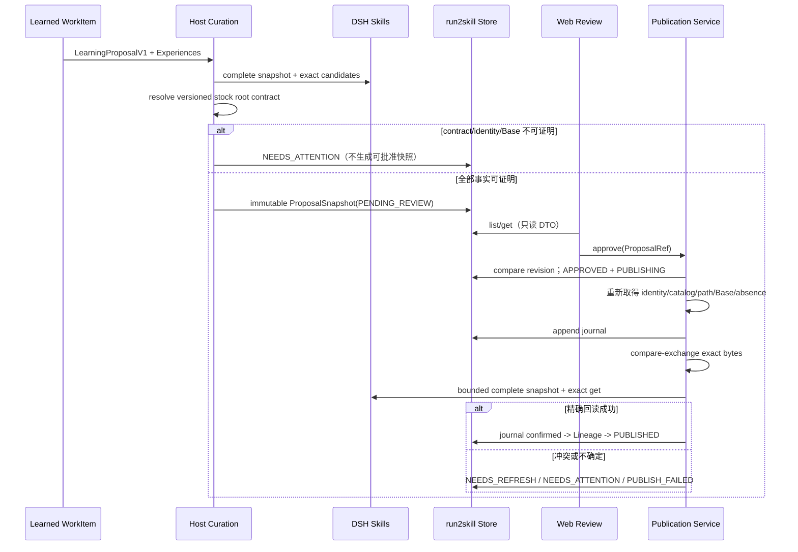

# 切片 C Design：最小安全闭环

状态：已接受；C1–C6 已合并；C7 暂停，先完成纯插件 root-contract 修正 #48
设计日期：2026-08-20
对应 Issue：#31
前置契约：已接受的 PRD、Architecture Baseline、切片 A/B，以及 CP-SKL-001、CP-PUB-001、CP-WEB-001 运行证据

## 1. 结论

切片 C 把已经持久化的 `LearningProposalV1` 变成一个真正可用、可审核、可安全发布的 DSH Skill 闭环：

```text
LEARNED
  -> Host 重新取得完整 Skill Catalog、可证明 root 和文件事实
  -> immutable ProposalSnapshot
  -> DSH Web 人工 Review
  -> immutable Approval
  -> CREATE / MERGE compare-exchange
  -> complete Registry + exact get 回读
  -> PUBLISHED
```

本切片不允许用浏览器内容、模型建议、默认路径或普通覆盖写入替代 Host 权威事实。`APPROVED` 只表示用户授权；只有写盘、热刷新和精确回读全部成立，才记录 `PUBLISHED`。

切片 C 的生产闭环采用 `docs/adr/0001-stock-dsh-publication-root-contract.md`：只支持固定 baseline 官方 `web` profile 的默认 filesystem roots，不依赖 DSH fork、未合并 roots API 或本地 patch。C1–C6 已合并，Issue #48 已把候选 `snapshot.roots` 绑定迁移为版本化纯插件 contract 并通过 CP-ROOT-003；C7 之后仍独立执行最终验收。配置、身份或 exact readback 无法证明时，Proposal 进入 `NEEDS_ATTENTION`。

## 2. 范围与阶段门

### 2.1 本切片交付

- 把模型给出的 `LearningProposalV1` 重新绑定为 Host-owned immutable `ProposalSnapshotV1`；
- 用完整 Effective Catalog 完成 CREATE、MERGE 或需用户确认的 DISCARD 策展；
- 证明 PROJECT/USER Workspace/DSH Home、版本化默认 root contract、文件身份和 exact target；
- durable Review Decision、Publication Outcome、Journal 和 Lineage revision；
- 本机可信的 Proposal Inbox、详情、Approve、Reject 和 Retry；
- CREATE/MERGE compare-exchange、target 串行、崩溃恢复和精确回读；
- CREATE PROJECT、MERGE、Base Conflict、CREATE USER 四个黄金场景的真实 DSH 证据。

### 2.2 明确非目标

- 不自动发布，不提供 Approve All、远程审批、CLI/TUI 审批旁路或浏览器编辑器；
- 不实现 PROJECT → USER promotion、跨 Scope MERGE、Local Override 或自动 rename；
- 不实现 Purge、Settings UI、完整 History、Rollback UI 或 retention；
- 不实现 source-control publication，不运行 `git add/commit/push`；
- 不修改、vendor 或 runtime patch DSH，不复制 Skill Registry；
- 不依赖 DSH fork、未合并 roots API、本地 patch、自有 Skill provider 或 sentinel 探测；
- 不提前实现切片 D 的安装、升级、迁移和产品化硬化。

### 2.3 进入实现的阶段门

Design 合并后才拆切片 C 实现 Issues。每个 Issue 仍执行轻量流程：一次范围审计、测试先行、最小实现、一次简化自审、完整本地门禁、必要 DSH 探针、Draft PR、exact-HEAD `gpt-5.6-sol/high` 审查 CLEAN、CI 通过后自动 squash merge。

### 2.4 允许发布的运行时阶段门

CREATE/MERGE Proposal 只有同时满足下列事实，才能进入 `PENDING_REVIEW`：

1. `ctx.skills.snapshot()` 是 `complete: true`；
2. 版本化官方默认 root contract、resolver version/digest 与受支持的 baseline/profile/config 匹配；
3. PROJECT workspace identity 或 USER DSH Home identity 可重新验证；
4. MERGE 的完整 Catalog winner 由原生 filesystem provider 提供，source/path 与标准 root 精确匹配；CREATE 的批准目标精确位于标准 root；
5. CREATE expected-absence 或 MERGE exact Base 可证明；
6. canonical Skill bytes 已由 Host 生成并通过格式与 secret Guard。

缺少任一事实都进入 `NEEDS_ATTENTION`。这不是临时错误旁路，也不能由用户点击 Approve 绕过。

显式保存请求的 DISCARD 不执行 publication，因此不要求 writable root、写入 target 或 Base/absence；它必须绑定 `complete: true` Catalog 中证明完全覆盖的完整 candidate identity、exact bytes 和 digest，并进入 Web 让用户确认。Catalog 不完整或覆盖 candidate 消失时仍为 `NEEDS_ATTENTION`。

## 3. 关键决策

1. **模型 Proposal 不是可批准 Proposal。** `LearningProposalV1` 只含语义建议；Host 必须重新计算 curation、root、target、Base/absence、最终 bytes 和 digest。
2. **Snapshot 一旦可见即不可变。** 任何内容、证据、Scope、workspace、root、target、Base 或 absence 改变，都创建新的 proposal revision/digest；旧 Approval 永久失效。
3. **root 证明采用版本化 stock contract。** PROJECT 从 DSH Workspace identity 解析，USER 从有效 DSH Home 解析；MERGE 使用现有 `get().path`，CREATE 使用已批准标准目标。最终仍由 `complete: true` 原生 Registry exact readback 证明，不由 run2skill 自证。
4. **Review 与 Publication 是两列事实。** `APPROVED` 不改写为失败；发布失败只更新独立 outcome 和 journal。
5. **Client 只提交引用和意图。** Approve/Reject/Retry 只携带严格 schema 的 `ProposalRef` 与确认值，绝不回传替代内容。
6. **同一 target 单飞。** Host 以 canonical target path 串行化发布；后到者必须重新检查 Base/absence。
7. **PUBLISHED 是回读事实。** 文件已写入但 Registry 未完整、winning candidate 不匹配或 `get()` 内容不同，都不能声称成功。
8. **恢复先观察，后行动。** 中断的 PUBLISHING 从 journal、磁盘 hash 和 Registry 事实判定，不盲目重写或回滚用户内容。

## 4. 数据流



DISCARD 分两类：普通学习结果在完整 Catalog 证明完全覆盖时可形成终态；显式保存请求必须生成可见 Review，让用户确认覆盖目标和理由后才 `DISCARDED`。

## 5. Durable 契约

### 5.1 ProposalSnapshotV1

`ProposalSnapshotV1` 保存于现有 `work_items` 聚合，不增加独立 Proposal 表。至少包含：

```text
proposalId, revision, digest, createdAt
sourceLearningProposalId, supportingExperienceIds
kind: CREATE | MERGE | DISCARD
name, description, whenToUse, invocation
exactSkillBytes, skillBytesDigest, rendererVersion, schemaVersion
persistenceScope
workspaceBinding?                 # PROJECT 必填
dshHomeBinding?                   # USER 必填
actionBinding:
  CREATE: rootBinding + targetBinding + expectedAbsence
  MERGE:  rootBinding + targetBinding + baseBinding
  DISCARD: coveringCandidateBinding
curationRationale
catalogObservationDigest
```

约束：

- CREATE 只能有 `rootBinding + targetBinding + expectedAbsence`；
- MERGE 只能有 `rootBinding + targetBinding + baseBinding`；
- DISCARD 不含 writable root 或写入目标，必须绑定证明覆盖的完整 candidate identity、exact bytes 和 digest；
- `rootBinding` 是 6.2 定义的 `EXISTING | ABSENT` 判别联合；contract version/digest、声明 root、现存祖先和固定缺失片段都是 immutable Proposal digest 的一部分；
- exact bytes 使用版本化 deterministic renderer；
- digest 是上述授权事实的 canonical JSON SHA-256，不包含可变 UI 字段；
- 相同事实重放得到相同 proposalId/digest，不增加 Store revision；
- 新事实产生新 revision/digest，旧 snapshot 保留为审计事实但不再可批准。

### 5.2 Review 与 Publication

```text
reviewDecision: PENDING | APPROVED | REJECTED
publicationOutcome:
  PENDING_REVIEW | DISCARDED | NEEDS_ATTENTION |
  NEEDS_REFRESH | PUBLISHED | PUBLISH_FAILED
processingState:
  READY_FOR_REVIEW | PUBLISHING | TERMINAL | NEEDS_ATTENTION
```

合法转换：

- `PENDING/PENDING_REVIEW -> APPROVED/PENDING_REVIEW + PUBLISHING`；
- `PENDING/PENDING_REVIEW -> REJECTED/DISCARDED + TERMINAL`；
- 显式保存 DISCARD 的覆盖确认记录为 `REJECTED/DISCARDED + TERMINAL`，含 `decisionReason=COVERAGE_CONFIRMED`；这表示用户拒绝产生重复 Skill，不表示发布失败；
- 用户不同意覆盖结论时不复用原 DISCARD：`proposals/retry` 执行一次有界重新分析并生成新 ProposalRef，无法形成新事实则进入 `NEEDS_ATTENTION`；
- `APPROVED -> NEEDS_REFRESH | NEEDS_ATTENTION | PUBLISH_FAILED | PUBLISHED`；
- `PUBLISH_FAILED -> PUBLISHING` 仅限原 ProposalRef 和全部绑定事实仍有效；
- `NEEDS_REFRESH` 只能形成新 ProposalRef，不能重用旧 Approval。

重复 mutation 必须返回相同 receipt 或明确 stale/conflict，不得重复写盘、重复 revision 或改变已有用户决定。

### 5.3 PublicationJournalV1

Journal 是 WorkItem 内 append-only、有界且可校验的动作记录。事件只保存恢复所需事实：

```text
APPROVAL_COMMITTED
FACTS_REVALIDATED
ROOT_PREPARED             # CREATE may create fixed missing segments
STAGE_PREPARED
BACKUP_INSTALLED          # MERGE only
TARGET_INSTALLED
DISK_VERIFIED
READBACK_CONFIRMED
LINEAGE_PENDING
LINEAGE_COMMITTED
OUTCOME_COMMITTED
```

每条记录包含 ordinal、attemptId、target identity、expected/observed hash、时间和前一记录 digest。记录不得保存未过滤 Session 原文、凭据或浏览器 payload。事件数量设置固定上限；重试通过新 attemptId 延续，不覆盖旧事实。

### 5.4 LineageV1

`lineages` 以 `scope + canonical target identity` 为 key，保存完整 revision snapshot：

- CREATE 成功写 `r1`；
- 首次 MERGE unmanaged Skill 时先收养 Base 为 `r1`，审核结果为 `r2`；
- 后续 MERGE 每次增加一版；
- 磁盘内容始终优先，Lineage 不能用于自动恢复被用户修改或删除的 Skill；
- Registry 回读确认后才允许提交对应 revision，saga 中断可由 journal 幂等补齐。

## 6. Curation、Scope 与 root 证明

### 6.1 Host-owned Curation

Host 使用 B3 的确定性 recall 取得少量完整 candidate，再验证模型建议：

- CREATE：完整 Catalog 中无同名 effective Skill，文件和 bundle 目录均不存在；
- MERGE：同一核心能力、同一 Scope、受支持的 writable source/provider，且 exact Base 可读取；
- DISCARD：完整 candidate 能证明完全覆盖；显式保存请求仍需用户确认；
- 只读来源、另一 Scope 部分覆盖、candidate 消失或 observation 变化：`NEEDS_ATTENTION`。

Similarity 只排序 shortlist，不能直接作出任何终态。

### 6.2 版本化 stock DSH root contract

Issue #48 已将候选 snapshot-roots 绑定迁移为 `RootBindingV2`。contract 只接受固定兼容性 baseline 的官方 `web` profile、默认 filesystem provider 和 `includeDefaultRoots=true`：

- PROJECT：重新解析 `workspaceRegistry` 的 canonical Workspace，并追加固定 `.dsh/skills`；
- USER：使用与目标 DSH 组合相同的有效 DSH Home resolution，并追加固定 `skills`；
- Host 通过 stock `standingMountFor(agent.ctx)` 定位 exact Agent 当前 joined preset generation，并从该 subtree 中唯一 active 的 stock filesystem fiber 读取已解析实际配置；显式 `dshHome`、环境和默认 Home 继续服从 stock precedence，fiber 缺失/重复/无效时 fail closed；
- MERGE：完整 Catalog winner 的原生 filesystem provider、`project-dsh`/`user-dsh` source 和 `ctx.skills.get().path` 必须与标准 root 一致；
- CREATE：标准目标、Catalog expected-absence 和文件 expected-absence 一并进入 immutable Approval；
- custom roots、`includeDefaultRoots=false`、重命名 provider、自定义 preset 或无法重建的配置仍可参与 lookup，但 publication 进入 `NEEDS_ATTENTION`。

`RootBindingV2` 必须把已存在与尚未创建的 root 分开：

```text
common:
  scope, expectedProvider, expectedSource
  resolverVersion, rootContractVersion, resolutionContractDigest
  declaredRootPath

EXISTING:
  state=EXISTING
  canonicalRootPath, rootIdentityDigest

ABSENT:
  state=ABSENT
  canonicalExistingAncestorPath, ancestorIdentityDigest
  missingSegments                  # 只能是固定允许片段
```

`resolutionContractDigest` 覆盖 contract/resolver version、baseline/profile/config、Workspace 或 DSH Home identity、expected provider/source 和 declared root。`rootIdentityDigest`/`ancestorIdentityDigest` 来自 filesystem abstraction 的不透明稳定 identity 的 canonical digest；实现不得解析 identity。PROJECT 的 `missingSegments` 只能是相对 canonical workspace 的 `.dsh`、`skills` 子序列，USER 只能是相对 effective DSH Home 的 `skills`。空数组非法：已经存在的 root 必须使用 `EXISTING`。

root contract 只证明被用户批准的写入目标；它不自证 DSH 已加载。PUBLISHED 仍必须由未修改 DSH 的 complete snapshot、原生 filesystem winner 和 exact `get(path/content)` 回读确认。不得用 run2skill 自有 provider 或 sentinel 替代该证明。

### 6.3 absent root 与 exact target

版本化 contract 可以批准尚未创建的标准目录，但不能伪造 `realpath` 结果。首次 CREATE 按以下固定协议准备 root：

1. PROJECT 只允许从已重新验证的 canonical workspace 追加固定片段 `.dsh/skills`；USER 只允许从已验证的 effective DSH Home 追加固定片段 `skills`；
2. 找到最近的已存在批准祖先，验证其 canonical identity 和 containment；
3. 对每个缺失固定片段执行非递归、单层 `mkdir`，每步前后 `lstat`，拒绝 symlink、junction、reparse point、文件或未知类型；
4. 遇到并发 `EEXIST` 只重新观察；只有同一 canonical parent 下的普通目录才可继续；
5. root 创建后执行 `realpath`/containment 与 resolution contract 复核，再允许 claim Skill bundle；
6. journal 记录 `ROOT_PREPARED` 及创建的固定片段。崩溃最多留下空的 `.dsh`/`skills` 目录；恢复不删除非空目录，也不把未知路径当成已批准 root；
7. 任一 ancestor 在操作前后身份变化、越界或成为链接时停止并进入 `NEEDS_ATTENTION`。

Approve 时必须重新计算完整 `RootBindingV2`：

- `EXISTING -> EXISTING` 只有 root identity、canonical path 和 resolution contract 全部相同时可继续；
- `ABSENT -> ABSENT` 只有 ancestor identity、declared path 和 missing segments 全部相同时可继续；
- `ABSENT -> EXISTING` 只允许 declared root 已由并发方创建为同一批准祖先下的普通目录，且逐段无 link/reparse、canonical containment 与 resolution contract 全部成立；
- 其他变化均为 `NEEDS_ATTENTION`，不得用新计算的 binding 替换已批准 digest。

安全创建完成后的 `EXISTING` 事实写入 journal；它是当前 attempt 的派生磁盘事实，不回写或改变 immutable Proposal。后续 retry 仍以原 `ABSENT` Approval 和 journal 共同恢复，不能伪造一个新 Approval。

v0.1 只生成 bundle Skill：`<canonicalRoot>/<name>/SKILL.md`。name 继续使用已冻结的小写 kebab-case schema；不接受路径分隔符、`.`、`..`、绝对路径或浏览器/模型提供的 path。CREATE 先完成上述 root 协议，再原子 claim 单个 bundle 目录。

MERGE 可读取合法 flat Skill，但若无法用已验证 CAS 原语安全保持其形态，则进入 `NEEDS_ATTENTION`；v0.1 不静默迁移 flat 到 bundle。该分支必须由实现 Issue 的探针决定并冻结，不能在运行时猜测。

## 7. Review RPC 与 Web UI

### 7.1 RPC v1

切片 C 只实现：

| Endpoint | 请求 | 返回 |
|---|---|---|
| `summary` | workspace/session binding | 当前 PROJECT + USER 待处理数量与健康状态 |
| `proposals/list` | workspaceId、cursor | Action Queue 摘要 |
| `proposals/get` | proposalId | immutable detail DTO |
| `proposals/approve` | ProposalRef | mutation receipt |
| `proposals/reject` | ProposalRef、`confirm: true` | mutation receipt |
| `proposals/retry` | ProposalRef | outcome 或新 ProposalRef |
| `coverage/confirm-discard` | ProposalRef | `DISCARDED` receipt |

Settings 与 Purge endpoints 留给切片 D。请求 envelope 版本化、严格 schema、拒绝未知字段，并设置固定字节/数组/分页上限。所有 mutation 先验证 loopback fence，再由 Host compare revision。

### 7.2 Action Queue

- 默认只列当前 canonical PROJECT workspace Proposal 与 USER Proposal；
- 不做完整历史页，不把其他项目 Proposal 混入当前页面；
- list 只返回摘要，Evidence、Diff、Base 和 raw bytes 由 detail 惰性获取；
- 页面不可见时停止 polling；focus/reconnect/mutation 后立即刷新；
- 每个组件最多一个 in-flight request，dispose 时 abort。

### 7.3 Review 内容

CREATE 必须展示 Why learned、过滤 Evidence、Strength、Session/Turn 坐标、Scope、Proposal revision/digest、PROJECT Workspace 或 USER effective DSH Home identity、root、exact target、expected-absence 和完整 raw bytes。

MERGE 额外展示 target identity、Base 和精确 Diff。安全视图可见化 bidi/zero-width/control 字符；raw 视图展示真正批准的 exact bytes。两者都只用 text node/`pre`，不执行 HTML、不加载嵌入资源、不自动激活链接。

### 7.4 可访问性与交互

- Header action 有可访问名称、待处理数量和可见焦点；
- Panel/Modal 管理初始焦点、focus trap、Escape 和关闭后焦点恢复；
- Approve 后立即显示 publishing、禁用重复 Approve/Reject；
- publishing/outcome 通过 `aria-live` 播报；
- Reject 二次确认并说明 Skill 不变、Proposal 离队、Evidence 按策略保留；
- 取消 Reject 不产生任何 durable 变化。

## 8. Publication 与恢复

### 8.1 Approve transaction

同一 target 串行区内严格执行：

1. compare ProposalRef；
2. durable `APPROVED + PUBLISHING`；
3. 重新验证 PROJECT Workspace 或 USER effective DSH Home、root、target；
4. 重新取得 `complete: true` Catalog，并重算版本化 root contract；
5. 重算 renderer bytes/digest；
6. 依次执行 source/scope、path、link/reparse、absence/Base、format、secret、writability Guard；
7. append journal；
8. compare-exchange；
9. 验证磁盘 exact bytes；
10. 等待 `skills/change` 或有界轮询；
11. `complete: true` snapshot + winning candidate identity + exact `get()`；
12. journal pending revision、幂等提交 Lineage、最后提交 outcome。

### 8.2 CREATE

- 独占 claim 最终 bundle 目录；任何既存文件或目录都冲突；
- 同目录 staging 写入、flush 后用 CP-PUB-001 已验证的 hard-link no-replace 安装 `SKILL.md`；
- expected-absence 必须同时覆盖完整 Catalog、bundle path 和 target path；
- race loser 返回 `NEEDS_REFRESH`，不得接管对方内容。

### 8.3 MERGE

- target 当前 bytes 必须等于 approved Base；
- 同目录 staging、target 串行、唯一 backup 和 hard-link no-replace 安装；
- backup 必须再次验证为 approved Base；
- mismatch 保留/恢复用户数据并返回 `NEEDS_REFRESH`；
- Registry 回读确认前保留恢复所需 backup。

### 8.4 崩溃恢复

启动先重新验证 immutable Approval 的 root contract；只有同一 contract 仍成立才恢复 Publication Journal，随后恢复 Learning 和 capture：

- target 已是 approved bytes：继续 Registry 回读，不重复写；
- target 是 Base、stage 完整：可在全部 bindings 仍成立时继续当前 attempt；
- backup 是 Base、target 缺失：按 journal 恢复到安全 Base 或继续已批准安装，取决于最后 durable stage；
- target/backup/stage 出现未知 hash：停止并 `NEEDS_ATTENTION`，不删除、不覆盖；
- readback 已确认但 Lineage/outcome 未提交：幂等补齐 saga；
- 所有 retry 次数、等待和 journal 长度有固定上限。

### 8.5 Registry 回读

只有下列条件同时成立才 `PUBLISHED`：

- 相同批准 cwd/agent scope 的 snapshot 为 `complete: true`；
- winning candidate 的 name/provider/source/path 与 `TargetBinding` 一致；
- `ctx.skills.get()` 返回的结构化字段和 content 与 approved bytes 一致；
- 对应 Lineage revision 已 durable。

磁盘成功而回读超时记录 `PUBLISH_FAILED`，不默认回滚已经审核的新内容。Retry 先观察：精确可见则幂等完成，事实改变则 `NEEDS_REFRESH`。

## 9. 故障语义

| 故障 | Agent | Proposal / Publication |
|---|---|---|
| Catalog/contract/identity 不完整 | 不阻断 | `NEEDS_ATTENTION`，不生成可批准 snapshot |
| stale ProposalRef | 不阻断 | conflict；无状态变化 |
| Base/absence 失效 | 不阻断 | 保留 `APPROVED`，Outcome=`NEEDS_REFRESH` |
| path/link/secret/format/权限失败 | 不阻断 | 保留 `APPROVED`，Outcome=`NEEDS_ATTENTION` |
| I/O 或 bounded readback 失败 | 不阻断 | `PUBLISH_FAILED`，journal 保留真实磁盘阶段 |
| Web/RPC 不可用 | 不阻断 | durable queue 保留；恢复后继续 Review |
| Store 不可用 | 不阻断 | 不授权、不写 Skill，记录有限健康状态 |

业务错误不得包含 secret、Evidence 原文、绝对 DSH Home 或未裁剪系统异常。

## 10. 代码边界

候选最小布局：

```text
src/domain/review/              # snapshot、digest、状态转换、DTO schema
src/application/curation/      # Host-owned curation 与 snapshot builder
src/application/publication/   # approve saga、recovery、readback
src/adapters/dsh-skills/        # complete snapshot/get 与 stock root resolver adapter
src/adapters/dsh-publication/   # path guards、CAS filesystem、journal facts
src/adapters/dsh-connection/    # review RPC
src/adapters/dsh-storage/       # WorkItem review fields、Lineage store
src/client/                     # Inbox/Review UI
```

约束：

- Domain 不导入 DSH、Cordis、Node fs 或 React；
- DSH root resolution/snapshot/get 只出现在 `dsh-skills` adapter；
- Node filesystem 只出现在 publication adapter；
- Client 不导入 Store、filesystem 或 publication service；
- 继续使用现有 `run2skill_v1` domain 的 `work_items`、`lineages` 和 `global`，不新增数据库或第二个 backend。

## 11. 测试与证据

### 11.1 Unit

- Proposal canonicalization、digest、互斥 Base/absence 与非法状态转换；
- RootBinding `EXISTING/ABSENT` canonical digest、批准时合法转化，以及 unsupported profile/config、incomplete catalog、identity/source/path mismatch；
- CREATE/MERGE/DISCARD Core Curation hard positives/negatives；
- renderer、Skill parse、secret、path traversal、containment、link/reparse Guards；
- stale ProposalRef、重复 Approve/Reject/Retry 幂等；
- raw/safe text 可见化与 DTO 字节上限。

### 11.2 Integration

- Storage restart 后 Proposal、Approval、Outcome、Journal、Lineage 不丢失；
- 同 target 多 Session race 只有一个成功，其他 `NEEDS_REFRESH`；
- crash matrix 覆盖 absent-root 逐层创建以及每个 journal/filesystem/Lineage 边界；
- Web RPC 在业务 handler 前拒绝远程 Host、Origin 和 cross-site；
- Client keyboard/focus/aria-live、Reject confirm 和 duplicate-click；
- Registry incomplete、candidate 消失、manual edit/delete、readback timeout 均 truthful。

### 11.3 固定 DSH probes

- CP-ROOT-003：stock baseline 纯插件 root contract 已证明 PROJECT/USER、absent root、unsupported config、MERGE existing path、原生 provider/source/path 与 exact readback；该 PASS 只解除 #48 门，不替代 C7；
- 旧候选上游 roots 探针仅保留为已放弃的历史实验，不再是默认门禁或生产证据；
- CP-PUB-001：Windows + WSL/Linux missing-root first CREATE、CREATE/MERGE race、crash、junction/symlink；
- CP-WEB-001：真实 web profile、loopback fence、Host/Client slot；
- exact `skills/change`、complete snapshot 和 `get()` 热回读。

采用新 DSH baseline 时必须重新记录 commit 并复跑受影响契约；不得用新上游预警结果静默替换当前 baseline。

### 11.4 黄金验收

1. CREATE · PROJECT：用户约束 -> Review -> `<project>/.dsh/skills/<name>/SKILL.md` -> r1 -> 无重启精确回读；
2. MERGE：同 Scope 可写 Skill -> Base + Diff Review -> r2 -> 新行为可发现；
3. Base Conflict：Review 后手工修改 -> 保留 APPROVED -> `NEEDS_REFRESH` -> 新 ProposalRef；
4. CREATE · USER：跨项目长期规则 -> `<DSH_HOME>/skills` -> 原生 Registry 精确回读 -> 卸载后仍可用；
5. 插件故障注入不阻断 DSH 正常 Turn；
6. Skill 含 synthetic secret 时必定阻止发布。

### 11.5 门禁

每个实现 PR 至少运行 `pnpm run typecheck`、`pnpm run lint`、完整 `pnpm run test` 和该 Issue 必要探针。切片验收 PR 额外运行 candidate verify、production audit、真实 DSH 黄金路径和 exact-HEAD CI。

## 12. Design 后 Issue 拆分与当前进度

本 Design 已接受；C1–C6 已按顺序合并：

1. **C1 — immutable ProposalSnapshot 与 durable Review 状态**

   扩展 WorkItem schema/store，冻结 canonical digest、Review Decision、Publication Outcome 和状态转换；不接 DSH、不写文件。

2. **C2 — complete Skill/root observation 与 Host-owned target binding**

   实现 root adapter、scope/target resolver、curation revalidation、renderer 和 CREATE absence/MERGE Base snapshot；root 不可证时 fail closed。

3. **C3 — Review RPC 与 immutable mutation**

   list/get/approve/reject/retry/confirm-discard 的严格 DTO、loopback handler、compare revision 和幂等 receipt；不写 Skill。

4. **C4 — DSH Web Proposal Inbox 与 Review UI**

   Action Queue、惰性详情、safe/raw、Diff、确认、键盘/focus/aria-live 和 polling；不实现 Settings/Purge/History。

5. **C5 — Publication filesystem CAS 与 append-only journal**

   absent-root 固定目录创建、path/link Guards、CREATE/MERGE 原语、target 单飞和 crash recovery primitives；不宣称 PUBLISHED。

6. **C6 — Approval publication saga、Registry 回读与 Lineage**

   串起 immutable Approval、revalidation、CAS、热回读、revision saga、retry/recovery 和 truthful outcomes。

7. **C7 — Slice C 真实 DSH 黄金验收**

   四个黄金场景、故障注入、secret 阻断与跨重启证据；只做验收修复，不提前实现 D。

C7 在 #48 合并前保持暂停。独立 Issue #48 已迁移候选 snapshot-roots 依赖、实现 ADR-0001，并在 stock、clean、未修改的固定 DSH baseline 上取得纯插件 root-contract 运行证据；该 Issue 仍不承担 C7 最终产品验收。

## 13. 已知取舍

- v0.1 选择 polling 而非自定义 push transport，以减少 Host/Client 状态面；
- full snapshot Lineage 比 delta 占用更多空间，但让审核、冲突和恢复更可验证；
- root contract 使用 stock 配置与 Host 可验证身份，不要求 DSH 提供 roots/write API 或 writable 承诺；权限仍由 publication 当下验证；
- 不完整 Catalog 牺牲即时性换取不误覆盖；
- 磁盘写入后回读失败不自动回滚，避免把已审核内容替换为可能已变化的旧 Base；
- Slice C 原有 7 个顺序 Issue 保持；#48 是 C7 前针对已识别生产前提错误的独立修正，不新增子系统。

## 14. 接受记录

本文只细化已冻结 PRD 与 Architecture，不改变 v0.1 产品范围。该 Design 已通过评审并被接受；C1–C6 已合并。2026-08-20 的窄修订只替换 root 生产前提并同步进度，不削弱 CAS、恢复、不可变 Approval、Review/Publication 分离或 exact readback。
