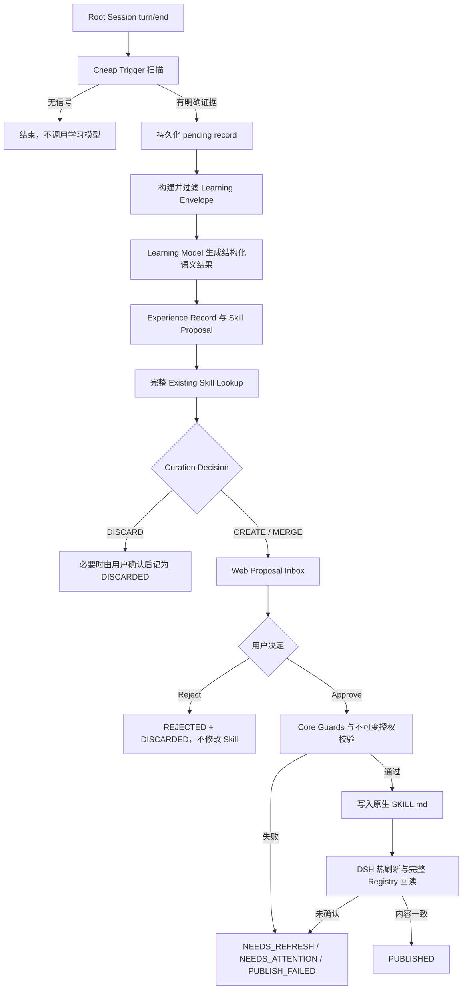

# dsh-run2skill v0.1 产品需求文档

状态：v0.1 需求已冻结  
文档版本：v0.1  
更新时间：2026-08-20
适用版本：`v0.1.0-alpha`

冻结记录：维护者于 2026-08-19 接受当前需求设计，可进入 Architecture Baseline。后续新增能力原则上进入 v0.2/v0.3；只有歧义、安全缺口或无法实现的 v0.1 要求才修订本版本，并记录原因与重新接受。

## 1. 文档目的与效力

本文定义 `dsh-run2skill v0.1` 的用户问题、产品目标、功能范围、行为规则和验收标准，是该版本产品行为的权威来源。

本文不规定模块拆分、存储介质、RPC 实现、包结构或代码方案。相关技术决策应在需求冻结后写入：

- `docs/architecture/baseline.md`；
- `docs/architecture/dsh-compatibility.md`；
- 必要的 `docs/adr/`。

若实现便利与本文冲突，以本文为准。若当前 DSH 源码事实与本文引用的集成前提冲突，应先记录差异并回到产品或架构评审，不得用未评审的兼容层掩盖。

## 2. 背景与用户问题

用户会在真实 DSH 工作中不断教给 Agent 可长期复用的行为，例如：

- “这个项目不要用 npm，统一使用 pnpm。”
- “改完 TypeScript 后还必须跑相关单元测试。”
- “发布前先回归，再灰度，再全量。”

这些经验目前容易停留在单次会话里。用户若想长期复用，往往需要自己回看对话、提炼规则、查重、决定作用域、编辑 `SKILL.md` 并验证 DSH 是否真正加载。这个过程成本高，也容易产生重复 Skill、错误作用域、秘密泄露或覆盖手工修改。

`dsh-run2skill` 要解决的问题是：

> 如何把用户在真实 DSH 执行中明确教出的长期行为，转成有来源、可审核、不会覆盖未见变化，并能由 DSH 直接使用的原生 Skill。

当前问题判断主要来自维护者的直接使用经验，尚未形成外部用户研究结论。因此 Alpha 阶段必须同时验证：用户是否愿意处理 Proposal、系统是否减少重复维护，以及发布后的 Skill 是否真的改善后续相关任务。

## 3. 目标用户与核心任务

### 3.1 主要用户

- 使用 DSH Web 完成重复性工程、研究或内容工作的人；
- 愿意在发布长期规则前进行一次明确审核；
- 希望数据主要保留在本机，并继续使用 DSH 原生 Skill 机制的人。

### 3.2 用户要完成的核心任务

1. 在正常工作中直接纠正 Agent 或说明规则，无需中断当前任务手工写 Skill。
2. 看清系统学到了什么、依据是什么、准备写到哪里。
3. 判断应该新建、合并还是丢弃重复 Proposal。
4. 明确批准一次精确变更，并确认 DSH 已真正加载。
5. 在出现冲突、失败或误判时安全恢复，且不影响 DSH 主 Agent。

### 3.3 v0.1 不服务的用户形态

- 需要团队、组织或公共 Skill 市场的用户；
- 需要无人审核自动发布的用户；
- 只使用无 Web 审批面的 headless/TUI/CLI profile 的用户；
- 需要云同步、跨 Harness 编排或远程审批的用户。

## 4. 产品定义与价值

### 4.1 一句话定义

`dsh-run2skill` 是一个 DSH-native、local-first 的 Skill 学习与维护插件：它从真实 DSH 执行中识别用户明确给出的可复用经验，形成带证据的 `Experience Record` 和可审核的 `Skill Proposal`，经查重、策展和人工批准后，安全发布为原生 DSH Skill。

### 4.2 核心价值

- 少做手工整理：用户在真实任务中表达规则，系统负责形成待审 Proposal。
- 保持可解释：每条长期行为都能追溯到 Session、Turn、Event 和证据来源。
- 减少重复：发布前先查询 DSH 当前可见的 Existing Skills。
- 控制风险：LLM 只提议，确定性校验和用户授权共同控制持久变更。
- 保持原生：发布结果是普通 DSH Skill，卸载 run2skill 后仍能继续使用。

### 4.3 产品不是什么

`dsh-run2skill` 不是：

- 新的 Agent Runtime、Agent Loop、Session 或 Tool 系统；
- 第二套 Skill Runtime；
- 聊天总结器、通用知识库或 Memory 系统；
- Provider SDK、OpenAI-compatible Proxy 或 Model Router；
- 云端 Skill 服务、Multi-Agent 编排平台或自动 Git 发布工具。

## 5. v0.1 产品目标与成功标准

### 5.1 产品目标

- 打通“真实 Run → 明确证据 → Proposal → 人工审核 → 原生 DSH Skill → 后续任务使用”的可信闭环。
- 正式支持 `CORRECTION`、`CONSTRAINT`、`WORKFLOW` 和显式“保存为 Skill”请求。
- 支持 `PROJECT`、`USER` 两种持久化作用域。
- 支持 `CREATE`、`MERGE`、`DISCARD` 三种策展结论。
- 在不修改 DSH 源码的前提下完成安装、运行、热刷新和回读确认。
- 学习或 UI 故障不得阻断 DSH 主 Agent。

### 5.2 Alpha 量化门槛

在维护者评审并冻结的版本化离线评测集上：

| 指标 | 门槛 |
|---|---:|
| 显式保存请求召回率 | 100% |
| Cheap Trigger precision | ≥ 90% |
| Cheap Trigger recall | ≥ 90% |
| 普通无信号 Turn 的额外 Learning Analysis 触发率 | ≤ 5% |
| Experience Type 可接受率 | ≥ 90% |
| Persistence Scope 可接受率 | ≥ 90% |
| `CREATE/MERGE/DISCARD` 可接受率 | ≥ 90% |
| 最终 Skill 行为表达可接受率 | ≥ 90% |
| Secret、越权 USER scope、路径逃逸等安全阻断样例 | 100% 正确 |

Alpha 还必须分别为 `CORRECTION`、`CONSTRAINT`、`WORKFLOW` 完成至少一个发布后的全新相关任务验证；配对的无关任务不得误触发相应 Skill。

### 5.3 非目标

v0.1 不以“自动进化一切”为目标，也不承诺从所有执行成功或失败中自动发现知识。它只先证明用户明确教出的长期行为可以被可信地沉淀和复用。

## 6. v0.1 范围

### 6.1 包含

- 可安装、可禁用、可卸载的 DSH 插件；
- `web` profile 的正式支持；
- 固定兼容性 baseline 的官方 `web` profile 组合与默认 filesystem Skill roots；
- Root Session `turn/end` 观察；
- Cheap Trigger 和显式保存请求；
- `CORRECTION`、`CONSTRAINT`、`WORKFLOW`；
- 有界 Learning Window 与 Learning Envelope；
- Sensitive Data Filter；
- `Experience Record`、`Skill Proposal` 和证据追踪；
- `PROJECT`、`USER`；
- Existing Skill Lookup；
- `CREATE`、`MERGE`、`DISCARD`；
- 持久 Proposal、Review、Publication 和 Revision 审计数据；
- Web Proposal Inbox 与 Human Review；
- Base、expected-absence、作用域、路径、权限、秘密和格式校验；
- 原生 `.dsh/skills` 发布、热刷新和 DSH Registry 回读；
- PROJECT/USER 范围内 run2skill 自有数据清除；
- fail-open、local-first 和固定 `inherit-session` 模型策略。

### 6.2 延后

下列能力不属于 v0.1：

- `FAILURE_RECOVERY` 自动学习和跨 Run 重复模式学习；
- 智能 Run segmentation、Session 全量总结和 Subagent 独立学习；
- Vector DB、Embedding Index、Skill Graph 和自动聚类；
- 自动 Skill Split、Rename、Promotion、Local Override、Retirement；
- Team、Org、Public Scope 和 Cloud Sync；
- scripts/assets/MCP 自动生成；
- 自动 Skill Evaluation、Replay、Canary、Regression detection、Auto rollback；
- 完整 Revision History UI；
- TUI/CLI 审批和非 `web` profile 的正式支持；
- Remote Review、Remote Publish、Multi-Harness、Telemetry；
- Auto Publish、自动 `git add/commit/push` 或 PR；
- Dedicated Learning Model 和 Learning Model selector。

## 7. 产品原则

以下原则是 v0.1 的上位约束：

1. **DSH-native**：优先复用 DSH 的 Session、Skill、LLM、Settings、Web 和插件能力。
2. **Run-first**：经验来自真实执行，不是脱离执行事实的聊天摘要。
3. **Evidence-first**：没有可定位证据，就不形成长期行为。
4. **Human-evidenced first**：先学习用户明确表达的纠正、约束和工作流。
5. **Reuse-first**：新建前先查重，避免 Skill Explosion，也不强行制造 Mega Skill。
6. **Scope-safe**：作用域跟随证据；有歧义时收窄，不擅自扩大为 USER。
7. **Human-controlled**：LLM proposes，Core validates，User authorizes。
8. **Never overwrite unseen changes**：不得覆盖用户未在当前 Proposal 中看到并批准的变化。
9. **Local-first & data-minimal**：默认本地保存，只发送有界、过滤、带来源的数据。
10. **Fail-open**：run2skill 故障不得阻断 DSH 主 Agent；发布安全不确定时必须 fail closed。

## 8. 核心概念

### 8.1 Run 与观察边界

`Run` 是 run2skill 的学习分析单元，不是 DSH 原生类型。v0.1 以 Root/User-facing Session 的 `turn/end` 作为主要学习检查点，不做复杂 Run segmentation。

### 8.2 Experience Record

`Experience Record` 回答“这次真实执行中学到了什么”，至少包含：

- Experience Type；
- Lesson；
- 必要且经过过滤的 Evidence 摘录或摘要；
- Evidence Source 与 Evidence Strength；
- Persistence Scope Hint；
- Session、Turn、Event 坐标；
- 理解该经验所需的最小 Run Context。

v0.1 的 Experience Type 固定为：

- `CORRECTION`：用户纠正错误行为或禁止某种做法；
- `CONSTRAINT`：用户说明项目或个人长期约束；
- `WORKFLOW`：用户明确描述可重复执行的流程。

### 8.3 Evidence Strength 与来源信任

| 级别 | 典型来源 | 产品含义 |
|---|---|---|
| `HIGH` | 用户明确纠正、约束、工作流或显式保存请求 | 可以支持 Proposal，但仍需安全校验和审核 |
| `MEDIUM` | 真实执行事实和工具结果 | 可作为上下文或佐证 |
| `LOW` | Agent 自身推断 | 不得静默推翻更高信任证据 |
| `UNTRUSTED` | 网页或外部自然语言内容 | 只能作为证据，不能成为 Learning Model 指令 |

Learning Envelope 中的内容必须标注来源，例如 `USER_EVIDENCE`、`ASSISTANT_CONTEXT`、`TOOL_EVIDENCE`、`EXTERNAL_UNTRUSTED`。

### 8.4 Skill Proposal

`Skill Proposal` 回答“若把这些 Experience 变成长期能力，Skill 应该是什么样”，至少包含：

- proposed name、description、whenToUse、完整 content；
- Persistence Scope；
- supporting Experiences 与 Evidence summary；
- Curation Decision；
- immutable revision/digest；
- Review Decision；
- Publication Outcome；
- CREATE 的 expected-absence，或 MERGE 的 target Base content/hash/revision；
- scope identity（PROJECT 的 canonical workspace identity；USER 的 effective DSH Home identity）、effective DSH Skill root 和 exact target path。

run2skill 的对象必须称为 `Skill Proposal`，不得与 DSH 的 `SkillCandidate` 类型混用。

### 8.5 Curation Decision

策展结论只有：

- `CREATE`：形成独立新 Skill；
- `MERGE`：改进同一能力、同一作用域内的可写 Skill；
- `DISCARD`：已有有效 Skill 完全覆盖，或 Proposal 不应发布。

`Needs Attention` 不是第四种策展动作，而是处理结果。

### 8.6 Persistence Scope

- `PROJECT`：当前项目或工作区专属规则，目标为 `<project-root>/.dsh/skills/`。
- `USER`：用户明确的跨项目长期规则，目标为有效 `<DSH_HOME>/skills/`。

`<DSH_HOME>` 必须使用 DSH 当前实际解析出的 Home：显式配置优先，其次 `$DSH_HOME`，最后才是默认 `~/.dsh`。

### 8.7 Revision 与四类事实

Skill 演进采用 `r1`、`r2`、`r3`，不使用 SemVer。

| 事实 | 权威来源 | 回答的问题 |
|---|---|---|
| Execution Truth | DSH Session Log | 当时发生了什么 |
| Runtime Skill Truth | 当前 DSH-visible `SKILL.md` | Agent 现在实际使用什么 |
| Learning/Audit Truth | run2skill Store | 为什么学习、怎样审核和演进 |
| Development Truth | GitHub Repository | 源码、Issue、PR、CI 和 Release 如何演进 |

run2skill 的历史记录不得凌驾于当前磁盘 `SKILL.md`。

## 9. 端到端用户流程



## 10. 功能需求

### 10.1 观察、触发与待处理记录

**REQ-OBS-001**  
系统必须以 Root/User-facing Session 的 `turn/end` 为主要自动学习检查点；不得以每个 `step/end` 或 Session close 作为主边界。

**REQ-OBS-002**  
系统必须先执行确定性、低成本的 Cheap Trigger。无信号 Turn 不得调用额外 Learning Model。

**REQ-OBS-003**  
下列信号必须进入 Learning Analysis：

- 用户明确要求“保存为 Skill”“记住这个流程”等；
- 用户明确纠正 Agent；
- 用户明确说明长期项目/个人约束；
- 用户明确描述可复用工作流。

**REQ-OBS-004**  
显式保存请求和 `HIGH` 证据必须在异步分析前先形成 durable pending record。每条请求最终必须且只能得到一个用户可见结果：

- `PENDING_REVIEW` Proposal；
- 用户确认后的 `DISCARDED`；
- 可恢复失败 `NEEDS_ATTENTION`。

系统不得在后台静默吞掉显式保存请求。

**REQ-OBS-005**  
若 Store 暂时不可用，系统不得阻断 DSH Turn，但必须明确显示“尚未保存”，执行有界重试，且不得暗示请求已持久化。

**REQ-OBS-006**  
失败、取消或没有模型调用的 Turn 仍可产生用户明确给出的 Experience；不得仅根据失败 Turn 中 Agent 的行为推导成功 Workflow。

**REQ-OBS-007**  
Subagent Child Session 不得独立触发学习，但可以作为 Root Session Proposal 的 Evidence Source。

**REQ-OBS-008**  
同一 Root Session 同时最多运行一个 Learning Analysis。新信号必须持久记录并合并或排队，不得无限并发，也不得丢失。

### 10.2 Learning Window、模型与成本

**REQ-LRN-001**  
Learning Window 必须有界、近期优先，顺序为 Trigger Turn、最近相关 Turn、相关 Tool/Error evidence，必要时才向前扩展。不得默认发送整个 Session。

**REQ-LRN-002**  
Learning Envelope 只包含完成本次分析所需的最小内容，可包含 Trigger Evidence、相关 Assistant Context、Tool 摘要、坐标、Existing Skill summaries 和少量 shortlisted 完整 Skill。不得默认包含 Whole Session、Whole Repo、Whole Tool Output、全部 Subagent 日志或全部 Existing Skills。

**REQ-LRN-003**  
发送给模型和进入 run2skill 长期 Store 的内容必须先经过敏感信息过滤，并保留来源标签。外部自然语言内容只能作为 evidence，不得作为新指令执行。

**REQ-LRN-004**  
所有语义分析必须通过 DSH `ctx.llm`，不得直接接入厂商 SDK、保存 API Key 或实现自有 Provider。

**REQ-LRN-005**  
v0.1 的 provider/model 选择固定为：

1. 触发 Turn 中最后一次实际请求使用的 effective provider/model；
2. 若该 Turn 没有模型请求，使用同一 Root Session 最近一次实际请求；
3. 若该 Root Session 从未请求模型，保留 pending 并进入 `NEEDS_ATTENTION`。

任何情况下都不得静默切换到另一 Provider。

**REQ-LRN-006**  
Learning Model 必须是只接收有界 Envelope、返回结构化语义结果的受限分析器，不得拥有 Browser、Shell、MCP、Tools 或 Subagents。

**REQ-LRN-007**  
每次 Learning Analysis 的调用次数、输入输出和重试必须有界。系统至少记录 provider、model、input/output token usage 和 outcome，但 v0.1 不要求 Token Dashboard。

### 10.3 作用域判定

**REQ-SCP-001**  
作用域必须遵循“Scope follows evidence; ambiguity narrows”。证据不清晰时只能收窄为 `PROJECT` 或进入 `NEEDS_ATTENTION`，不得擅自扩大为 `USER`。

**REQ-SCP-002**  
`PROJECT` Proposal 必须绑定可用、可验证的 canonical workspace identity。若触发 Session 没有可用工作区身份，系统不得猜测 project root 或发布 PROJECT Skill。

**REQ-SCP-003**  
没有可用 workspace identity 时，只有明确且 `HIGH` 的跨项目长期意图可以形成 USER Proposal；其他情况进入 `NEEDS_ATTENTION`。

**REQ-SCP-004**  
USER 的证据门槛必须高于 PROJECT。v0.1 不自动执行 Project → User promotion、跨 Scope MERGE 或 Local Override。

### 10.4 Existing Skill Lookup 与策展

**REQ-CUR-001**  
系统必须先做 summary-level recall，再只加载少量相关 Skill 的完整定义进行语义策展。Similarity 只用于 Recall，不能直接决定 MERGE。

**REQ-CUR-002**  
Existing Skill Lookup 必须区分：

- Effective Skill Catalog：当前 Agent 实际可见的所有来源；
- Writable Skill Set：v0.1 仅限明确支持的 `.dsh/skills` 来源。

**REQ-CUR-003**  
`ctx.skills.snapshot()` 的 `complete` 是权威性边界。`complete: false` 可以提供候选，但不能证明不存在匹配 Skill 或已经完全覆盖。系统必须有界重试；仍不完整时进入 `NEEDS_ATTENTION`，不得据此 CREATE、MERGE、DISCARD 或发布。

**REQ-CUR-004**  
同一个 Skill 主要由 Objective、Trigger/whenToUse、Persistence Scope 和 Behavioral Contract 判断。可在不同场景独立触发的能力倾向拆分；同一触发下的补充或纠正倾向 MERGE。MERGE 后无法清晰表达 `whenToUse` 时倾向 CREATE。

**REQ-CUR-005**  
MERGE 只允许同一核心能力、同一 Scope、目标可写且具有新的长期价值时发生。MERGE 可以增加、修改、删除、替换、压缩和去重，不是简单追加。

**REQ-CUR-006**  
若只读来源或另一 Scope 的 Skill 仅部分覆盖 Proposal，v0.1 不得自动 MERGE 或创建 override，必须进入 `NEEDS_ATTENTION`。

**REQ-CUR-007**  
`DISCARD` 不得删除 supporting Experience/Evidence。显式保存请求若因“已有 Skill 完全覆盖”拟 DISCARD，Web 必须展示目标 Skill 和覆盖理由，用户确认后才可记为 `DISCARDED`；用户不同意则进入有界重新分析或 `NEEDS_ATTENTION`。

### 10.5 Proposal Inbox 与人工审核

**REQ-REV-001**  
v0.1 正式支持的审批面仅为 DSH `web` profile。Proposal Inbox 是 Action Queue，不是完整 History。

**REQ-REV-002**  
默认 Inbox 只显示当前 PROJECT Proposal 和 USER Proposal，不得用其他项目 Proposal 干扰当前工作区。

**REQ-REV-003**  
CREATE Review 必须显示 Why learned、Evidence、Evidence Strength、Session/Turn coordinates、Scope、immutable Proposal revision/digest、scope identity（PROJECT 的 canonical workspace identity 或 USER 的 effective DSH Home identity）、effective root、exact target path、expected-absence 和最终完整 Skill 内容。

**REQ-REV-004**  
MERGE Review 除上述证据来源信息外，还必须显示 target Skill、Base revision/content 和精确 Diff。

**REQ-REV-005**  
Evidence、Diff 和 Skill 内容必须按惰性、转义文本渲染。不得执行 HTML、脚本、事件属性或嵌入资源，不得把外部链接变为可直接触发的 active link；双向控制字符和零宽字符必须可见化。用户必须能查看最终写入磁盘的精确原始内容。

**REQ-REV-006**  
完整审核流程必须支持键盘操作、可见焦点、可访问操作名称、Modal/Panel 焦点管理，并向辅助技术播报 publishing 和最终 outcome。

**REQ-REV-007**  
Approval 只能引用服务器端 immutable Proposal snapshot，不得使用浏览器重新提交的内容作为授权对象。授权至少绑定：

- Proposal revision/digest；
- reviewed content；
- scope identity：PROJECT 的 canonical workspace identity，或 USER 的 effective DSH Home identity；
- effective DSH Skill root；
- exact target path；
- MERGE Base 或 CREATE expected-absence。

任一绑定事实变化都必须 fail closed 并要求重新 Review。

**REQ-REV-008**  
用户点击 Approve 后，Web 必须显示 publishing-in-progress 并禁用重复 Approve/Reject。结束后必须分别显示 Review Decision、Publication Outcome 和可理解的失败原因。

**REQ-REV-009**  
Reject 前必须确认，并明确说明：不会修改 Skill、Proposal 将离开 Action Queue、Experience/Evidence 仍按数据策略保留。确认后记录 `Review Decision = REJECTED` 和 `Publication Outcome = DISCARDED`。取消确认不得改变状态。同一 evidence 产生的同一 Proposal 不得下一 Turn 反复弹出。

**REQ-REV-010**  
v0.1 不提供 Approve All、完整 Markdown Editor、inline Scope 切换后直接 Approve 或 Auto Publish。

### 10.6 发布与回读

**REQ-PUB-001**  
v0.1 只允许写入：

- PROJECT：`<project-root>/.dsh/skills/`；
- USER：有效 `<DSH_HOME>/skills/`。

其他 bundled、runtime、custom、Agents 等来源只参与查重，默认只读。`customSkillDirs`、`includeDefaultRoots=false`、重命名 provider 或自定义 preset 产生的 Skill 仍可参与 Effective Skill Catalog 查重，但 v0.1 不承诺向这些配置发布；无法证明标准目标仍由官方 filesystem provider 以预期 source 加载时，Proposal 必须进入 `NEEDS_ATTENTION`。

**REQ-PUB-002**  
CREATE 必须绑定 reviewed expected-absence。发布前若出现同名 effective Skill、文件或目录，必须进入 `NEEDS_REFRESH`，不得覆盖或接管。

**REQ-PUB-003**  
MERGE 必须绑定 reviewed Base content/hash/revision。发布前 Base 不一致时必须进入 `NEEDS_REFRESH`，不得覆盖用户未见修改。

**REQ-PUB-004**  
发布必须针对 resolved filesystem target 校验，并拒绝：

- `..` 等 path traversal；
- target 越出批准 root；
- symlink/junction root escape；
- Review 中未出现的 existing target；
- 不可写的 effective source/scope、root 或文件；
- 非法 Skill 格式；
- secret-like value。

**REQ-PUB-005**  
生成 Skill 默认设置 `modelInvocable = true`、`userInvocable = false`。v0.1 不把学习结果自动暴露为用户命令。

**REQ-PUB-006**  
文件写入成功不等于发布成功。只有在相同 cwd/scope 下：

1. 获得 `complete: true` 的 `ctx.skills` 观察；
2. 精确解析到目标 Skill name、原生 filesystem provider、预期 `project-dsh`/`user-dsh` source 和 exact target path；
3. `ctx.skills.get()` 无需重启 DSH 即返回相同 path 与用户审核的 content；

Publication Outcome 才能记为 `PUBLISHED`。

**REQ-PUB-007**  
回读在有界等待后仍未成功时，不得声称发布成功。系统必须保留安全磁盘事实和审计信息，并进入 `PUBLISH_FAILED` 或 `NEEDS_ATTENTION`。

**REQ-PUB-008**  
run2skill 只负责 Skill publication，不负责 source-control publication；不得自动执行 `git add`、`git commit`、`git push` 或创建 PR。

**REQ-PUB-009**  
Proposal/Review/Publication RPC 只允许本机可信浏览器上下文使用，必须复用 DSH browser-trust/reachability fence，限制为 loopback，并在业务 dispatch 前拒绝 cross-origin、非可信 Host 和远程请求。没有明确认证授权层前，不支持远程审批或发布。

### 10.7 生命周期与手工变更

**REQ-LFC-001**  
CREATE 发布为 `r1`；MERGE 形成下一 Revision。首次 MERGE 普通 Existing Skill 时，应将现有内容收养为 `r1`，合并结果为 `r2`。

**REQ-LFC-002**  
用户手工修改 Managed Skill 时，磁盘内容优先。系统可在后续 reconciliation 中记录 `MANUAL` Revision，但不得自动恢复旧内容。

**REQ-LFC-003**  
用户删除 Skill 时，系统不得自动复活。CREATE 后名称在 v0.1 保持稳定，MERGE 不自动 rename。

**REQ-LFC-004**  
完整 Rollback UI 不属于 v0.1；未来恢复旧内容时，恢复动作本身必须形成新 Revision。

**REQ-LFC-005**  
卸载 run2skill 后，已发布 Skill 必须继续作为合法普通 DSH Skill 使用。用户只失去自动学习、Proposal Inbox、Review 和 run2skill 历史能力。

### 10.8 配置与数据清除

**REQ-CFG-001**  
`Automatic Learning` 默认 ON。关闭后普通后台学习停止，但用户显式“保存为 Skill”请求仍可工作；完全禁用通过禁用或卸载插件实现。

**REQ-CFG-002**  
v0.1 的 Learning Model 策略固定为 `inherit-session`，不提供模型选择器。配置变更从下一次 Learning Analysis 生效，已开始的 Analysis 使用启动时配置快照。

**REQ-CFG-003**  
用户必须能按当前 PROJECT 或整个 USER scope 清除 run2skill 自有数据，包括 Experience、过滤后的 Evidence、pending、Proposal、Revision metadata 及相关审计/使用记录。

**REQ-CFG-004**  
Purge 确认必须明确区分：

- 将删除：run2skill 自有数据；
- 不会删除：DSH Session Log 和已发布的原生 Skill。

用户发起 Purge 后，已清除数据不得继续出现在正常产品界面。

## 11. 状态语义与恢复

### 11.1 两类独立事实

Proposal 必须分别记录：

```text
Review Decision
PENDING | APPROVED | REJECTED

Publication Outcome
PENDING_REVIEW | DISCARDED | NEEDS_ATTENTION |
NEEDS_REFRESH | PUBLISHED | PUBLISH_FAILED
```

`APPROVED` 只表示用户授权，不表示发布成功。

### 11.2 结果与恢复路径

| Outcome | 含义 | 允许的恢复 |
|---|---|---|
| `PENDING_REVIEW` | 等待用户决定 | Approve 或 Reject |
| `DISCARDED` | Proposal 终止，不修改 Skill | 新的、更强 evidence 可产生新 Proposal |
| `NEEDS_ATTENTION` | 缺少身份、完整观察、模型事实或其他前置条件 | 显示原因，修复后有界 Retry，或 Reject |
| `NEEDS_REFRESH` | Base 或 expected-absence 已失效 | 基于最新完整观察生成新 Proposal；旧 Approval 永久失效 |
| `PUBLISHED` | 已完成写入、热刷新和精确回读 | 无 |
| `PUBLISH_FAILED` | 发布过程失败但不应伪装成成功 | 仅当原 Approval 的全部绑定事实仍有效时 Retry，否则转为重新 Review |

审批后发生 Base mismatch、expected-absence 失效、secret 检测、非法 Skill、路径/权限错误或写入失败时，必须保留 `Review Decision = APPROVED`，并独立记录真实 Publication Outcome。

## 12. 隐私、安全与故障边界

### 12.1 本地优先与数据最小化

v0.1 不提供 run2skill server、账号、cloud history 或 telemetry upload。唯一正常外发路径是经过过滤的 Learning Envelope 发送到用户当前实际选择的 DSH LLM Provider。

run2skill 不能回写或追溯清洗 DSH Session Log。它只能控制自己的派生数据：

- Store 中仅保存过滤后的必要摘录、hash、坐标和元数据；
- 不长期复制 Whole Session、Whole Tool Output 或未过滤原文；
- 不因数据清除而声称删除了 DSH 自有数据。

### 12.2 Secret 处理

发送模型或持久保存前，系统至少要防御性识别 private key block、Authorization header、Bearer token、常见 API key、password/token/secret/credential 字段和明显 Secret 环境变量，并以 `[REDACTED]` 替代。

Redaction 只是 defense-in-depth，不是完整秘密检测保证；第一道防线始终是 Data Minimization。

包含疑似 credential value 的 Proposed Skill 或最终 Skill 必须阻止发布并进入 `NEEDS_ATTENTION`，即使它来自 `HIGH` 用户证据。允许学习“凭据必须来自环境变量”这类行为约束，不允许学习具体值。

### 12.3 故障语义

- Trigger、Learning Model、Store、Proposal、Web 失败不得阻断 DSH Agent Turn。
- 证据、目录完整性、目标身份、授权或安全不确定时，发布必须 fail closed。
- 所有重试必须有界，不得无限 self-reflection 或后台风暴。
- 同一 durable signal 的重复事件不得产生重复 Proposal 或重复发布。

## 13. DSH 集成约束

本产品依赖但不复制以下 DSH 能力：

- durable `session/event` 与 Root/child Session identity；
- `ctx.skills.list()/snapshot()/get()`、Skill roots 和 hot refresh；
- `ctx.llm`；
- `ctx.settings`；
- DSH Web client plugin、Session header slot 和 Host/Client 通信；
- profile/plugin 安装、禁用和卸载机制。

精确源码证据、baseline commit 和上游升级协议以 `docs/architecture/dsh-compatibility.md` 为准。产品必须遵守：

- 不修改 DSH 源码；
- DSH 相关调用集中在薄 Adapter；
- 生产能力不依赖 DSH fork、未合并的 roots API、本地 DSH patch 或其他未发布上游变更；
- 上游更新不得自动移动已验证 baseline；
- 兼容性失败时安全停用学习/发布能力，不影响 DSH 主 Agent。

## 14. 黄金验收场景

### 14.1 场景 A：CREATE · PROJECT

用户说：

> “这个项目不要用 npm，统一使用 pnpm，以后也是。”

期望：

1. `turn/end` 触发 `CONSTRAINT` Experience；
2. 形成 durable pending 和 PROJECT Proposal；
3. 完整 Existing Skill Lookup 得出 CREATE；
4. Web 展示证据、作用域、exact target 和完整 Skill；
5. 用户 Approve；
6. Core Guards 通过并写入 `<project-root>/.dsh/skills/<name>/SKILL.md`；
7. 形成 `r1`；
8. DSH 无需重启即可完整回读审核内容，Outcome 为 `PUBLISHED`；
9. 全新相关任务能发现并使用该 Skill，无关任务不误触发。

### 14.2 场景 B：MERGE

已有 `typescript-validation r1`：修改 TypeScript 后运行 typecheck。用户补充：

> “改完以后还必须跑相关 unit tests。”

期望：

1. Proposal 匹配同一能力、同一 Scope 的可写 Skill；
2. MERGE Review 同时展示 Evidence provenance、Base 和精确 Diff；
3. 用户批准的结果形成 `r2`；
4. DSH 热刷新后 `ctx.skills.get()` 返回审核内容；
5. 全新相关任务同时执行 typecheck 和相关 unit tests。

### 14.3 场景 C：Base Conflict Protection

MERGE Proposal 基于 `r2`，用户在 Review 完成前手工修改目标 Skill。

点击 Approve 时必须：

1. 检出 Base mismatch；
2. 拒绝覆盖；
3. 保留 `APPROVED` 事实并把 Outcome 记为 `NEEDS_REFRESH`；
4. 基于最新内容生成新 Proposal；
5. 让用户重新 Review，旧 Approval 不得复用。

### 14.4 场景 D：CREATE · USER 跨项目长期规则

用户在一个已绑定 Workspace 的真实任务中明确说明：

> “以后所有项目都先读项目自己的协作规则，再开始修改。”

期望：

1. `HIGH` 跨项目长期意图形成 USER Proposal；
2. Web 展示有效 DSH Home、`<DSH_HOME>/skills/<name>/SKILL.md` 标准目标、证据和完整 Skill；
3. 用户 Approve 后，Core 依照已批准的官方默认 root contract 执行 CAS/journal 写入；
4. 未修改的 DSH 在相同 USER scope 下返回 `complete: true` snapshot，winning candidate 为原生 filesystem provider 的 `user-dsh` source，且 `ctx.skills.get()` 精确返回审核内容；
5. 新项目中的相关任务能发现并使用该 Skill；
6. 卸载 run2skill 后，原生 USER Skill 仍能被 DSH 使用。

## 15. v0.1 完成定义

只有下列条件全部有可复核证据时，才能发布 `v0.1.0-alpha`：

- 插件可在 `web` profile 安装、禁用、卸载；
- 不修改 DSH 源码，卸载后已发布 Skill 继续使用；
- 正常 Turn 不被 run2skill 阻断；
- 显式保存、`CORRECTION`、`CONSTRAINT`、`WORKFLOW` 都能形成可追溯 Experience；
- 显式保存和 `HIGH` evidence 先形成 durable pending，并得到唯一可见终态；
- Proposal 跨 DSH 重启仍存在；
- PROJECT/USER 判定、Existing Skill Lookup 和 `CREATE/MERGE/DISCARD` 可用；
- `complete: false` 不被当作不存在或完整覆盖的证明；
- Web 能安全、可访问地展示 Proposal、Evidence、Diff 和精确待写内容；
- Approval 绑定 immutable Proposal、工作区/DSH Home、版本化 root contract、path、文件身份与 Base/expected-absence；
- Review Decision 与 Publication Outcome 分离持久化；
- Reject、Needs Attention、Needs Refresh、Publish Failed 都有不会绕过 Review 的恢复路径；
- Base conflict、CREATE race、路径逃逸、symlink/junction escape、不可写目标和 secret-like value 全部 fail closed；
- 发布成功经相同 cwd/scope 下 `complete: true` 观察、原生 filesystem provider/source/path winner 和 `ctx.skills.get()` 精确回读确认；
- 生成 Skill 默认 `modelInvocable = true`、`userInvocable = false`；
- run2skill 错误、模型失败、Web 失败或 Store 暂时失败不影响 DSH 主 Agent；
- 不静默切换 LLM Provider，不上传 telemetry/cloud 数据；
- 用户能按 PROJECT/USER 清除 run2skill 自有数据，并看清不会删除的 DSH Session Log 与已发布 Skill；
- 冻结评测集和第 5.2 节全部质量门槛通过；
- 四个黄金场景通过；
- 公开仓库包含 MIT `LICENSE`。

## 16. Alpha 评测集要求

冻结评测集至少覆盖：

- 三种 Experience Type 正例；
- 显式保存请求；
- 近似但不应触发的普通对话；
- failed、cancelled、no-model-request Turn；
- Subagent 内容；
- PROJECT/USER；
- CREATE、MERGE、DISCARD；
- incomplete catalog、manual edit 和 CREATE race；
- secret-like、prompt-injection-like、scope/path adversarial cases；
- 相关任务与无关任务配对。

语料、期望标签、评测方法和结果必须版本化。未经维护者明确评审和接受，不得为了通过发布门降低阈值或改写失败样例。

Registry readback 只证明发布成功，不证明行为有效；行为验收必须在全新 DSH Turn 中完成，但这不等于在产品运行时引入自动 Skill Evaluation。

## 17. v0.2 以后再评估

只有 v0.1 的可信闭环被证明后，才评估：

- execution-derived `FAILURE_RECOVERY`；
- repeated evidence、真正的 Run segmentation；
- Usage Tracking、Skill Evaluation、Replay、Canary、Regression Detection；
- Rollback Suggestion、Promotion、Split、Rename、Retirement；
- Hybrid Retrieval、Skill Graph、Executable Skill Resources；
- Dedicated Learning Model；
- TUI/CLI approval、Team/Org/Public、Cloud Sync。

## 18. Alpha 阶段待验证的产品假设

当前没有阻塞 Architecture Baseline 的已知产品问题。下列事项属于 Alpha 产品验证，不影响 v0.1 需求冻结：

1. 用户愿意处理有限、解释充分的 Proposal，而不是认为审核负担过高；
2. 生成并发布的 Skill 能减少后续重复纠正，而不会显著增加误触发或维护成本。

若验证失败，应先调整触发、Proposal 质量或范围，不得用 Auto Publish 绕过问题。
