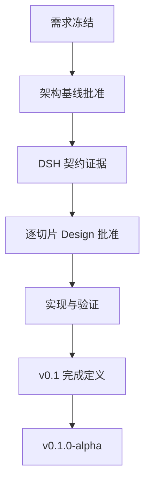

# dsh-run2skill 项目路线

状态：切片 A/B 已验收，切片 C Design 已接受且 C1–C6 已合并；C7 暂停，先完成纯插件 root-contract 修正 #48
更新时间：2026-08-20

## 1. 路线目标

在不修改 DeepSeek Harness（DSH）源码、不复制 DSH Runtime 的前提下，交付一个 DSH-native、local-first 插件，把真实 DSH 工作中由用户明确给出的长期行为沉淀为有证据、可审核、可安全发布的原生 DSH Skill。

本路线管理从需求冻结到 `v0.1.0-alpha` 的阶段顺序、阶段门和交付物：

- 产品行为以 `docs/product/prd.md` 为准；
- DSH 事实以 `docs/architecture/dsh-compatibility.md` 为准；
- 技术边界以后续获批的 `docs/architecture/baseline.md` 为准。

## 2. 仓库与上游边界

固定约束：

- 本仓库只包含 dsh-run2skill 自有源码、文档、测试和可丢弃探针，不 vendoring DSH 源码。
- DSH 兼容性验证使用固定 baseline commit 的干净上游 checkout；本项目不得依赖本地 DSH patch。
- 机器相关的目录布局、凭据和远程操作规则不属于项目文档。

## 3. 阶段路线

### 阶段 0：工作区初始化

状态：已完成。

已完成工作：

- 已建立独立项目仓库与可移植的项目协作规则；
- 已记录 DSH 官方来源、精确 baseline commit 和上游更新协议；
- 已建立产品、架构、Design 与 Contract Probe 文档目录；
- 可丢弃探针从外部干净 DSH checkout 创建隔离副本，不修改上游源码。

阶段门：仓库与 DSH 上游边界清晰；公开内容不依赖机器配置；DSH baseline 可复现。

### 阶段 1：需求与规则冻结

状态：已完成。维护者于 2026-08-19 接受 v0.1 Requirements Freeze。

工作：

- 将需求草案重构为正式 PRD；
- 评审目标、用户、v0.1 范围、非目标、术语和状态；
- 核验并发、幂等、重复触发、Reject 抑制和崩溃恢复语义；
- 核验 PROJECT/USER 证据门槛；
- 核验 Secret、权限、路径、外部内容和数据最小化边界；
- 使当时定义的三个黄金场景和质量门槛可测试；2026-08-20 窄修订补充 USER 黄金场景；
- 用固定 DSH baseline 核验需求依赖的源码事实；
- 明确 DSH 上游更新和兼容策略；
- 确认可移植的项目协作规则。

交付物：

- `docs/product/prd.md`；
- `docs/product/requirements-review.md`；
- `docs/architecture/dsh-compatibility.md`；
- `docs/architecture/architecture-input.md`；
- 项目 `AGENTS.md`。

阶段门：维护者评审并接受“需求冻结（`Requirements Freeze`）”。未通过前不得进入 Architecture Baseline。

### 阶段 2：架构基线

状态：已完成。维护者于 2026-08-19 接受 Architecture Baseline v0.1。

输入：冻结 PRD、兼容性基线和 `docs/architecture/architecture-input.md`。

工作：

- 画清系统上下文（System Context）与构建/复用（Build-vs-Borrow）边界；
- 定义领域模型（Domain Model）和稳定契约；
- 定义 Host、Web、Store、Learning、Curation、Publication 职责；
- 定义事件、并发、幂等和 fail-open 模型；
- 定义 Persistence、Revision 和 Publication 事务边界；
- 定义 DSH Adapter、版本兼容和升级协议；
- 定义 LLM、隐私、安全、Settings 和 Web RPC 边界；
- 定义测试策略、包结构候选和纵向切片映射。

交付物：

- `docs/architecture/baseline.md`；
- 更新后的 `docs/architecture/dsh-compatibility.md`；
- 必要的 `docs/adr/`。

阶段门：维护者明确接受 `Architecture Baseline`。

### 阶段 3：架构风险验证

状态：基线探针轮次已完成。

只做有界、可丢弃的 Contract Probe，验证：

- Root Session `turn/end` 的可靠观察；
- `ctx.llm` 的受限结构化调用；
- `ctx.skills` 的查询、完整性、写入边界和热刷新；
- DSH Web plugin 挂载、浏览器信任边界和 Host/Client 通信；
- run2skill 异常不会阻塞 DSH Agent。

结果：Session、Storage、LLM、Skill、Web、Publication CAS 和安装生命周期已取得运行证据。CP-ROOT-001 的默认组合 parity 历史证据仍为 PARTIAL，但“等待 provider roots API”已被 ADR-0001 取代；stock-DSH 纯插件 CP-ROOT-003 已在固定 baseline 通过。

阶段门：Slice A/B 所需的底层契约已有运行证据，且两条切片均已完成验收；Slice C Design 与 C1–C6 已完成。#48 已移除候选 roots API 生产依赖并通过 CP-ROOT-003；C7 仍需在独立 #40 中执行最终黄金验收。

### 阶段 4：纵向切片与 Issues

状态：进行中；切片 A/B 已验收。切片 C Design 已接受，C1–C6 已合并；C7 保持最终验收边界，当前先推进独立修正 #48；不提前铺开切片 D 的详细 Issues。

按依赖顺序拆分：

1. **切片 A——Observe**：安装插件、观察 Root `turn/end`、识别明确 Trigger。
2. **切片 B——Learn**：构建 Envelope，形成 Experience 和 Proposal。
3. **切片 C——最小安全闭环**：完整 lookup、策展、持久状态、Web Review、不可变授权、Core Guards、发布、热刷新和回读。
4. **切片 D——Productize**：Settings、Inbox 完善、Purge、迁移、打包、安装和运维硬化。

切片 C 是第一次允许宣称 Run → Skill 闭环成功的阶段，不能用临时 CLI/TUI 或内部 bypass 替代 Web Human Review。

每条切片实现前必须有独立 Design，说明：

- 状态和数据流；
- 稳定 Contract；
- 错误与恢复语义；
- 测试和可观测证据；
- 验收标准和非目标。

Design 获批后再拆 Issues。Issue 记录范围与验收，feature branch 承载实现和测试，PR 承载 Review 与可复核证据。

当前交付物：切片 A/B 的独立 Design、公开 Issues、实现代码，以及 `docs/evidence/slice-a-acceptance.md` 和 `docs/evidence/slice-b-acceptance.md`；切片 C Design 位于 `docs/design/slice-c-safe-loop.md`，C1–C6（#34–#39）已完成。#48 只修正纯插件 root contract，完成后才恢复 C7（#40）最终集成验收。

阶段门：当前切片 Design 可独立评审，Issues 具备明确验收条件。

### 阶段 5：逐切片开发

```text
Design → Review → Issues → Feature Branch → Implementation
       → Tests → PR → Review → Squash Merge
```

每条切片都要形成可运行、可验证的纵向能力，不以一批孤立模块代替端到端证据。不得直接 push `main`。

每个 Issue 先做一次简短范围审计；行为修改测试先行，并实现已批准范围内的最小闭环。稳定 HEAD 保留 typecheck、lint 和完整单元测试，直接相关的真实 DSH probe 在该 HEAD 运行。重型完整 DSH build、跨平台矩阵、安装生命周期和全量 crash/compatibility matrix 只在改动直接影响对应边界，或进入稳定发布候选时集中运行，不在每个修复 push 后机械重复。

实现后只做一次简化自审，不使用 Compound Engineering、多角色或跨模型流程。PR 在稳定的精确 HEAD 上接受一次只读 `gpt-5.6-sol` / `high` 审查：P0/P1 阻塞；P2 仅在可复现且影响当前 Issue 验收、安全、用户数据、写错目录或主流程可用时阻塞；其余 P2/P3 建 GitHub backlog，不为字面 `CLEAN` 无限循环。只有修复阻塞 finding 的 push 才要求新的 exact-HEAD 审查；CI、必要探针和审查均无阻塞 finding 后，直接转 Ready 并 squash merge。需求或架构变化仍交由维护者决策，流程简化不改变产品范围。

Slice A/B 已逐 Issue 合并并完成集成验收。C1 → C2 → C3 → C4 → C5 → C6 已完成，#48 已完成；C7 尚未启动。切片 D 只保留路线和阶段门，不提前拆成容易漂移的详细实现 Issue。

### 阶段 6：v0.1 集成验证

集中验证：

- CREATE PROJECT、MERGE、Base Conflict、CREATE USER 四个黄金场景；
- Proposal 跨重启持久化；
- Manual Edit、多 Session 并发、重复触发和 crash recovery；
- LLM、Store、Web、Publication 失败时的 fail-open；
- Secret 阻断和最小数据外发；
- 安装、升级、禁用、卸载和 DSH 热刷新；
- 卸载后已发布 Skill 继续有效；
- 当前 baseline 和最新 `origin/master` 的兼容性预警；
- PRD 中冻结评测集与全部质量门槛。

阶段门：PRD 的 v0.1 完成定义全部有可复核证据。

### 阶段 7：Alpha 发布与真实使用

- 发布 `v0.1.0-alpha`；
- 在真实 DSH 工作中观察误触发、漏触发、错误 MERGE、Review 负担和后续 Skill 行为；
- 只修复 v0.1 可信闭环问题；
- 扩展方向进入 v0.2 backlog，不回填进已冻结范围。

## 4. DSH 上游更新协议

- 开发和验收绑定明确 baseline commit，不绑定浮动 main/master。
- 日常只 fetch；不得无评估 pull 并移动 baseline。
- 提升前比较 Session、Skills、LLM、Settings、Web 和插件加载接口。
- 当前 baseline 必须通过兼容测试；最新上游只作为预警。
- 所有 DSH 调用集中在薄 Adapter。
- 不兼容时安全停用受影响能力，不得影响 DSH 主 Agent。
- 只有兼容性证据、测试和文档同步完成后才能更新 baseline。

## 5. 总体阶段门



任何局部实现便利都不能越过尚未通过的上游阶段门。
